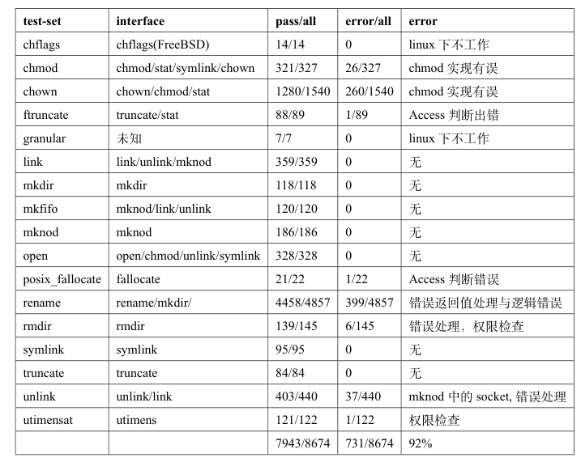

# PPT大纲

## 研究背景和目的

### 文件系统与数据库的关系图




-  数据库与文件系统承担同样的功能，但数据库更注重数据的一致性、可靠性、安全性
- 文件系统中许多新的思路和想法与数据库中已有的不谋而合
- 在文件系统中添加数据库中的功能需要大量的重复工作


既然这样，一个思路就是将文件系统与数据库的功能充分利用。大多数的数据库是基于文件系统的，数据库已经使用了文件系统提供的接口来完成完成数据存储，那文件系统也应该可以利用数据库的高效索引、事务备份等特性来增强文件系统的一致性、安全性等。


### 相关的工作

- File System Interfaces to Databases
  - IFS (基于关系型数据库 POSTGRES 实现的文件系统)
- File Systems Built Using a Database
  - Oracle iFS (Oracle)
  - AMINO ( Berkeley Database)
- File Systems with Database Features (事务)
  - exF2FS
  - DurableFs 


### 目的

- 重用数据库的基础设施
- 利用数据库本身具有的高效索引、事务特性，增强文件系统的搜索效率、安全性
- 简化文件系统实现，提高文件系统的可扩展性（在更高层次完成文件系统的设计工作)


## 整体系统结构

### 包含的项目

1. Alien: 使用 rust 实现的简单类 linux 操作系统，验证将数据库文件系统移植到
  操作系统内核	的可能性
2. jammdb: key-value 数据库，本文选择使用的数据库
3. rvfs: rust 写的 vfs 框架，主要参考 linux 中的 vfs, 用在 Alien OS 中
4. dbfs: 本文设计实现的数据库文件系统，同时包含了用户态 fuse 实现
5. dbop: 数据库操作抽象，一种在操作系统中导出数据库接口的方法

### 项目结构图


## DBFS/Alien OS设计与实现

### DBFS

#### 数据库结构


- key-value and key-bucket
- 嵌入式、单文件
- ACID
- 并发读取与单个写入
- B+Tree

#### 元数据管理与目录树构建-Everything is key-value


#### 文件数据存储-Everything is key-value


#### 数据库的接口导出

```
tx.delete_bucket()
tx.get_bucket()
tx.create_bucket()
bucket.delete_bucket()
bucket.get_bucket()
bucket.get_kv()
bucket.put()
bucket.delete()
bucket.create_bucket()
```

```
```

#### 接口设计与核心结构


1. 最底层是最终数据的存储目标，在用户态，DBFS 可以将数据存储在一个普通
   文件中，在内核态，DBFS 与其他内核文件系统一样，将数据存储于块设备中
2. 数据库层是存储算法的载体，其负责组织数据的存储，管理文件系统的所有信
   息，作为文件系统实现的引擎
3.  DBFS 层是文件系统实现层，文件系统的构建依靠数据库提供的功能，DBFS 提
   供了一层通用的接口，使得 DBFS 可以通过适配从而运行于用户态和内核态
4. 最上层是 DBFS 最终的表现形式，如果将 DBFS 用在用户态，可以通过 DBFS
   的通用接口适配 fuse 提供的接口，如果将 DBFS 移植到内核态，那么可以接入
   内核的 VFS 接口


- 核心是数据库实体 DB，需要外部使用者进行初始化

- DbfsAttr 、DbfsStat、DbfsError、DbfsPerm 这类结构，其作用主要是完成通用接口与上层适配接口的转换
- Cache pool、Globalinfo 这类接口，其主要作用是记录某些文件操作信息，以及避免一些不必要的内存分配
  开销


### Fuse实现


- 使用


### Alien OS实现


- 物理内存、虚拟内存管理
- 中断
- 进程管理
- 文件系统
- 虚拟文件系统


#### DBFS内核移植

- 虚拟文件FakeFile
- 缺页处理
- 块设备映射到一段连续的虚拟地址空间


## 实验与结果分析

### pjdfstest

- 92%通过率



### mdtest


- 部分测试达到了与ext3相同的水平
- rename操作远远高于另外两个
- 充分利用数据库的数据结构优势加速查找构成
- 在fuse的实现中增加缓存结构

### Fio测试


### Filebench


### Alien OS 中FAT32与DBFS的读写测试


## 总结与展望

- 设计并实现一个基于key-value类型的数据库文件系统DBFS
- 实现一个类linux的简单操作系统内核Alien OS
- 将DBFS支持linux 的fuse并移植到Alien OS中
- 完成用户态和内核态两种情况下的测试


1. 分析DBFS潜在的性能瓶颈
2. 基于更强大的数据库实现DBFS
3. 移植DBFS到linux内核当中