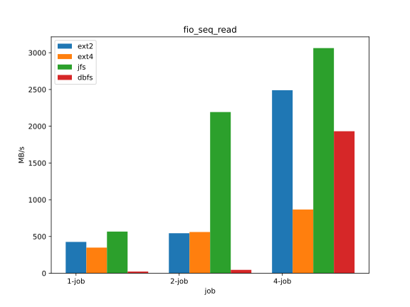
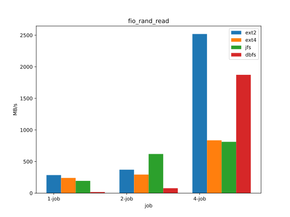

# 文件系统性能测试

[TOC]


## 性能测试内容

1. 读写速度测试：测试文件系统的读写速度，包括顺序读写和随机读写
2. 并发测试：测试文件系统在并发访问下的性能表现
3. 压力测试：测试文件系统在高负载下的性能表现

### 测试指标

文件系统性能测试可以使用多个指标来衡量，下面是一些常见的文件系统测试指标：

1. 延迟（Latency）：文件系统读取或写入数据所需的时间。延迟是衡量文件系统性能的重要指标，因为用户通常关心操作完成所需的时间。
2. 吞吐量（Throughput）：文件系统在一定时间内读取或写入数据的速率。吞吐量通常用MBps或GBps表示。
3. IOPS（每秒输入/输出操作数）：文件系统在一秒钟内处理的读写操作数。IOPS通常是衡量闪存存储设备性能的重要指标。
4. 并发性（Concurrency）：文件系统同时处理多个读写操作的能力。并发性是在高负载条件下测试文件系统性能的关键指标。
5. 可靠性（Reliability）：文件系统出现故障或意外情况时的恢复能力。例如，当系统意外断电时，文件系统应该能够在重新启动后恢复数据。
6. 一致性（Consistency）：文件系统保持数据一致性的能力。例如，当多个用户同时读取和写入文件时，文件系统应该能够正确处理数据并保持一致性。
7. 安全性（Security）：文件系统保护数据不被非授权用户访问的能力。例如，文件系统应该支持文件权限和访问控制列表（ACL）。

测试指标的选择取决于文件系统的具体用途和性能需求。在选择测试指标时，应该考虑到测试环境、应用场景和用户需求，以便正确地评估文件系统的性能。


```c
#include <stdio.h>
#include <stdlib.h>
#include <time.h>

#define FILE_SIZE_MB 1024 // 文件大小（MB）
#define BLOCK_SIZE_KB 4 // 块大小（KB）

// 生成指定大小的文件
void generate_file(const char* filename, int size_mb) {
    FILE* fp = fopen(filename, "wb");
    char* block = (char*)malloc(BLOCK_SIZE_KB * 1024);
    for (int i = 0; i < BLOCK_SIZE_KB * 1024; i++) {
        block[i] = i % 256; // 用0~255的随机数填充块数据
    }
    for (int i = 0; i < size_mb * 1024 / BLOCK_SIZE_KB; i++) {
        fwrite(block, BLOCK_SIZE_KB * 1024, 1, fp);
    }
    free(block);
    fclose(fp);
}

// 测试吞吐量
void test_throughput(const char* filename) {
    FILE* fp = fopen(filename, "rb");
    char* block = (char*)malloc(BLOCK_SIZE_KB * 1024);
    clock_t start = clock(); // 记录开始时间
    while (fread(block, BLOCK_SIZE_KB * 1024, 1, fp)) {} // 循环读取块数据
    clock_t end = clock(); // 记录结束时间
    free(block);
    fclose(fp);
    double duration = (double)(end - start) / CLOCKS_PER_SEC; // 计算读取时间（秒）
    double throughput = FILE_SIZE_MB / duration; // 计算吞吐量（MBps）
    printf("Throughput: %.2f MBps\n", throughput);
}

int main() {
    const char* filename = "testfile";
    generate_file(filename, FILE_SIZE_MB);
    test_throughput(filename);
    return 0;
}

```


## 顺序读性能

```rust
const FILE_SIZE: usize = 1024 * 1024 * 10;

#[cfg(feature = "8k")]
const BLOCK_SIZE: usize = 8192;
#[cfg(feature = "4k")]
const BLOCK_SIZE: usize = 4096;
#[cfg(feature = "1k")]
const BLOCK_SIZE: usize = 1024;
#[cfg(feature = "512")]
const BLOCK_SIZE: usize = 512;
#[cfg(feature = "256")]
const BLOCK_SIZE: usize = 256;
```

先往文件中写入10MB大小的数据，在将10MB大小的数据全部读出

### 测试结果

```rust
//fat32
time cost = 12777ms, read speed = 820KB/s
//dbfs
time cost = 22812ms, read speed = 459KB/s
```

## 顺序写性能

```c
SIZE:10MB
BLOCK_SIZE:1024B
```

#### 测试结果

```rust
time cost = 12632ms, write speed = 830KB/s
time cost = 25085ms, write speed = 418KB/s
```


## 随机读写性能

1. 打开文件：使用文件 I/O 函数打开测试文件，并将其指针保存在变量中。
2. 生成随机数：使用随机数生成函数生成随机数，用于确定读取或写入文件的位置和大小。
3. 进行随机读写：使用文件 I/O 函数对文件进行随机读写，根据生成的随机数确定读取或写入的位置和大小。要进行随机读写测试，应使用随机位置和随机大小进行读写操作，而不是顺序读写操作。
4. 记录测试结果：在测试期间，应记录每个操作的完成时间、读取或写入的位置和大小等信息，以便后续分析测试结果。
5. 分析测试结果：测试完成后，可以分析测试结果以了解文件系统的随机读写性能。可以计算测试期间每秒钟完成的操作数、延迟、带宽等指标，并将它们与其他文件系统进行比较。

```c
#include <stdio.h>
#include <stdlib.h>
#include <string.h>
#include <fcntl.h>
#include <unistd.h>
#include <time.h>

#define TESTFILE "testfile"    // 测试文件名
#define TESTSIZE (1024 * 1024) // 测试文件大小（1MB）

int main()
{
    char buf[4096]; // 缓冲区大小（4KB）
    int fd, i, j, offset, ret;
    double start, end, elapsed, ops, throughput;

    srand(time(NULL)); // 初始化随机数生成器

    // 创建测试文件
    fd = open(TESTFILE, O_CREAT | O_TRUNC | O_WRONLY, 0666);
    if (fd == -1)
    {
        perror("open");
        exit(1);
    }
    for (i = 0; i < TESTSIZE / sizeof(buf); i++)
    {
        if (write(fd, buf, sizeof(buf)) == -1)
        {
            perror("write");
            exit(1);
        }
    }
    close(fd);

    // 打开测试文件
    fd = open(TESTFILE, O_RDONLY);
    if (fd == -1)
    {
        perror("open");
        exit(1);
    }

    // 随机读取测试
    start = clock();
    for (i = 0; i < 1000000; i++)
    {
        offset = rand() % TESTSIZE;
        if (lseek(fd, offset, SEEK_SET) == -1)
        {
            perror("lseek");
            exit(1);
        }
        if (read(fd, buf, sizeof(buf)) == -1)
        {
            perror("read");
            exit(1);
        }
    }
    end = clock();
    elapsed = (end - start) / CLOCKS_PER_SEC;
    ops = i / elapsed;
    throughput = ops * sizeof(buf) / (1024 * 1024);
    printf("Random read test:\n");
    printf("Elapsed time: %.3f s\n", elapsed);
    printf("Operations per second: %.0f\n", ops);
    printf("Throughput: %.2f MB/s\n", throughput);

    // 随机写入测试
    start = clock();
    for (i = 0; i < 1000000; i++)
    {
        offset = rand() % TESTSIZE;
        if (lseek(fd, offset, SEEK_SET) == -1)
        {
            perror("lseek");
            exit(1);
        }
        if (write(fd, buf, sizeof(buf)) == -1)
        {
            perror("write");
            exit(1);
        }
    }
    end = clock();
    elapsed = (end - start) / CLOCKS_PER_SEC;
    ops = i / elapsed;
    throughput = ops * sizeof(buf) / (1024 * 1024);
    printf("Random write test:\n");
    printf("Elapsed time: %.3f s\n", elapsed);
    printf("Operations per second: %.0f\n", ops);
    printf("Throughput: %.2f MB/s\n", throughput);

    // 关闭测试文件
    close(fd);

    // 删除测试文件
    ret = remove(TESTFILE);
    if (ret == -1)
    {
        perror("remove");
        exit(1);
    }

    return 0;
}

```

### 测试条件

```rust
const FILE_SIZE: usize = 1024 * 1024 * 16;
//16MB
const BLOCK_SIZE: usize = 4096;

const ITER: usize = 1000_0;
```


### 测试结果

#### fat32

```rust
Random read test:
Elapsed time: 155409ms
Read: 39997KB
Throughput: 257.367002152385KB/s
Operations: 64.3463377281882ops/s

Random write test:
Elapsed time: 153839ms
Write: 40000KB
Throughput: 260.01209056221114KB/s
Operations: 65.00302264055279ops/s
```

#### dbfs

```rust
Random read test:
Elapsed time: 111441ms
Read: 39992KB
Throughput: 358.8639392144722KB/s
Operations: 89.73358099801689ops/s

Random write test:
Elapsed time: 132381ms
Write: 40000KB
Throughput: 302.15816469130766KB/s
Operations: 75.53954117282692ops/s
```


```c
#include <stdio.h>
#include <stdlib.h>
#include <string.h>
#include <pthread.h>
#include <unistd.h>
#include <fcntl.h>
#include <sys/stat.h>
#include <sys/types.h>

#define THREAD_NUM 10 // 线程数
#define FILE_SIZE_MB 1024 // 文件大小（MB）
#define BLOCK_SIZE_KB 4 // 块大小（KB）
#define WRITE_FREQ 1000 // 写入频率（毫秒）
#define FAULT_FREQ 3000 // 故障模拟频率（毫秒）

char* block = NULL; // 块数据
pthread_mutex_t lock; // 互斥锁
int running = 1; // 是否继续运行
int faulting = 0; // 是否正在模拟故障

// 生成指定大小的文件
void generate_file(const char* filename, int size_mb) {
    FILE* fp = fopen(filename, "wb");
    for (int i = 0; i < size_mb * 1024 / BLOCK_SIZE_KB; i++) {
        fwrite(block, BLOCK_SIZE_KB * 1024, 1, fp);
    }
    fclose(fp);
}

// 随机生成一个块数据
void random_block(char* block) {
    for (int i = 0; i < BLOCK_SIZE_KB * 1024; i++) {
        block[i] = rand() % 256; // 用0~255的随机数填充块数据
    }
}

// 写入数据
void write_data(const char* filename, int thread_id) {
    int fd = open(filename, O_WRONLY | O_APPEND);
    if (fd < 0) {
        perror("open");
        return;
    }
    while (running) {
        random_block(block);
        pthread_mutex_lock(&lock); // 加锁
        if (write(fd, block, BLOCK_SIZE_KB * 1024) < 0) {
            perror("write");
        }
        pthread_mutex_unlock(&lock); // 解锁
        usleep(WRITE_FREQ * 1000); // 等待写入频率
    }
    close(fd);
}

// 读取数据
void read_data(const char* filename, int thread_id) {
    int fd = open(filename, O_RDONLY);
    if (fd < 0) {
        perror("open");
        return;
    }
    while (running) {
        char buf[BLOCK_SIZE_KB * 1024];
        pthread_mutex_lock(&lock); // 加锁
        if (read(fd, buf, BLOCK_SIZE_KB * 1024) < 0) {
            perror("read");
        }
        pthread_mutex_unlock(&lock); // 解锁
    }
    close(fd);
}

```


## fuse测试

在完成fuse接口的适配工作后，可以在linux上对dbfs的正确性和性能进行测试, 对于功能性验证，我们主要使用pjdfstest这个比较流行的测试集,对于性能测试，我们主要使用FIO、mdtest、filebench三个工具或者测试集。


### Juice fs + Fuse2fs [e2fs](https://e2fsprogs.sourceforge.net/)

fuse2fs - FUSE file system client for ext2/ext3/ext4 file systems。

为了与其他文件系统作比较，这里选取了ext系列文件系统，这个系列的文件系统有fuse的客户端，因此可以与dbfs进行对比,同时我们还选取了另一个使用了数据库技术的`juice fs` 参与对比。这里我们简要介绍这几个文件系统的主要特征。

#### ext2/ext3/ext4

ext2是Linux中最早的文件系统之一，也是最简单的文件系统。它具有可靠性和稳定性，但不支持日志记录和热插拔。这意味着如果系统异常关机，文件系统可能会损坏。ext2文件系统的优点是速度快，适合用于嵌入式系统和旧硬件设备。ext3是在ext2基础上发展而来的文件系统，增加了日志记录功能，可以避免文件系统损坏。当系统异常关机时，ext3会使用日志记录来恢复文件系统，保证数据的一致性。ext3的日志功能对磁盘的驱动器读写头进行了优化,所以，文件系统的读写性能较之Ext2文件系统并来说，性能并没有降低。ext4是在ext3基础上发展改进的文件系统，增加了一些新功能和性能改进。它支持更大的文件和分区，支持快速恢复和热插拔。此外，ext4还采用了一些新的技术来提高文件系统性能，如延迟分配、多块分配和快速预读取。实验中，我们选择使用ext2与ext4两个主要版本进行测试。

#### Juice fs

JuiceFS是一种分布式文件系统，基于FUSE和对象存储技术，提供了云原生应用中所需的高可用性、弹性伸缩性和跨区域数据复制等特性。JuiceFS可以与各种云厂商的对象存储服务（如AWS S3、Aliyun OSS、Tencent COS、Google Cloud Storage等）进行集成，使用户可以方便地在云端存储和访问数据。juiceFS 采用数据与元数据分离存储的架构，从而实现文件系统的分布式设计。文件数据本身会被切分保存在对象存储（例如 Amazon S3），而元数据则可以保存在 Redis、MySQL、TiKV、SQLite 等多种数据库中。除了对象存储，还支持使用本地磁盘、WebDAV 和 HDFS 等作为底层存储。


### 测试条件

机器信息:

- 8  Intel(R) Core(TM) i5-8265U CPU @ 1.60GHz
- 8GB memory
- Ubuntu 22.04.2 LTS

程序运行条件:

1. dbfs使用release模式运行, mount 参数为 

```
-o auto_unmount allow_other default_permissions rw async
```

2. ext系列使用fuse2fs工具进行挂载,具体步骤为:

   1. 使用dd生成4GB大小的文件
   2. 使用mkfs工具对文件进行格式化生成对应的文件系统
   3. 使用fuse2fs工具将文件系统挂载到任意一个空目录上

   这个系列的挂载参数与dbfs的相同

3. juicefs 使用其自带的工具完成，具体步骤为:

   1. 安装jucie客户端与sqlite数据库
   2. 使用juicefs format 命令创建了一个文件系统
   3. 使用juicefs mount 命令挂载文件系统

   juicefs的挂载参为：

```
-o allow_other,default_permissions,rw,async，writeback_cache
```

在运行测试时，挂载后文件系统内的内容会被全部删除。对于功能测试，我们只详细测试了dbfs，对于其它文件系统，只作简要的说明。

所有的测试使用脚本自动进行，并用python进行绘图。


### pjdfstest

pjdfstest是一套简化版的文件系统POSIX兼容性测试套件，它可以工作在FreeBSD, Solaris, Linux上用于测试UFS, ZFS, ext3, XFS and the NTFS-3G等文件系统。目前pjdfstest包含八千多个测试用例，基本涵盖了文件系统的接口。

pjdfstest的项目地址与编译流程位于[pjdfstest](https://github.com/pjd/pjdfstest)

在挂载dbfs-fuse后，可以在挂载目录下运行测试程序得到dbfs的测试结果。

#### 测试结果

| test-set        | interface                 | pass/all  | error/all | error                    |
| --------------- | ------------------------- | --------- | --------- | ------------------------ |
| chflags         | chflags(FreeBSD)          | 14/14     | :x:       | linux下不工作            |
| chmod           | chmod/stat/symlink/chown  | 321/327   | 26/327    | chmod实现有误            |
| chown           | chown/chmod/stat          | 1280/1540 | 260/1540  | chmod实现有误            |
| ftruncate       | truncate/stat             | 88/89     | 1/89      | Access判断出错           |
| granular        | 未知                      | 7/7       | :x:       | linux下不工作            |
| link            | link/unlink/mknod         | 359/359   | :x:       | :heavy_check_mark:       |
| mkdir           | mkdir                     | 118/118   | :x:       | :heavy_check_mark:       |
| mkfifo          | mknod/link/unlink         | 120/120   | :x:       | :heavy_check_mark:       |
| mknod           | mknod                     | 186/186   | :x:       | :heavy_check_mark:       |
| open            | open/chmod/unlink/symlink | 328/328   | :x:       | :heavy_check_mark:       |
| posix_fallocate | fallocate                 | 21/22     | 1/22      | Access判断错误           |
| rename          | rename/mkdir/             | 4458/4857 | 399/4857  | 错误返回值处理与逻辑错误 |
| rmdir           | rmdir                     | 139/145   | 6/145     | 错误处理，权限检查       |
| symlink         | symlink                   | 95/95     | :x:       | :heavy_check_mark:       |
| truncate        | truncate                  | 84/84     | :x:       | :heavy_check_mark:       |
| unlink          | unlink/link               | 403/440   | 37/440    | mknod中的socket,错误处理 |
| utimensat       | utimens                   | 121/122   | 1/122     | 权限检查                 |
|                 |                           | 7943/8674 | 731/8674  | 92%                      |


#### 结果说明

在pjdfstest中，错误主要集中在rename和chown的处理当中，rename是其中最复杂的部分，本项目并没有处理所有细节，chown是权限检查的主要部分，实现细节也有待斟酌。还有出现错误的位置主要是错误处理当中，一些错误值没有按照Posix标准进行返回.


#### TODO

- [ ] 更准确的错误处理
- [ ] chown的细节处理, 似乎需要处理用户和当前进程的的关系
- [ ] rename的完整实现


### FIO测试(性能测试)

fio是一款基于命令行的磁盘I/O性能测试工具，可以测试各种不同类型的磁盘I/O工作负载，例如随机读写、顺序读写、混合读写等。fio可以在Linux、FreeBSD、macOS等操作系统上运行，支持多线程、异步I/O和多种I/O引擎，具有高度的可定制性和可扩展性。

fio的主要优势在于其灵活性和可配置性。用户可以通过fio的配置文件或者命令行选项，自定义测试工作负载、块大小、I/O引擎、线程数、测试时间等参数。此外，fio还可以输出详细的测试结果，包括吞吐量、IOPS、延迟等指标，方便用户进行性能分析和比较。

fio的主要参数有：

- `--name`：用户指定的测试名称，会影响测试文件名
- `--directory`：测试目录
- `--ioengine`：测试时下发 IO 的方式；通常用 libaio 即可
- `--rw`：常用的有 read，write，randread，randwrite，分别代表顺序读写和随机读写
- `--bs`：每次 IO 的大小
- `--size`：每个线程的 IO 总大小；通常就等于测试文件的大小
- `--numjobs`：测试并发线程数；默认每个线程单独跑一个测试文件
- `--direct`：在打开文件时添加 `O_DIRECT` 标记位，不使用系统缓冲，可以使测试结果更稳定准确

本文使用fio工具测试几个文件系统的顺序读，顺序写，随机读，随机写性能。在实验过程中，发现在进行读测试时由于需要先往目录下写入文件再读取，因此第一次读测试的结果与后面的测试会有较大波动，因此本文对第一次读的测试不做记录，而是在第一次读往目录写入文件后再测试，为了提高正确性，测量了三次取其平均值。


#### 顺序写

```shell
sudo fio --name=$(fs) --directory=$(fs)  --rw=write --bs=1m --size=$(size) --numjobs=$(jobs) --direct=1 --group_reporting
```

对于顺序写来说，本文设定了1g大小的文件，以及1,2,4三种并发数量，这两个参数由$(jobs) 和\$(size) 控制，这里要注意的是文件总大小为1g，因此当并发数量不为1时，每个线程的 IO 总大小\$(size) 需要调整为 1g/size


#### 顺序读

```bash
sudo fio --name=$(fs) --directory=$(fs)  --rw=read --bs=1m --size=$(size) --numjobs=$(jobs) --direct=1 --group_reporting
```



结果分析：

在顺序读测试中，总的趋势是随着并发数量上升，各个文件系统的读速度都呈上升趋势，这在ext2、dbfs和jfs

都有充分体现。在dbfs中这个趋势更为明显，这里可以给出具体的测量数值：

| threads/fs | ext2 | ext4 | jfs  | dbfs |
| ---------- | ---- | ---- | ---- | ---- |
| 1          | 426  | 349  | 567  | 23   |
| 2          | 544  | 561  | 2193 | 46   |
| 4          | 2490 | 867  | 3063 | 1932 |

从表中可以看到，对于dbfs，在从2个线程到4个线程的测试中，性能几乎是阶越式提升。

why？


#### 随机写

```shell
sudo fio --name=$(fs) --directory=$(fs)  --rw=randwrite --bs=1m --size=$(size) --numjobs=$(jobs) --direct=1 --group_reporting
```


#### 随机读

```shell
sudo fio --name=$(fs) --directory=$(fs)  --rw=randread --bs=1m --size=$(size) --numjobs=$(jobs) --direct=1 --group_reporting
```




 结果分析：

对于随机读测试，随着线程数量的增加，随机读的性能都在逐渐增加，其中ext2和dbfs的提升都较为明显，dbfs

在2到4的转变中提升与在顺序读的测试中一样，呈现出阶越式的提升。


### mdtest(元数据处理能力)

mdtest是一款针对服务器元数据处理能力的基准测试工具，可以用来模拟对文件或目录的open/stat/close操作，然后返回报告。它支持MPI，可以用来协调大量客户端对服务器发起请求。

- -b: 目录树的分支参数
- -d: 指出测试运行的目录
- -I: 每个树节点包含的项目
- -z: 目录树的深度


各个文件系统的测试命令如下所示：

```
sudo mdtest -d dbfuse -b 6 -I 8 -z 2
```

#### 测试结果


#### 结果说明

#### TODO

- [ ] remove/rename太慢


### FIleBench测试


## 性能改进

从上面得到的结果中可以看到，不管是大文件的读写性能还是元数据处理能力，dbfs都与其他文件系统存在较大的差距，但是按照设计方案来说，其设计与ext系列的文件系统有相似的结构，理论上不应该存在如此大的性能差距，因此可以推断其仍然具有较大的改进空间，并且导致这些问题的一定是显而易见的一些设计缺陷。通过反复实验与测试，本文观察到了几个可以提升性能的地方。


### 1. flush+sync_all

在数据库中, 每当一个写事务发生，根据`jammdb` 的机制，会调用`flush` 和 `sync_all` 来将文件的元数据以及缓存中的数据写回磁盘，并更新`mmap`中的只读缓存，由于缺乏写缓存且fuse位于用户态，这导致了非常大的性能开销，因此我们需要在这两个函数中作一定的优化。

具体而言, 我们在实现`jammdb`的 `File` 的接口时，并不直接将`flush` 和 `sync_all` 映射到`File`的这两个接口。原来这两个接口的实现是这样的: 

```rust
fn flush(&mut self) -> core2::io::Result<()> {
        self.file
            .flush()
            .map_err(|_x| core2::io::Error::new(core2::io::ErrorKind::Other, "flush error"))
}
fn sync_all(&self) -> IOResult<()> {
        self.file
            .sync_all()
            .map_err(|_x| core2::io::Error::new(core2::io::ErrorKind::Other, "sync_all error"))
}
```

对这两个接口的初步改进方案是我们直接将对文件的调用忽略，因为操作系统会为我们更新文件的数据。

WARN： 破坏事务一致性


### 2. 固定文件大小

在原来的实现中，本文使用本机的文件模拟dbfs的镜像文件，但这个实现是按照数据库的申请而逐渐增大文件大小的，对于ext文件系统，一开始就分配了一个固定大小的极限文件，因此在读写过程中并不会向系统再次申请文件，而对于juicefs来说，其本身不需要读取镜像文件，而是直接使用linux的文件接口。

在这个改进中，我们在创建文件时，直接初始化这个文件的大小为一个常数值，因为所有的性能测试文件大小都在一个可预测的范围，因此整个过程中数据库只会调用这个分配接口而不需要真正的去分配。同时，对于mmap系统调用，在数据库的原实现中，每一次增大文件都会重新进行映射，然后我们的改进是固定了文件的大小，因此对这个调用也同时进行了修改，我们只在第一次进行映射时记录映射的数据，后面调用这个接口时，返回的仍然是第一个数据。

```rust
static MMAP:Once<Arc<IndexByPageIDImpl>> = Once::new();

impl MemoryMap for FakeMMap {
    fn do_map(&self, file: &mut File) -> IOResult<Arc<dyn IndexByPageID>> {
        if !MMAP.is_completed(){
            let file = &file.file;
            let fake_file = file.downcast_ref::<FakeFile>().unwrap();
            let res = mmap(&fake_file.file, false);
            if res.is_err() {
                return Err(core2::io::Error::new(
                    core2::io::ErrorKind::Other,
                    "not support",
                ));
            }
            let map = res.unwrap();
            let map = Arc::new(IndexByPageIDImpl{map});
            MMAP.call_once(||map);
        }
        Ok(MMAP.get().unwrap().clone())
    }
}
```


### 3.调整块大小

对于dbfs来说，本质上是没有块大小的说法的，这里其实指的就是我们在使用key-value键值对保存文件数据时做的优化手段，这在设计文档中也有说明。

在原实现中，我们规定了这个块大小为512字节，但是在实验中发现，其他几个文件系统使用的块大小都为4kb大小，在进行fio测试时，我们设定了每次读取的大小为1MB，对于其他几个文件系统来说，每次只需要读256个块，但是对于dbfs来说就需要读取2048个键值对，而且这些键值对是需要依次查找的，其他文件系统则会尝试分配在一个连续的空间，因此增大dbfs的块大小，理论上是可以增大吞吐量的。这里改进我们增加了几个可选的块大小。

```rust
#[cfg(feature = "sli512")]
pub const SLICE_SIZE:usize = 512;

#[cfg(feature = "sli1k")]
pub const SLICE_SIZE:usize = 1024;

#[cfg(feature = "sli4k")]
pub const SLICE_SIZE:usize = 4096;

#[cfg(feature = "sli8k")]
pub const SLICE_SIZE:usize = 8192;

```


### 4.修改数据库存储数据的方式（TODO)

在这个方案中，需要分析数据库在存储数据时使用的策略，再根据一般存储文件的需求做相应改进。


## 改进测试

上文中我们已经提出了三个当前可行的解决方案，因此，在本节中我们会对这些改进方法进行测试，检查这些改进是否会真正地提升性能。具体而言，我们对每一个改进依次运行mdtest测试，fio的读写测试。

### mdtest测试


解析： 从图中可以看到，没有优化的原始实现与优化后的实现差距很大，有的操作达到了数十倍的性能提升。

### fio-seq-write


### fio-seq-read


### fio-rand-write


### fio-rand-read


## 改进后的最终测试

### mdtest


- ==纵坐标百分比  归一化==
- ==图改进==


## Reference

https://www.qiniu.com/qfans/qnso-21565865#comments tools

https://blog.csdn.net/pwl999/article/details/106787042  LTP

https://juicefs.com/docs/zh/community/posix_compatibility/#%E6%B5%8B%E8%AF%95%E7%8E%AF%E5%A2%83

https://www.cnblogs.com/raykuan/p/6914748.html FIO

https://www.jianshu.com/p/e6892d808e94

https://github.com/hpc/ior ior+mdtest

https://blog.csdn.net/Neutionwei/article/details/108437857  mkfs.ext
