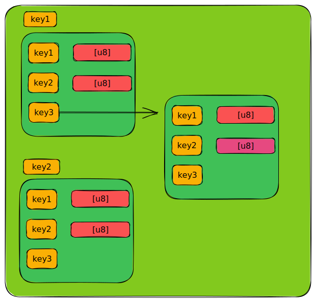

# dbfs设计

## 数据库



```
key1-bucket
		|key1-value
		|key2-value
		|key-bucket |key1-value
					|key2-value
					|key3-value
key-bucket
		|key-value
		|key-value
```

```rust
let db = DB::open::<FileOpenOptions, _>(Arc::new(FakeMap), "my-database.db").unwrap();
let tx = db.tx(true).unwrap();
let bucket = tx.create_bucket("file").unwrap();
bucket.put("name", "hello").unwrap();
bucket.put("data1", "world").unwrap();
bucket.put("data2", "world").unwrap();
let n_bucket = bucket.create_bucket("dir1").unwrap();
```

这里我们讨论的数据库是key-value类型的数据库，一般来说，key-value类型的数据库会提供最基本的键值对插入、删除功能，一些数据库会基于table构建，一些数据库有其它实现方式，本文讨论的是rust实现的`jammdb` 数据库，这是go语言实现的`boltdb` rust重写。此数据库的内部基于桶`bucket`实现。如上面所示，该数据库的基本结构由一个个处于全局空间的`bucket`组成，`bucket`可以存储普通的key-value数据，这里key和value都是[u8]数组，同时也可以存储嵌套的`bucket`数据结构。一个`bucket`是由一棵B+树构成，b+树将大小为4k或者其它大小的页面组织起来存储数据，这里的页面与传统的存储块类似，只是因为数据库使用内存映射而将存储结构设置为页大小。

## 为什么使用数据库构建文件系统

数据库和文件系统的功能逐渐交叉，两者存在很多借鉴，多数数据库依赖文件系统，但也存在一些数据库对文件系统的依赖没有那么强，即使那些依赖文件系统的数据库，在一些限定情况下，我们也可以消除这些依赖。基于数据库来实现文件系统：

1. 一方面可以大大简化文件系统的实现流程，因为数据库已经提供了一些丰富的功能，在强大的数据库中甚至包含了自己的缓存模块，而不去使用操作系统提供的缓存
2. 另一方面，数据库本身就包含一些有用的特性，例如完整的事务支持，要在文件系统中实现完整的事务支持是一件麻烦的事
3. 基于数据库的实现，可以在一定程度上统一目录和文件的差异。
4. 利用数据库的数据结构，可以对文件存储/访问/元数据扩展等开拓更有趣的功能

## DBFS设计：

这种设计是为了满足linux中VFS的路径解析算法，对于一个路径`/d1/dd1/f1`来说，VFS会依次解析`/`、`d1`、`dd1`、`f1`，即从根目录下查找得到目录`d1`，再从`d1`中查找得到目录`dd1`, 如果dbfs需要在vfs的框架下运行，就需要定义良好的数据结构从而可以完成查找文件/目录的功能。


上图是使用`jammdb` 数据库的数据结构对文件系统结构的设计图。

在上面所示的图片中,将文件或者目录都使用`bucket`这个数据结构表示，表示文件/目录的`bucket`的编号是唯一的，就像`inode_number`一样，这些`bucket`位于数据库的全局空间中而不是嵌套创建的，位于全局空间的这些`bucket` 在创建时其key就是一个只会递增的`usize`，从而保证了这些`bucket`的唯一性。嵌套的`bucket`可能会被用来存储其它信息，但也可能出于优化考虑不会使用，但保证不会用来标识一个文件/目录。

**说明：下文使用key-data表示存储的value字段是普通的[u8]数组，key-bucket表示出现一个嵌套的`bucket`.**

文件/目录的基础属性用key-data字段来存储，这些基础属性是uid/gid/ctime/atime等。对于文件/目录数据来说，可以使用key-data字段/key-bucket存储。

- 使用key-bucket的结构存储，如果引入这个结构，在表现形式是比较直观，但访问数据时将会发生跨页面的跳转，会导致性能出现下降，这与传统的文件系统实现类似。并且，由于使用bucket来表示一个文件/目录，而前文提到，一个bucket就代表一棵b+树，其至少会包含一个固定大小的存储页，如果这里将数据再放入嵌套的bucket中，将会出现这个bucket空间浪费的情况。

- 将其作为key-data字段，可以保证在文件较小时，文件的属性信息，存储的数据都位于同一个页面上，可以充分利用存储页。**因此这是一种较好的方案。**但是文件和目录存储的内容存在差异，因此如何将数据使用key-data存储起来，还需要更进一步讨论。

对于目录或者文件来说，其本质上来说没有区别，都只是存储数据的一个容器，只是按照传统的说法，目录存储的数据是其子目录或者子文件的索引信息，而文件存储的是用户实际想要存储的数据。bucket这个数据结构将文件和目录统一表示，两者存储的数据都是key-data对，一种直观的想法是:

1. 对于文件来说，其保存的是用户实际数据，那么它的字段可以是

   - `data: [u8]`, 但是如果这样存储文件数据，当文件发生写操作的时候，由于一般key-value数据库不会提供修改的功能，只有删除和添加的操作，因此对于大文件来说，修改就意味着先删除再插入的动作，相当于拷贝了两次数据，这是非常降低性能的操作。

   - `data1: [u8]` `data2: [u8]` `data3: [u8]` ,这种存储优化方式是对数据进行分片,将数据存储为一个个小片，每次对文件进行追加就插入一条`data{i} :[u8]`, 这里的i会一直递增。 但是这也会造成一种现象，即如果追加的数据很少，只有几个bytes, 那么新建一个key-data对就不划算了， 所以再进一步的优化是 规定一个`data` 存储一个固定大小的数据，比如512byte, 当追加数据的时候，如果最后一个`data{i}`未满512bytes 就在此基础上追加，否则就插入新的key-value对。这样每次修改的数据量就可以控制在可以接受的范围内。在这种设计下，当文件的读写发生在中间部分时，会出现数据跨key-value对的情况，但比起直接一个key-data存储文件数据，这种设计会减少很多不必要的开销。

2. 对于目录来说，其保存的是子文件/子目录，假设其包含文件f1,f2,子目录d1,那么它可以存储三个字段:

   `f1: 1`  `f2: 2`  `f3: 3`, 包含的文件名称作为key, 其对应的bucket 编号为 data，这种想法也很直观，但和文件的结构差别大了，我们可以换一种方式，使用

   `data{i}: f1:1`   `data{i}: f2:2`, 即把子文件的名称和其对应的bucket编号存在data字段中，而key字段就与文件存储一样用`datai`标识，只是对于目录来说，就不用考虑将data字段固定一个大小了，因为子文件/目录的名称不会很大，即使发生重命名操作，只需要先删除再添加就可以了。

3. 对于符号链接文件来说，其存储与上面两者类似，但其可能只需要一个`data: path`就可以了。

经过上述的分析，就可以确定文件/目录如何使用key-value组织内容了。

上述的这种设计可以方便地完成硬链接/软连接的实现。

为了完成上述的实现，可能需要一些额外字段的辅助，这时原本可能不需要在数据库中出现的超级块结构就有存在的必要了，比如对于全局空间递增的bucket编号，我们需要记录上一次使用DBFS文件系统后的编号，从而可以在下一次挂载时可以正确创建新的文件。上面对文件的数据存储规定的固定切片大小也可以保存在超级块结构中。而这个所谓超级块只需要一个bucket结构存储即可。


### 一些常见操作的实现

**create file/dir** : 数据库根据填充的`inode_number`的标识号找到对应的bucket, 添加一条`data{i}: f:number` 键值对，并创建一个新的bucket，填充属性信息与控制信息。

**mv file/dir** :  数据库根据旧目录的标识号找到对应bucket，从bucket中删除对应的`data{i}: f:number` ,在新目录下插入一条新的键值对, 新key-data的data字段的number是旧的number

**cp file/dir** ： 数据库根据源目录的标识号找到对应bucket，查找需要复制的文件的键值对，得到其唯一标识符后，再查找标识符得到文件的bucket。 在目标目录下插入一条键值对，新建一个bucket,填充信息，并将复制的文件的数据拷贝至新的bucket中。

**link/unlink:**  数据库根据源目录的标识号找到对应bucket，找到存储对应文件的key-data字段，读出其对应的bucket标识号，新建一条key-data字段存储这个标识号，根据标识号找到对应的bucket，修改保存硬链接数目的key-data字段。

这些操作与传统的文件系统没有太大的差别。只是在数据库中这些操作得到了简化，因为只是键值对的删除和插入操作。


## 对文件/目录统一的一些思考

上述的设计中，将普通文件/目录文件/链接文件都抽象为bucket的形式，文件相关的内容全部表示为键值对的形式，此时不同文件的表示已经初步得到了统一。此时可以更近一步，不再区分传统意义上文件/目录，**一个bucket就对应一个存储数据的载体**,用户可以认为这是一个普通文件，或是一个目录，或是一个链接文件，只需要在这个bucket存储一条key-value对，比如`type:Normal file`  `type:Directory` `type:Symlink` 来进行区别, 而**在传统文件系统中权限控制和属性列表 此时也可以全部交给用户指定( 注: 这里需要考虑是不是所有的内容都由用户控制，在现在的操作系统中，这显然是不行的，因为多用户系统就是为了进行权限控制，因此我们可以规定bucket存储一些操作系统规定的内容)**。用户可以在一个bucket中创建`author: linfeng`  `ctime:2023.1.1` 键值对以表明这个bucket的作者是linfeng,创建的时间是2023.1.1。如果用户想要插入数据，那么就在bucket中插入一条键值对，如果想要插入多条数据，那么用户就可以对这些数据做一个预处理保证键的唯一性（bucket的键是唯一的，一个简单的方法是唯一键生成方式可以是当前的时间）再将这些数据插入到bucket中。用户可以根据其保存数据时创建的key来对信息进行读取。

 bucket存储的内容全部交给用户管理，那么传统的文件系统结构就不存在了，传统的关于文件系统的系统调用语义也就不同了。当然我认为这是必然出现的事情，传统的文件系统相关调用，比如`ls` `cat` `read` `write`等隐含地表示了要操作的对象是文件或者是目录，而现在已经不存在这种区别了，那么统一的bucket表达形式如何完成这些系统调用想要完成的功能呢？这里有两种方式可以选择:

### 1. 使用统一的bucket模拟传统文件系统

这种方式就是上述dbfs的设计方式，这种设计方式可以完全按照传统文件系统的运行方式运行。但是可以看到，这个时候bucket存储的数据已经被设计者人为进行了一些限制，因为里面不同类型的bucket代表了不同的文件类型，用户只能对bucket进行规定的操作。

### 2.抛弃原有的系统调用以及其语义

如果不关注原有的系统调用，而是根据这种统一的设计设计新的系统调用，那么就应该关注用户在使用文件时想要做什么？需要做什么？在传统意义上，用户使用文件来保存数据，并且为了更好组织这些文件引入了目录，为了便利和资源的有效利用又引入了链接文件，这就是用户想要做的事情，保存数据的方式很简单，任何一种不太复杂的数据结构都可以成为文件用来保存数据，而引入目录之后，磁盘上存储的东西就不只是单纯的文件数据了，需要增加新的数据结构来适应这种变化，因此在目录中存储的数据就变成了目录项，用来指向文件的所在位置。而硬链接的引入则需要使得多个文件名指向同一份文件数据，这就需要一种标识使得文件数据变得唯一，inode的设计很好地完成了这个工作。这些用户想要的东西，在统一模型上如何实现呢？

#### 思路

上述文中提到，key-value数据库提供了`key-data`   和 `key-bucket` 的数据结构，这两种数据结构可以形成嵌套的结构。


- bucket不分类型，数据全部由key-value对构成，value可以是data([u8])，也可以是bucket，这个bucket可以是**全局空间的bucket.**，也可以是**局部嵌套的bucket**，上图中1、2、4指向的就是全局bucket，5指向的是局部嵌套的bucket, 两者的区别是全局的bucket需要一个标识进行间接跳转，比如1对应的'bucket1' 就是全局空间的bucket的标识， 而局部嵌套的不需要跳转，直接访问。创建哪种类型的bucket将由用户决定。

- <font color=red>我们将这些键值对分为叶子键值对与非叶子键值对, 叶子键值对只包含一种类型，即value为[u8]数组，且这个数组的信息没有指向一个全局的bucket(图中1位置)， 而非叶子键值对则说明这个value可能是一个bucket，也可能是指向全局空间中的bucket标识符</font>

- **bucket的一部分key-value将被操作系统固定，比如权限控制相关的uid/gid/xwr, 时间相关的atime/ctime/mtime,这些字段可以被用户修改或者访问，但是不允许删除掉，其它的key-value将交给用户来进行控制。**

- 除了系统控制的其它key-value对由用户进行解释，由于比如对一个`bucket0:file1` (在bucket0中key为file1) ， 用户需要传递一个函数以解释如何对这个key对应的value进行解释/操作，用户提供的函数形式为

  ```rust
  enum Para<'a>{
      Data(&'a [u8]),
      Bucket(bucket),
  }
  fn (p:Para,buf:&mut[u8])
  ```

  那么内核数据库中查找到这个key时，根据其value构建para并调用用户传递的函数并执行。

  对于这样bucket数据由用户进行解释的需求，是否可以将原来那些文件系统相关系统调用统一为一个系统调用？其形式大致是

  ```rust
  enum Para<'a>{
      Data(&'a [u8]),
      Bucket(bucket),
  }
  fn syscall_interpretate(path:&str,buf:&mut[u8],func:fn(p:Para,buf:&mut[u8]))
  // func: 桶/[u8]的解析函数
  ```

  此时原来那些系统调用完成的事情由用户提供的`func`完成。

  这里牵扯到的一个问题是是否保留传统文件系统中路径游走和缓存的概念，当然这里路径游走的概念与传统的有点细微差别，这里的含义是指用户解释一个级联键值对时是否需要一个类似vfs层的结构来缓存遇到的bucket结构，从而在下一次在访问这个bucket时加速查找而不是从头开始查找。因为在这个统一模型下，如果出现buckt级联的情况，那么当用户需要解释一个较长的键值对时，比如根据上图所示的: `bucket0:file2:fil2:data` 

  1. 不需要路径游走和缓存

     对于这个级联的键值对，从第一个bucket0开始查找，找到其key {file2} 对应的value， 上图中是'bucket2'，那么再查找全局空间中bucket2, 再找到其key {fil2} 对应的value {bucket4}, 再到全局空间查找到bucket4， 最后找到 key{data} 指向的数据

  2. 存在路径游走和缓存的概念

     内核空间中存在类似于vfs的数据结构，用以缓存bucket的信息，缓存的信息就是bucket中的键值对，在第一次访问时从磁盘上读取信息并缓存。那么对这个级联的键值对，就不需要每次到磁盘进行查找，可能只需要在内存中查找就可以得到。

  更近一步的，对于这些级联的key-value对，每一个分量的处理是一样的吗？从上述所说肯定是不一样的，比如 级联对`bucket0:file2:fil2:data` ，如果用户提供的处理函数是对应这个data对应的数据，那么前面的`:file2:file2`系统又应该如何解释呢，**需要让用户把每一级的处理函数都提供吗?**这里就存在一个**默认实现** 的问题，因为要存在这种级联的键值对处理，说明用户中间那些键值对就是**非叶子键值对**，那么在对这种级联键值对处理时，中间的键值对处理按照进入下一个bucket处理。用户提供的处理函数只针对最后一个叶子键值对分量，这样可以一定程度上减少用户的负担。

  

  那么考虑到默认实现，我们是否可以为用户提供一些现成的，简单的处理函数使用呢，因为很多时候用户可能就是想看一下这个key对应value是什么，那么只需要一个简单的打印字符串或者打印[u8]数组函数。比如我们可以提供下面这种简单的函数:

  ```rust
  fn print_value_with_string(para) //将value解析为字符串打印
  fn print_value_with_u8array(para) //将value直接打印不解析
  fn read_data(para,buf) // 读取value的内容到buf中
  fn write_data(para,buf) // 修改value的内容
  
  fn add_key_data(para,buf) //插入一条新的叶子键值对
  fn add_bucket(para,global:bool) //插入一个非叶子键值对
  fn delete_key(para) //删除一条键值对
  
  fn step_into(para) // 进入value所对应的bucket
  ```

  对于级联对`bucket0:file2:fil2:data` 来说，处理时中间分量默认使用`step_into` ，末尾分量由用户定义的函数处理。

### 3.统一语义与DBFS相结合

<font color=red>为了与传统的文件系统兼容，统一模型仍然需要找到合适的方式适应VFS, 或者说做一个胶水层，将传统的VFS层与这个模型糅合起来(flatfs启发)，不管那种方式，都有点点丑陋。</font>

另一种方案是利用上面设计的DBFS与统一语义结合。可以看到，DBFS应该是统一模型中的一个子集，通过对统一模型进行限制，就可以变成DBFS, 那么这就带来一个好处，我们可以在数据库之上构建DBFS以满足应用程序的传统文件系统需求，并暴露一些系统调用，当用户使用原有的文件系统相关系统调用时，默认使用DBFS完成功能，而当用户调用**扩展的系统调用**时，我们将按照统一模型进行处理。当然用户也可以直接忽略DBFS的存在，而完全使用统一模型的思路，这当然是更好的。

不过这里的一个待解决问题是由于DBFS已经占用了一些key-value对，比如以“data”开头的存储数据的那些键，用户在即使用DBFS又使用统一模型的情况下，可能会造成**键冲突**，因此需要考虑是否可以对DBFS部分的那些key做混淆，使用一些在用户定义的key中不太会出现的字符进行标识？这样用户在使用统一模型时就能减少一部分键冲突。


### 存在的问题与解决方法

上面提到，我们将存储的数据交给用户进行解释，因此系统调用中的参数是来自用户，但是这个方案会带来一些问题

- 安全问题，由用户定义的函数如何在内核安全运行？这里似乎没有方案可以检测用户函数的合法性和正确性。

#### 解决方法1

这个问题尤为重要，因为非法的用户程序将会破坏内核环境。这里的一个想法是不允许用户自行实现处理函数，而是内核提供一些**基元函数**，用户只能使用这些基元函数或其组合对数据进行操作。因为从上面的讨论中可以看到，用户对bucket的存储只有叶子键值对和非叶子键值对的区别。而对叶子键值对的操作无非是delete/read/write/add ，对非叶子键值对的操作也是仅限于delete/step into/ add ，基于这个假设，操作系统提供这些基元函数，这些基元函数其实就是上文中提到的为用户默认提供的一些函数翻版。

```rust
pub struct RenameKeyOperate {
    pub old_key: String,
    pub new_key: String,
}
pub struct AddKeyOperate {
    pub map: BTreeMap<String, Vec<u8>>,
}
pub struct AddBucketOperate {
    pub key:String,
    pub other:Option<Box<OperateSet>>
}
pub struct StepIntoOperate {
    pub key:String,
    pub other:Option<Box<OperateSet>>
}
pub struct DeleteKeyOperate {
    pub keys: Vec<String>,
}
pub struct ReadOperate {
    pub keys: Vec<String>,
    pub buf_addr: usize,
    pub buf_size: usize,
}
pub enum Operate {
    RenameKey(RenameKeyOperate),
    AddKey(AddKeyOperate),
    AddBucket(AddBucketOperate),
    DeleteKey(DeleteKeyOperate),
    Read(ReadOperate),
    StepInto(StepIntoOperate),
}

pub struct OperateSet {
    pub operate: Vec<Operate>,
}
```

对于用户来说，处理数据的需求是复杂的，似乎没有办法在内核为其提供足够的基元函数来完成数据处理，所以我们只能提供一些粒度适中的函数，既能让用户可以对数据有更多的处理，又不需要运行用户自定义处理函数。**这种方案会降低用户对数据的掌控能力，在对数据进行更细的操作就不太行了。**

**example**

```rust
let addkey_operate = AddKeyOperate::new()
        .add_key("name", b"hello".to_vec())
        .add_key("data1", b"world".to_vec())
        .add_key("data2", b"world".to_vec());
let buf = [0u8; 20];
let read_operate = ReadOperate::new()
        .add_key("name")
        .add_key("data1")
        .add_key("data2")
        .set_buf(buf.as_ptr() as usize, 20);
let mut add_bucket = AddBucketOperate::new("dir1",None);
let add_operate = AddKeyOperate::new()
                .add_key("uid",b"111".to_vec())
                .add_key("gid",b"222".to_vec())
                .add_key("mode",b"333".to_vec());

let add_bucket1 = AddBucketOperate::new("dir2",None);
let operate_set = OperateSet::new()
                .add_operate(Operate::AddKey(add_operate))
                .add_operate(Operate::AddBucket(add_bucket1));
add_bucket.add_other(Box::new(operate_set));

let operate_set = OperateSet::new()
        .add_operate(Operate::AddKey(addkey_operate))
        .add_operate(Operate::AddBucket(add_bucket))
        .add_operate(Operate::Read(read_operate));

execute_operate("test", operate_set);
```

如果将上述这段代码等效为用户可能会实现的函数，其形式大概如下：

```rust
fn equal(buf:&mut [u8]){
    let db = DB::open::<FileOpenOptions, _>(Arc::new(FakeMap), "my-database.db").unwrap();
    let tx = db.tx(true).unwrap();
    let bucket = tx.get_bucket("test").unwrap();
    bucket.put("name", b"hello".to_vec()).unwrap();
    bucket.put("data1", b"world".to_vec()).unwrap();
    bucket.put("data2", b"world".to_vec()).unwrap();
    let mut start = 0;
    let v1 = bucket.get_kv("name").unwrap();
    let min = min(v1.len(), buf.len() - start);
    buf[start..start + min].copy_from_slice(&v1[..min]);
    start += min;
    let v2 = bucket.get_kv("data1").unwrap();
    let min = min(v2.len(), buf.len() - start);
    buf[start..start + min].copy_from_slice(&v2[..min]);
    start += min;
    let v3 = bucket.get_kv("data2").unwrap();
    let min = min(v3.len(), buf.len() - start);
    buf[start..start + min].copy_from_slice(&v3[..min]);
    start += min;

    let dir = bucket.create_bucket("dir1").unwrap();
    dir.put("uid", b"111".to_vec()).unwrap();
    dir.put("gid", b"222".to_vec()).unwrap();
    dir.put("mode", b"333".to_vec()).unwrap();
    dir.create_bucket("dir2").unwrap();
}
```


#### 解决方法2

利用Linux中的一些特性，e-BPF以及其它一些项目似乎有办法在内核执行用户定义的函数。


### 一些传统操作在这个统一模型上的体现

**create** : 传统的文件系统中这个操作一般用于创建文件，统一模型中则对应于创建一个key-value对，这个键值对可以表达用户的任意想法，当用户只是简单地为这个存储桶添加一条信息时，其可以使用`add_key_data` ,当用户决定要存储的东西有点复杂了，可能向在另一个存储桶中来组织，那么就可以使用`add_bucket`来创建一个，并稍后往桶内添加内容。

```rust
fn add_key_data(para,buf) //插入一条新的叶子键值对
fn add_bucket(para,global:bool) //插入一个非叶子键值对
```

**move** : 传统文件系统中move用户移动文件或者目录，在统一模型下，则可能表达了用户想要从一个bucket中将数据移到另一个bucket中，

**rename** : rename在传统文件系统中，因为有inode和目录项的抽象，rename操作只会修改目录项的内容，而在统一模型下，rename表达了修改key的需求，如果key-value模型不提供修改功能，即只有删除和添加操作时，rename操作将会损害性能，尤其在其存储的数据很大时更为严重，因为这个操作将等价于删除和添加两个操作。

在统一模型上使用传统文件系统的操作是不太直观的，那么这时DBFS的作用就显现出来，毕竟DBFS就是为传统操作而设计。


### 应用场景

1. 元数据扩展： 用户可以向文件轻易添加/删除/修改/读取元数据信息。
2. 简化文件的读取

因为使用key-value来存储数据，因此用户可以只读取bucket中的特定数据，一个典型的例子是在一个服务器上，当客户端需要读取一个服务器上的日志文件时，可能用户只想读取某个时段的内容，但是在传统的文件系统上，就必须把整个文件下载到本机，再处理其中需要的部分。但是对于统一模型来说，用户可以在读取文件时就可以选择要读取的部分。

3. 存储结构化数据

传统的文件系统存储数据时并不关注数据是什么，对文件系统来说只是二进制数据而已，文件系统无法感知存储的内容，但是在数据库中，已经对数据有了一定的感知能力，用户可以数据怎么存储有更多的控制。

### 在dbfs的设计中实践统一模型

- 首先完成DBFS的实现，这是与VFS沟通的部分
- 扩展功能将不会经过VFS层而直接到达数据库层。


## 实验

1. 如何为dbfs实现mmap

jammdb是使用mmap调用映射文件到内存中，而这块内存是只读并且操作系统会同步文件的更改到这块内存中。在内核中我们是否有必要去调用mmap这个接口呢？我们直接将设备抽象为了一个文件，这个过程中已经引入了缓存，那我们可以直接利用这个缓存，而不用使用mmap的接口，这样一来，既可以省去多余的内存映射开销，也可以省去同步的麻烦。

```rust
pub struct CacheLayer {
    device: Arc<QemuBlockDevice>,
    lru: LruCache<usize, FrameTracker>,
}
```

这个`CacheLayer` 使用`LRU` 的方式缓存数据，并直接从页帧分配器中分配物理页来进行缓存。

2. 如何为fat32实现缓存

为了尽可能提高fat32的读写效率，也需要为fat32实现缓存，两者目前的缓存实现的差异在于fat32的缓存是按照512字节大小来对齐，但两者总的缓存大小是相同的。为了公平性，应该保证两者的一致性。

### 顺序读写测试

### 顺序写测试

操作: 打开文件并持续向文件内写入1MB大小的数据，统计时间

现象:

两者没有差距，有时候dbfs会优于fat32一点点。

### 顺序读测试

操作：打开文件先持续写入1MB大小的数据，再持续读取1MB大小的数据

现象：dbfs会是fat32的4倍状态

### 问题：为什么会这样？

对于上面两个测试，在理论上来说，不管是读还是写，都是在缓存中操作的，应该来说，在顺序读上两者差异也不会很大，但是这里却发生了几倍的差距。而且结果显示了fat32的顺序读写性能相差不大。

那就是说，fat32在两种测试中都会表现出较差的性能，在顺序写的过程中，dbfs会带来较大的开销，从而导致这个开销与fat32的开销差不多，所以两者在写操作中的性能会相差不大，但是在读测试中，dbfs不会带来大的开销，而fat32仍然会与写一样有较大的开销，因此在读上dbfs会更优。

**fat32的开销应该来自于其频繁读写数据，seek操作。**


## 参考资料

[数据库作为文件系统 [视频\] |黑客新闻 (ycombinator.com)](https://news.ycombinator.com/item?id=20394088)

[zboxfs/zbox: Zero-details, privacy-focused in-app file system. (github.com)](https://github.com/zboxfs/zbox)

redisfs：[Replication-Friendly Redis-based filesystem (steve.fi)](https://steve.fi/software/redisfs/)

[filesystems - Why do hard links exist? - Unix & Linux Stack Exchange](https://unix.stackexchange.com/questions/20670/why-do-hard-links-exist)

[linux文件系统权限管理 - 简书 (jianshu.com)](https://www.jianshu.com/p/190cbc9b23f8)

[boltdb 源码分析 - 我叫尤加利 (youjiali1995.github.io)](https://youjiali1995.github.io/storage/boltdb/)