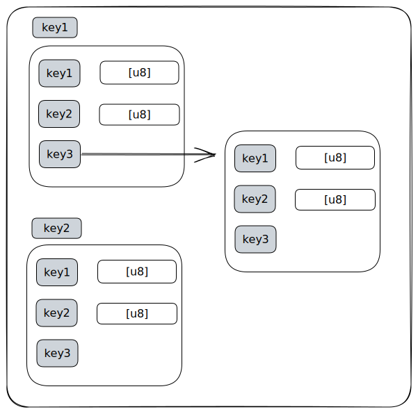

# 基于数据库的文件系统设计与实现
- [基于数据库的文件系统设计与实现](#基于数据库的文件系统设计与实现)
  - [摘要](#摘要)
  - [第一章 绪论](#第一章-绪论)
    - [1.1 研究背景](#11-研究背景)
    - [1.2 国内外研究现状](#12-国内外研究现状)
    - [1.3 研究目的和意义](#13-研究目的和意义)
    - [1.4 主要工作内容](#14-主要工作内容)
    - [1.5 文章结构](#15-文章结构)
  - [第二章 相关理论与方法](#第二章-相关理论与方法)
    - [2.1 数据库](#21-数据库)
    - [2.2 Linux内核与文件系统](#22-linux内核与文件系统)
    - [2.3  数据库文件系统实现技术与方法](#23--数据库文件系统实现技术与方法)
    - [2.4 编程语言](#24-编程语言)
    - [2.5 本章小结](#25-本章小结)
  - [第三章 DBFS设计与实现](#第三章-dbfs设计与实现)
    - [3.1  数据库结构的分析](#31--数据库结构的分析)
    - [3.2 元信息管理与目录树构建](#32-元信息管理与目录树构建)
    - [3.3 文件数据存储](#33-文件数据存储)
    - [3.4 DBFS接口设计](#34-dbfs接口设计)
    - [3.5 数据库接口导出  (==是否删除掉？感觉没有必要写在这里==)](#35-数据库接口导出--是否删除掉感觉没有必要写在这里)
    - [3.6 小结](#36-小结)
  - [第四章  Fuse与Alien OS](#第四章--fuse与alien-os)
    - [4.1 linux用户态DBFS-Fuse实现](#41-linux用户态dbfs-fuse实现)
    - [4.2 Alien OS](#42-alien-os)
      - [4.2.1 VFS](#421-vfs)
      - [4 .2.2 DBFS 内核移植](#4-22-dbfs-内核移植)
    - [4.3 小结](#43-小结)
  - [第五章 测试与改进](#第五章-测试与改进)
    - [5.1 测试指标与其它文件系统](#51-测试指标与其它文件系统)
    - [5.2 测试环境和准备](#52-测试环境和准备)
    - [5.3 pjdfstest POSIX兼容性测试](#53-pjdfstest-posix兼容性测试)
      - [测试结果](#测试结果)
      - [结果说明](#结果说明)
    - [5.4 mdtest 元数据性能测试](#54-mdtest-元数据性能测试)
    - [5.5 fio读写性能测试](#55-fio读写性能测试)
    - [5.6 webserver 和 mail server](#56-webserver-和-mail-server)
    - [5.7 性能优化](#57-性能优化)
      - [1. flush+sync\_all](#1-flushsync_all)
      - [2. 固定文件大小](#2-固定文件大小)
      - [3.调整块大小](#3调整块大小)
  - [第六章 结论](#第六章-结论)
    - [6.1 总结和归纳](#61-总结和归纳)
    - [6.2 研究贡献](#62-研究贡献)
    - [6.3 未来工作展望](#63-未来工作展望)
  - [参考文献](#参考文献)
  - [素材](#素材)


## 摘要

文件系统在发展过程中一直在借鉴数据库的相关特性，诸如日志、事务、高效索引机制等。但在一个新的文件系统中引入这些特性是一个复杂且容易出现错误的挑战，一方面这些特性本身就需要复杂的数据结构和算法支撑，另一方面，这些特性需要在文件系统投入使用前进行完整的测试和分析。而在数据库中，这些特性是其本身就具备的，并且已经经过了长时间的实际应用得到了检验。如何将数据库的功能与文件系统进行有机结合是一直是一项复杂但有潜力的工作。目前大多数的解决方案集中于将数据库的特性移植到文件系统中，只有少部分的工作在探索如何将两者进行深度融合，以达到充分利用数据库功能的效果。在此基础上，本文选择基于键值数据库设计一个文件系统，探索如何平衡两者之间的差异，并充分利用数据库中的数据结构构建一个高效的、可扩展的的文件系统结构。本文基于数据库jammdb实现了一个数据库文件系统(DBFS), 并将其移植到了一个自行编写的操作系统Alien OS内核当中，同时为其实现了linux的fuse用户态接口。

本文的实验结果表明，DBFS的实现符合POSIX文件系统语义，并通过了其92%的测试。在元数据密集型测试中DBFS充分利用了数据库的高效数据结构，在文件查找、目录搜索等操作上达到了与常见的ext文件系统同一水平，DBFS同样将数据库的事务特性融入到文件系统实现当中，使其在一些原子性操作上领先常见的文件系统。在读写性能测试中，得益于数据库的缓存机制，DBFS也有不错的表现。总体而言，基于数据库的文件系统在保证了同时具有文件系统和数据库功能的前提下，大大简化了文件系统的开发难度，提高了文件系统的可扩展性。


**关键词： 文件系统、数据库、操作系统、DBFS、fuse、Alien OS**


## 第一章 绪论

### 1.1 研究背景

计算机的文件系统是一种存储和组织计算机数据的方法，它使得对数据的访问和查找变得容易，文件系统使用文件和树形目录的抽象逻辑概念代替了硬盘和光盘等物理设备使用数据块的概念，用户使用文件系统来保存数据而不必关心数据实际保存在硬盘（或者光盘）的地址为多少的数据块上，只需要记住这个文件的所属目录和文件名。在写入新数据之前，用户不必关心硬盘上的哪个块地址没有被使用，硬盘上的存储空间管理（分配和释放）功能由文件系统自动完成，用户只需要记住数据被写入到了哪个文件中。随着时间的推移，存储需求不断变化，数据量不断增加， 文件系统必须是可靠的、持久的、安全的、高效的、容错的和可扩展的，[^1] 为了实现这些特性并跟上不断变化的计算需求和存储需求，不同的技术和文件系统随着时间的推移而被引入到操作系统中，但是绝大多数的文件系统实现仍然采用的是树状层次结构，提供给用户的接口仍然是`open`,`read/write`等。

在文件系统快速发展的同时，数据库系统同样也在随着需求的不断变化而快速迭代。数据库是以电子方式存储的系统数据集合，它可以包含任何类型的数据，包括文字、数字、图像、视频和文件。这些数据按一定的数据模型组织、描述和存储，具有较小冗余度、较高数据独立性和易扩展性，并可为各种用户共享。通常，数据库的实现以文件系统为基础，所有的数据库操作，如增删改查、备份等最后都会转换为对磁盘上文件的操作，但有时数据库并不想受到文件系统实现带来的影响，一个广泛的现象是许多数据库系统的实现都会包含一个缓存模块，以此来提高其性能和可靠性。除了一直占据主要地位的大型关系型数据库系统，如Mysql、SQLserver等，近年来也出现了一些嵌入式数据库和许多nosql数据库，这些数据库与传统的数据库相比，其对系统资源的占用更小，如sqlite，其与应用程序运行在同一个地址空间中，而不是像Mysql那样存在服务器端和客户端的区别，同时，新兴的nosql数据库虽然功能不如传统的大型关系型数据库完善，但根据需求的变化，这些nosql数据库在一些专有领域也有着不错的表现。

从数据库和文件系统的发展来看，两者是在互相改进，共同发展，从两者的功能来看，他们都是存储数据的一种管理方式。既然两者的功能如此相像，那一个值得思考的问题就是为什么大多数的数据库系统实现以文件系统为基础，而不能反其道而行之？文件系统的实现者是否可以重用数据库的基础设施以获得数据库提供的强大能力和更多特性。更近一步地，文件系统的实现是否可以完全在一个数据库系统提供的接口上进行。

### 1.2 国内外研究现状

早期，数据库系统的基础是底层的文件系统，许多管理数据的特性都只是在数据库系统上得到体现，而近年来，文件系统的设计开发中越来越借鉴了数据库相关技术的思想，二者不断融合发展。日志文件系统就是在借鉴数据库系统的日志和事务特性之后发展出的一种文件系统。在对文件系统进行修改时，需要进行很多操作，比如在扩展一个文件的大小时，需要对文件的元信息和磁盘元信息都需要修改，这些操作可能中途被打断，但是，理论上这些操作不是不可中断的。如果操作被打断，就可能造成文件系统出现不一致的状态，虽然可以使用一些工具对这些情况进行修复，如fsck，但这些工具在修复时需要扫描整个磁盘，繁琐且速度较慢。日志文件系统在修改磁盘数据时利用日志信息记录修改过程，如果文件系统发生崩溃，重启后只需要根据日志信息就可以恢复数据从而保证数据的一致性和完整性。发展较早的日志文件系统JFS [@]、XFS[@]如今在某些系统上仍然广泛使用。而较新的Btrfs[@]、Ext4[@]、NTFS[@]等具有日志功能的文件系统在服务器系统与桌面系统上占据着主要地位。除了对数据库的日志和简单事务的借鉴之外，许多适应新需求的文件系统实现在设计中会直接包含事务ACID特性的设计，exF2FS[@]是一个事务性的日志文件系统，其允许事务跨越多个文件，应用程序可以显式指定与事务关联的文件，同时其允许使用少量内存执行事务并在一个事务中封装多个更新。DurableFS[@]提供了一种受限制的事务形式：文件打开和关闭之间的操作自动形成具有原子性和持久性保证的事务。

一些文件系统的实现不再局限于在文件系统的设计上引入数据库系统的特性，而是选择直接基于数据库系统进行文件系统的实现，考虑到数据库系统提供的特性的实现复杂度，这种方案在实施难度上要远远小于重新设计文件系统。IFS[@]是一个基于关系型数据库`POSTGRES`实现的文件系统，其向用户提供事务特性以及时间旅行功能，同时其使用多张关系表来构建层级文件系统以最大限度地支持传统POSIX接口。

Oracle iFS[@]是一个运行在数据库之上的文件系统，实质上，Oracle iFS 提供了文件系统和数据库之间的范式转换，同时提高了一些高级搜索和数据备份功能。国内学者[@]将Oracle iFS移植到linux的VFS模块中使得用户对其使用就如原有的文件系统一样，并且将基于内容分类、关联访问、基于内容的访问、版本控制等功能扩展到VFS中。AMINO[@]是一个具有ACID语义的文件系统，其使用Berkeley Database作为后备存储，将一个易于使用但功能强大的嵌套事务API导出到用户空间。 应用程序可以开始、提交和中止事务，同时其设计了一个简单的API，使协作进程能够共享事务。 使用相同的API，单个应用程序可以支持多个并发事务。该文件系统不仅为应用程序提供了ACID的额外好处，在性能方面也与ext3相当。

### 1.3 研究目的和意义

基于数据库的文件系统设计与实现，是一个基于数据库技术的文件系统实现方案。其可以利用数据库的高效管理和查询能力来存储和管理文件数据，能够更好地支持大规模、多类型数据的管理和查询。此外，基于数据库的文件系统还能够支持多用户、多任务的并发操作，提高系统的可靠性和性能。本研究旨在通过将文件系统和数据库系统相结合，充分发挥两者的优势，实现高效、可扩展、易管理的文件存储与管理系统。具体地，通过将文件和相关的元数据存储在数据库中，利用数据库系统的索引机制实现高效的文件检索和访问，同时设计文件在数据库中的存储方式，实现文件的高效存储和管理，在用户态，我们也提供数据库操作的直接抽象使得用户也可以直接使用数据库的接口进行数据的存储和访问，这种设计不仅可以提高系统的性能和可扩展性，还可以提高系统的可靠性和安全性。

基于数据库的文件系统设计与实现的研究具有重要的理论和实际意义。它可以为用户数据管理和存储提供一种新的解决方案，同时还能扩展文件系统的功能。

### 1.4 主要工作内容

基于数据库的文件系统设计与实现的主要工作内容是将数据库的存储和管理思想结合到文件系统中，设计并实现一个具有数据库特性的文件系统，实现对文件的高效管理和查询以及存储。具体研究内容包括：

1. 数据库技术与文件系统结合：将数据库的基本概念、数据结构、数据存储和管理技术与文件系统的数据组织、存储和访问方式相结合，构建一个具有数据库特性的文件系统。
2. 文件管理与查询优化：设计文件系统，包括文件的存储、读取、修改、删除等操作，并优化文件的查询性能，通过对文件元数据的索引和优化算法等手段，实现对文件的快速查询和检索。
3. 数据一致性与事务管理：研究文件系统和数据库之间的数据一致性问题，实现事务管理功能，确保数据的完整性和一致性。
4. 安全性与权限管理：根据linux系统的文件权限检查机制，在文件系统中实现相关的检查逻辑，保证文件系统具有正确的安全性。
5. 系统实现与性能测试：基于上述研究内容，设计并实现一个完整的基于数据库的文件系统原型，并进行性能测试和优化，验证其可行性和实用性。

本项目的所有实现使用`rust`语言完成，在实现中，本文没有选择功能强大的数据库来作为文件系统实现的底层支持，而是选择了 一个简单的`key-value`数据库。同时，因为使用`rust`来完成所有实现，而将这些实现直接放到`linux`中目前还不可行，因此本文为此实现了一个简单的类linux操作系统，并将dbfs移植到此系统上。同时为了获得它的性能数据和实现的正确性，本文在linux系统上为数据库文件系统实现了fuse的接口，并使用几个常见的性能测试工具以及几个常见的文件系统进行了测试。


总的来说，本项目总共会包含以下几个项目:

1. Alien: 使用`rust`实现的简单类linux操作系统，验证将数据库文件系统移植到操作系统内核的可能性。
2. jammdb: key-value数据库，本文选择使用的数据库。
4. rvfs: rust写的vfs框架，主要参考linux中的vfs。
5. dbfs: 本文设计实现的数据库文件系统，同时包含了用户态fuse实现。
6. dbop: 数据库操作抽象，一种在操作系统中导出数据库接口的方法

### 1.5 文章结构

本文的结构安排如下：

第一章，给出本课题的研究背景和意义，并概述国内外的研究现状，本文的主要工作内容以及文章的写作结构。

在第二章，介绍数据库、文件系统、操作系统内核以及数据库文件系统相关的领域知识以及这些系统如何协同工作，同时说明本文选择的编程语言。

在第三章，详细介绍本次实现的数据库文件系统使用到的数据库，以及整个数据库文件系统的架构和设计方案。

在第四章，介绍数据库文件系统的fuse接口适配，以及将数据库文件系统接入到操作系统内核的方案。

在第五章，对本文所设计的系统进行实验测试，以评估其性能和可靠性，以及与其他相关系统进行比较分析，主要的测试讨论位于用户态的fuse实现，并简要介绍接入内核的测试。

在第六章，总结全文，并指出未来进一步的研究方向。


## 第二章 相关理论与方法

本章介绍了本项目设计到的相关理论和方法，并对数据库文件系统的实现技术进行深入研究和总结。2.1节主要介绍数据库系统的一些概念，比如事务，索引，缓存，并发等；2.2节主要介绍操作系统和文件系统的关系，文件系统在内核中扮演的角色，并详细介绍VFS的数据结构与方法；2.3节介绍数据库文件系统的实现技术和方法，阐述将数据库作为文件系统存储引擎并将其移植到内核中的困难之处。

### 2.1 数据库

在计算机应用中，数据是非常重要的资源，其管理和处理对应用系统的正常运行和业务发展至关重要。但是，传统的数据处理方式往往是以文件为基础的，这往往会导致许多问题：

1. 数据格式不统一：以文件方式组织的数据在逻辑上更简单，但可扩展性差，访问这种数据的程序需要了解数据的具体组织格式，这就导致面对不同的数据应用程序就需要实现不同的读取方法。
2. 数据冗余：同一份数据可能会被存储在不同的文件中，导致数据冗余，增加数据存储和维护的成本
3. 数据不一致：当多个应用程序同时修改数据时，可能会导致数据不一致，出现错误或者异常情况
4. 数据共享困难：文件系统无法提供有效的数据共享机制，导致数据共享困难，降低了系统的协同处理能力

为了解决这些问题，做到像操作系统屏蔽硬件访问复杂性那样，屏蔽数据访问的复杂性，数据库应运而生。数据库通过不同的数据模型，设计出不同的数据结构，通过使用诸如表、视图、访问控制、日志等技术在一定程度上解决了文件系统存在的问题。

数据库除了可以解决这些问题，自身也包含许多实用的特性：

**事务(Transaction)**： 

事务是指一个或多个数据库操作（如插入、更新、删除等）的逻辑单元，是数据库中数据一致性和完整性的保证。在一个事务中，所有操作要么全部执行成功，要么全部失败回滚，不会出现部分操作成功、部分操作失败的情况。

事务必须具备以下四个属性，也称为ACID属性：

1. 原子性（Atomicity）：事务中的所有操作要么全部执行成功，要么全部回滚失败，不会出现部分操作成功的情况。

2. 一致性（Consistency）：事务执行前后，数据必须满足一定的约束条件，如主键唯一性、外键关联等，简单来说，就是数据库随着状态的转移，需要始终保证其正确性。

3. 隔离性（Isolation）：并发访问数据库时，事务之间是相互隔离的，一个事务执行过程中对其他事务不会产生影响。

4. 持久性（Durability）：事务执行成功后，对数据库的修改是永久性的，即使系统故障或者机器崩溃，也不会影响已提交的事务。

事务的存在可以有效地维护数据库数据的一致性和完整性，避免数据的冲突和丢失。

**索引和缓存：**

数据库中往往都会包含索引和缓存结构，这两个结构是提高数据库查询速度和性能的关键因素。索引类似于图书馆中的书目索引，在数据库中可以通过关键字快速定位到需要查询的数据。数据库索引可以分为多种类型，例如B树索引、哈希索引、全文索引等。其中，B树索引是最常用的一种索引类型，它可以对关键字进行排序，并且支持范围查询。索引可以加速数据库的查询操作，但是也会增加数据的存储空间和维护成本。

缓存结构通常位于内存中，用来缓存数据库中的数据和索引等重要信息。缓存可以避免频繁的磁盘读写操作，减少磁盘I/O操作的开销。在数据库系统中，缓存通常由多级缓存组成，包括文件系统缓存和数据库缓存等多种类型的缓存。一些数据库也会直接绕过操作系统提供的缓存，直接在数据库系统中维护自己的缓存结构。如何保持缓存数据的一致性、如何正确清理缓存等是缓存结构的主要任务。

**并发：**

文件系统中并不提供专门的并发控制机制，对文件的并发访问由操作系统来进行控制，不仅并发粒度大，而且难以保证数据的一致性。数据库往往具备更细的并发粒度和更强的并发控制能力。常见的并发粒度有数据行、数据表、数据页、数据库等，通过支持不同级别的并发力度，应用程序可以大大提高其并行效率。常见的并发控制策略有锁，版本控制，事务等。


### 2.2 Linux内核与文件系统

Linux内核与文件系统密不可分，文件系统是内核的一个重要组成部分。Linux内核中实现了各种文件系统的支持，例如EXT4、XFS、Btrfs、NTFS等。文件系统的主要作用是管理文件和目录，提供文件的读写、创建、删除等操作，以及对文件的安全保护和权限控制。

Linux内核中实现了通用的VFS（Virtual File System，虚拟文件系统）层[^2]，所有文件系统都要实现VFS接口，以便于内核能够统一管理和访问各种不同类型的文件系统。VFS层提供了一系列的文件系统操作函数，如打开、关闭、读写文件等，这些操作函数可以被上层应用程序和系统调用使用。在VFS层之下，每个具体的文件系统都有自己的实现，根据具体的文件系统类型提供相应的文件操作接口。

vfs定义了一套统一的数据结构，底层的文件系统通过这些数据结构支持vfs，其主要的结构如下：

1. SuperBlock：超级块存储文件系统的元数据，包括文件系统类型，名称，挂载点，这些信息用于操作系统正确识别文件系统，其还保存文件系统的使用情况，磁盘空间剩余量。
2. Dentry：用于表示文件系统树中的一个目录项，其记录了文件或目录在文件系统树的位置，通过遍历父目录，可以得到文件或目录的绝对路径。同时，dentry还缓存最近使用的子目录项，管理文件系统的锁，并负责完成文件系统的挂载。
3. Inode：用于表示文件系统中的一个文件。每个文件在文件系统中都有一个唯一的`Inode`结构体与之对应。其记录了文件在磁盘上的属性和元信息，是磁盘文件在内存中的映像。
4. File：`File`是用来表示打开的文件的数据结构，其包含了文件的访问模式、当前读写位置、对应的`Inode`等信息。每当用户打开一个文件时，内核就会为该文件创建一个`File`结构体，并将其作为文件句柄返回给用户程序。用户程序可以使用该文件句柄对文件进行读写、关闭等操作。

本文实现的文件系统DBFS想要接入到linux内核当中，就需要支持上述提到的数据结构和方法。

### 2.3  数据库文件系统实现技术与方法

有关数据库文件系统的研究集中在2006年windows提出winfs之际，大多数的数据库文件系统实现方案是在数据库之上封装一个文件系统的接口层，使得用户访问数据库时按照使用普通文件系统一样方便，这种方案主要用于远程服务器上，这种方案的好处是降低用户使用数据库的心智负担，但其并没有从本质上使用数据库来改进文件系统。另外一些流行的方案是从数据库中借鉴相关设计思路，并应用在文件系统的实现当中，这种方案一定程度上获得了数据库的好处，但仍然不够彻底，而且需要在文件系统实现数据库中已经具备且实现正确的复杂算法，引入了不必要的工作。一种能最大限度利用数据库的文件系统实施方案是，直接将数据库作为数据引擎，并在其上构建文件系统。

具体而言，这种方案需要一个功能强大的数据库，并且这个数据库的架构最好是类似于sqlite的单机数据库，因为诸如MySql或者Sqlserver这种C/S架构的数据库，是无法将其移植到linux这种宏内核架构当中的。有了数据库之后，可以按照以下步骤来完成数据库文件系统 (DBFS)：

1. 因为数据库一般位于用户态，依赖操作系统提供的系统调用，因此第一步就是分析数据库对操作系统的依赖，并将依赖最小化。
2. 第二步，将数据库的接口依赖转换为内核函数的依赖，这一步尤为重要，因为数据库一般会以来操作系统提供的文件系统接口，但是此时数据库作为引擎需要直接管理底层的存储设备，因此需要考虑如何将对文件的操作转换为对底层设备的操作。
3. 第三步，在将数据库从用户态移植到内核中之后，此时可以按照数据库的提供的接口和数据结构来设计文件系统，这包含了使用数据库结构表达文件系统的目录结构，存储文件元数据与实际数据，充分利用数据库提供的数据结构和算法有助于提升文件系统实现的性能。
4. 第四步，适配linux的VFS，使得DBFS可以与其他文件系统一起由vfs结构统一管理。
5. 第五步，测试DBFS的正确性和性能。

这些是完成DBFS所需要的必要步骤，但直接在内核实现和测试文件系统可能存在一定的困难，一种可行的方案是在用户态实现DBFS，使用普通文件模拟存储设备并使用用户态的测试工具集对其进行测试，在经过检验之后再将DBFS移入内核。

### 2.4 编程语言

本文所包含的所有项目均使用rust实现。在涉及到操作系统和文件系统这样的低级别的任务时，往往多数人选择使用c/c++来进行实现，而现在有了另一个选择，Rust 是一个非常优秀的编程语言，其相比c语言来说，有许多优势：

1. 内存安全性：在编写操作系统或文件系统时这种底层代码时，一个常见的问题是内存泄漏、空指针引用等，这些问题在Rust中是不可能的或者很少发生的，因为Rust有强大的编译时借用检查和内存管理机制。
2. 零成本抽象: Rust具有零成本抽象，这意味着我们可以在Rust中使用高级语言特性，同时不会增加额外的运行时开销。比如我们可以使用Rust的trait和泛型来创建高效的抽象数据类型，这可以使项目的代码更容易阅读和维护。
3. 性能: Rust被设计为一种高性能的语言。在操作系统和文件系统等场景下，性能是一个非常关键的因素。Rust通过使用内存安全性和零成本抽象等技术，可以在不牺牲性能的前提下提高开发效率。
4. 社区支持：Rust拥有一个强大的开源社区，提供了许多有用的工具和库，这些工具和库可以帮助我们更轻松地构建操作系统和文件系统。

目前rust已经进入linux内核当中，并且可以使用rust来实现内核模块。本文选择rust，也是因为未来linux社区对rust的支持进一步增强，那么使用rust实现的DBFS也将有望移植到linux内核当中。

### 2.5 本章小结

在这一章，本文介绍了数据库、文件系统的重要概念，并简述了数据库文件系统的实现方法以及本项目使用的编程语言，这为后面的DBFS具体设计奠定了知识基础。


## 第三章 DBFS设计与实现

本章介绍了数据库文件系统(DBFS)的详细设计，在3.1节,描述了本文选择的数据库`jammdb`的数据结构和使用方法在3.2节，详细介绍了如何将数据库的数据结构对应到基于Inode的文件系统设计中，说明如何保存文件的元数据和目录结构；在3.3节，介绍了使用key-value键值对存储文件数据的两种方法；在3.4节，介绍了如何将位于内核当中的数据库接口导出给用户使用；在3.5节中，简要描述了DBFS中的与OS无关的接口设计。





如图所示，整个DBFS被设计成一个与OS无关的模块，而内部又由两个独立的模块构成，分别是数据库和文件系统实现。本文的文件系统构建在一个键值对数据库之上，因此需要选择一个符合要求的数据库，本文选择了jammdb。要使用这个数据库，需要对数据库的依赖进行分析，并对数据库做一定量的改造工作，从而可以使其具备模块化特性和可移植性。数据库模块提供了基本键值对的插入、删除、查询操作。文件系统模块与传统的文件系统在功能上是类似的，在这个模块中，需要定义合适的数据结构和直观的接口，合适的数据结构便于用户获取以及数据库存储，直观的接口将有助于DBFS的移植和适配。文件系统模块需要依靠数据库模块提供的功能，将定义好的数据结构通过数据库提供的接口保存到数据库中或者从数据库中查询。


### 3.1  数据库结构的分析

jammdb是一个嵌入式、单文件的key-value数据库，其提供ACID特性，支持多个并发读取和单个写入。所有的数据被组织成一棵B+树，随机和顺序读取速度很快。其对文件的操作基于内存映射。选择这个数据库作为dbfs实现的原因是其结构比较简单，因为复杂的数据库不仅难以移植到裸机平台，要将其放到内核态需要大量的工作，但简单带来的一个坏处就是数据库的功能不够强大，并且数据库本身没有对磁盘设备作出相应的优化，这可能会导致最终的DBFS性能不能达到最好状态。

数据库的数据结构如下所示:




数据库的内部基于桶`bucket`实现。如图所示，该数据库的基本结构由一个个处于全局空间的`bucket`组成，`bucket`可以存储普通的key-value数据，这里key和value都是[u8]数组，同时也可以存储嵌套的`bucket`数据结构。一个`bucket`是由一棵B+树构成，b+树将大小为4k或者其它大小的页面组织起来存储数据，这里的页面与传统文件系统的磁盘块类似，只是因为数据库使用内存映射而将存储结构描述为页。

数据库使用mmap系统调用来实现其缓存结构和事务特性，所有的只读操作发生在内存映射区域，当发生写操作时，数据库会及时刷新磁盘并同步更新内存映射。


### 3 .2 DBFS的接口设计与核心结构





上图显示了DBFS的接口设计。自下而上，DBFS由各层接口连接起来，且每个层都是一个独立的模块，可以被其他项目所复用。各层的功能描述如下：

1. 最底层是最终数据的存储目标，在用户态，DBFS可以将数据存储在一个普通文件中，在内核态，DBFS与其他内核文件系统一样，将数据存储于块设备中。
2. 数据库层是存储算法的载体，其负责组织数据的存储，管理文件系统的所有信息，作为文件系统实现的引擎。
3. DBFS层是文件系统实现层，文件系统的构建依靠数据库提供的功能，DBFS提供了一层通用的接口，使得DBFS可以通过适配从而运行于用户态和内核态。
4. 最上层是DBFS最终的表现形式，如果将DBFS用在用户态，可以通过DBFS的通用接口适配fuse提供的接口，如果将DBFS移植到内核态，那么可以接入内核的VFS接口。

对于数据库来说，其原来的设计是作为一个用户态程序供用户使用，因此其依赖操作系统提供的功能(mmap/File),  DBFS的最终目标是移植到内核当中，在内核中并不能直接使用这些函数，为此，本文需要修改数据库底层的接口，通过rust的类型系统将数据库对OS的依赖统一成独立的接口(database low interface)，使得在使用数据库时，可以自定义底层接口，通过为文件或块设备实现对应的接口，数据库可以在用户态或者内核态中运行。

数据库本身提供接口(database interface)供用户使用，对于jammdb，常用的接口是插入/删除一条键值对，插入/删除一个bucket，还包含其它一些遍历键值对的接口。文件系统在这一系列接口之上实现。在参考了VFS主要接口和Fuse的接口后，本文在DBFS中为所有的文件系统操作提供了一个抽象层，在这个抽象层中，每一个函数即可以接收来自VFS的调用，也可以接受来自Fuse的调用。例如对于read/write两个操作，DBFS提供的抽象接口形式如下所示：

```rust
pub fn dbfs_common_read(number: usize, buf: &mut [u8], offset: u64) -> DbfsResult<usize> 
pub fn dbfs_common_write(number: usize, buf: &[u8], offset: u64) -> DbfsResult<usize> 
```

对于如何将通用接口适配到用户态和内核态，在第四章有详细的描述。


在DBFS这个模块中，其主要的数据结构图[ ]所示, 其核心是数据库实体DB。在DBFS的初始化阶段，用户态的fuse或者内核的文件系统初始化函数会创建一个数据库实体，然后将此实体初始化位于DBFS的全局数据结构。初始化完成后，DBFS将会完成之后针对文件的所有操作。在DBFS项目中，包含了用户态的fuse实现，因此用户可以直接在这个项目中完成用户态文件系统的挂载并在linux系统上完成所有文件系统相关的行为。对于DBFS的内核实现，则需要针对操作系统进行移植。本文在笔者自己实现的简单类linux OS中完成了这个移植。DBFS内部包含了一系列数据结构，对于`DbfsAttr` 、`DbfsStat`、`DbfsError`、`DbfsPerm` 这类结构，其作用主要是完成通用接口与上层适配接口的转换，因为来自VFS或者Fuse的适配接口的需求不同，因此这些数据结构基本涵盖了两者的数据结构的要求。对于`Cache pool`、`Global info`这类接口，其主要作用一是缓存DBFS的一些信息，从而加速那些频繁发生的请求，比如一个经常会发生的请求是`readdir`。作用二是避免一些不必要的内存分配开销，对于Fuse的实现，可能会频繁向操作系统申请和释放内存，加入一个局部的缓存分配器可以带来更好的局部性。


### 3.3元信息管理与目录树构建


上图是使用`jammdb` 数据库的数据结构来构建文件系统的设计图。这种设计主要是为了满足linux中VFS的路径解析算法，对于一个路径`/d1/dd1/f1`来说，VFS会依次解析`/`、`d1`、`dd1`、`f1`，即从根目录下递归地查找每一个路径分量，直到文件不存在或查找到文件。

根据设计图，本文将文件或者目录都使用`bucket`这个数据结构统一表示，这些`bucket`位于数据库的全局空间中而不是嵌套创建的，位于全局空间的这些`bucket` 在创建时其key是一个只会递增的64位大小的数，这可以保证这些`bucket` 在数据库中的唯一性。文件/目录的`bucket`的编号是唯一的，就像传统文件系统中的`inode number`一样。嵌套的`bucket` 在这个设计中不被使用，如果使用嵌套的`bucket`来表示文件的话，这些文件会缺乏唯一的标识符，当VFS在进行路径解析时，将无法进行正确的查找，同时，由于缺少唯一标识，文件系统内部也无法有效地缓存文件的信息。

全局空间中除了文件和目录之外，还有一个额外的`bucket`：超级块结构，超级块结构中只存储了少量有关磁盘和文件系统的信息：

| 字段            | 含义                                     |
| --------------- | ---------------------------------------- |
| continue_number | 64位大小递增的数，用于唯一标识文件       |
| magic           | 魔数，用于检验DBFS                       |
| blk_size        | 块大小，与传统的块大小不同，下文将会介绍 |
| disk_size       | 磁盘大小                                 |

当DBFS在挂载时，初始化函数将会从块设备中读取超级块的信息，在完成校验后会将continue_number初始到一个全局变量中，在后续创建文件或者目录时直接读取全局变量并进行自增操作。当操作系统调用刷新超级块操作或进行文件系统卸载时，这个全局变量会被写回到磁盘的超级块中。

在表示文件或目录的bucket中保存了其全部的元信息：

| 字段       | 含义                                   |
| ---------- | -------------------------------------- |
| gid        | 文件所属用户id                         |
| uid        | 文件所属用户组id                       |
| mode       | 文件模式，包含权限和文件类型           |
| size       | 文件大小，对于目录来说记录的是文件数量 |
| ctime      | 文件最后一次元数据发生修改时间         |
| mtime      | 文件内容最后一次修改时间               |
| atime      | 文件最后一次访问时间                   |
| hard_links | 硬链接计数                             |
| blk_size   | 块大小，与超级块中的一致               |

这些元数据可以满足绝大多数的文件操作，在创建一个文件或者目录时，将会有一个bucket被创建，并初始化这些字段信息，反之，当文件或目录被删除时，其对应的bucket被删除，所有元信息也会被删除。除此之外，DBFS还支持文件系统的扩展属性，扩展属性（Extended Attributes）是一种可选的文件系统功能，用于在文件系统上为文件和目录附加元数据。扩展属性为内核提供了一种通用的、可扩展的元数据存储机制，可以支持许多不同的功能，例如访问控制、安全策略、元数据存储等。DBFS没有专门为此开辟新的存储方式，而将其与普通的元数据一致对待，这些扩展属性被动态地添加和修改，并且对于扩展属性DBFS并不限制其键值对的大小，因为DBFS本身就是使用键值对来存储这些内容，这可以大大增强文件存储信息的能力。


在表示目录的bucket中，需要保存目录中的文件和子目录信息从而可以构建目录树结构，本文存储的方式如下：

| key         | value | 含义                                 |
| ----------- | ----- | ------------------------------------ |
| data：name1 | 111   | name1文件在全局空间的bucket标识为111 |
| data：name2 | 222   | name2文件在全局空间的bucket标识为222 |

目录将存储的子目录和文件组织在key为data:{name},键为其在全局空间的bucket标识。各级目录通过一个键值对进行关联，从而模拟出一棵目录树。


### 3.4文件数据存储

文件与目录一样都需要存储数据，只不过文件中存储的是来自用户的数据，与目录一样，本文也使用键值对来存储这些数据，并且这些键值对和那些元数据键值对一起位于同一个bucket当中，因为一个bucket由一个B+树组织的页面构成，因此一个bucket至少占据了一个页大小的磁盘区域，将这些数据放在一起，可以保证在文件较小时，所有数据都位于同一个页面上，这可以充分利用磁盘空间并加速文件的读取。本文对普通文件的存储方式如下所示：

| key     | value         | 含义       |
| ------- | ------------- | ---------- |
| data：0 | [u8;blk_size] | 第一块数据 |
| data：1 | [u8;blk_size] | 第二块数据 |
| data：2 | [u8;blk_size] | 第三块数据 |

对于数据库来说，其对value的大小没有限制，一种直观思路是直接把文件数据保存在一个键值对中，但数据库一般不会提供原地修改数据的功能，因此当文件数据发生修改时，就不得不对这条键值对进行读取-修改-插入三个动作，这对于大文件读写来说效率是不可接受的。本文借鉴了传统文件系统中的思路，将数据分块进行保存，在文件被修改时，只需要找到被修改数据所在的区间，然后针对一条键值对进行修改即可。同时，这些块大小可以进行配置，本文提供了512B、1k、2k、4k、8k大小的块大小供用户选择。

对于符号链接文件，其只保存了一个路径信息，因此其只包含一个数据字段：

| key  | value | 含义           |
| ---- | ----- | -------------- |
| data | path  | 软链接路径信息 |


### 3.5 数据库接口导出 

DBFS具有了数据库的典型特征并被用户使用，但是只提供文件系统的功能却并不能充分利用数据库。在具备文件系统功能的基础上，本文尝试将数据库本身的接口也提供给用户使用，用户除了按照正常使用文件的方式使用DBFS，还可以直接使用数据库，并且此时使用数据库没有了文件系统设计中的限制，用户可以充分使用数据库的能力。

为了将数据库的接口导出到用户态，需要权衡性能和便捷程度。这里列举了数据库最主要的接口：

```rust
let tx = db.tx()
let bucket = tx.get_bucket() 
tx.delete_bucket()
tx.get_bucket()
tx.create_bucket()
bucket.delete_bucket()
bucket.get_bucket()	
bucket.get_kv()
bucket.put()
bucket.delete()
bucket.create_bucket()
```

导出数据库接口，意味着需要在内核增加一些系统调用，若将上面的接口一一对应一个系统调用，则需要增加十几个系统调用，这虽然可以方便用户调用但大大浪费了宝贵的系统调用资源。本文选择的方案是将操作批次化，在一个系统调用中完成用户需要的操作。

具体而言，本文将数据库的这些基本操作结构化，每一个操作对应一个枚举类型，枚举包含一个结构体，结构体包含了这个操作需要的参数，这里以添加键值对和删除键值对为例，其对应的结构为：

```rust
pub struct AddKeyOperate {
    pub map: BTreeMap<String, Vec<u8>>,
}
pub struct DeleteKeyOperate {
    pub keys: Vec<String>,
}
```

用户的`delete_bucket/delete`操作用 `DeleteKeyOperate` 结构体表述，并且可以删除多个键。同理对于添加键值对也是一样。

在结构化这些基本操作后，因为这些操作是独立的，用户在需要完成一些复杂操作的情况下可能需要多次进行系统调用，因此本文引入了嵌套操作的思路，目前主要支持两种情况的嵌套操作，一种是添加一个bucket，后续用户可能会往此bucket中添加键值对，一种是进入一个嵌套的bucket。针对这种情况，在表示这两个操作的结构体中，引入了一个嵌套字段，其示意如下：

```rust
pub struct AddBucketOperate {
    pub key:String,
    pub other:Option<Box<OperateSet>>
}
pub struct StepIntoOperate {
    pub key:String,
    pub other:Option<Box<OperateSet>>
}
.......
pub enum Operate {
    .......
    AddBucket(AddBucketOperate),
    StepInto(StepIntoOperate),
}
pub struct OperateSet {
    pub operate: Vec<Operate>,
}
```

需要注意的是，本文只在导出数据库接口上面做了基本尝试，这些接口可以满足用户的绝大部分需求。对于更为复杂的需求可能存在一定的局限。

### 3.6 小结

本章介绍了DBFS的设计与实现，通过对数据库的具体分析以及对ext文件系统的参考，本文充分利用了数据库的核心数据结构完成了DBFS的设计，并为DBFS设计了一个自下而上通用的接口，这使得数据库和DBFS都具有很大的灵活性和通用性。

## 第四章  Fuse与Alien OS

在上一章中讨论了DBFS文件系统的核心设计思路，本章则给出了将DBFS中与OS无关的接口适配到位于用户态的Fuse接口方案，然后给出将DBFS移植到内核中的方案。4.1节介绍了fuse相关的知识以及DBFS的fuse实现；4.2节介绍了本文实现的一个简单类linux内核，描述了这个内核的主要功能和模块。本文没有直接选择linux内核的原因在于目前内核中rust的支持不够完善，数据库以及DBFS使用的数据结构在内核中可能仍未支持，因此笔者在原有工作的基础上，完善了一个运行在riscv平台的简单操作系统Alien OS，Alien OS保持了与linux内核大致相同的体系结构，有了将DBFS移植到此内核中的成功经验，未来移植到linux内核中会更加顺利。虽然可以在Alien OS自行编写测试程序测试DBFS的性能，但这种做法说服力不强，将DBFS接入Fuse，可以在将DBFS挂载到linux系统中，使用标准的测试工具来对文件系统的性能做评估，并与其他文件系统做比对。

### 4.1 linux用户态DBFS-Fuse实现

Fuse（Filesystem in Userspace）是一个用户空间文件系统接口，它允许非特权用户在不修改操作系统内核的情况下创建自己的文件系统。Fuse提供了一种通用的机制，用于将用户空间的代码与内核文件系统接口连接起来，从而实现自定义文件系统的开发。


Fuse文件系统工作流程如下：

1. 应用程序调用标准库中的系统调用，例如open()，read()等。
2. 应用程序的请求传递到Fuse内核模块，该模块负责将请求路由到特定的Fuse文件系统实现。
3. Fuse文件系统实现处理请求并执行相关的操作，例如读取或写入文件。
4. 文件系统操作的结果返回给Fuse内核模块。
5. 内核模块将结果返回给应用程序，仿佛这些操作是直接由内核处理的一样。

Fuse的优点在于，它允许用户空间程序使用一种通用的API来实现自定义文件系统。这使得开发人员可以更轻松地开发和测试文件系统，而无需担心对内核进行修改。此外，Fuse还提供了一些其他功能，例如访问远程文件系统，加密文件系统和网络文件系统等。Fuse文件系统的缺点在于，由于所有文件系统操作都是通过用户空间代码执行的，因此对于某些高负载应用程序，可能会导致性能问题

得益于用户空间的通用API，Fuse可以支持不同的编程语言来实现文件系统，其提供了一个名为"libfuse"的C库，该库包含了一组用于管理文件系统的数据结构和函数。大多数开发者会基于该库实现用户态文件系统，为了与整体的项目代码保持一致，本文并未使用该库，而是选择了一个使用rust实现的用户库`Fuser`。两者在功能上没有差别，因此只要关注具体的文件系统实现即可。

`Fuser` 利用rust的类型系统，使得fuse的API可以更加直观和方便地被用户使用。为了支持Fuse，需要实现一个定义好的接口。这些接口基本变形自内核中的VFS，包含了一个文件系统主要的功能：

```rust
pub trait Filesystem {
    fn init(&mut self, req: &Request<'_>, config: &mut KernelConfig) -> Result<(), c_int> {
        Ok(())
    }
 	fn destroy(&mut self) {}
    fn lookup(&mut self, _req: &Request<'_>, parent: u64, name: &OsStr, reply: ReplyEntry) 
    fn getattr(&mut self, _req: &Request<'_>, ino: u64, reply: ReplyAttr)
    fn readlink(&mut self, _req: &Request<'_>, ino: u64, reply: ReplyData)
    ......
}
```

前文提到，DBFS提供了一个通用的接口层，只需从`Filesystem`这个trait定义的函数中获取到DBFS接口所需的参数，就可以直接将两者一一对应。

对于用户态文件系统来说，不能直接访问内核的存储设备，所以需要一个虚拟的存储设备，这里使用了普通文件来进行模拟，通过实现前文提到的数据库的底层接口，就可以自下而上地打通整个项目结构。为了尽可能提高DBFS的性能，本文对其中的一些实现做了优化并实现了一些本来并不需要但是可以提升性能的接口，主要涉及的接口有`readdirplus` 、 `copy_file_range` 、`batch_forget`等。

### 4.2 Alien OS

这是一个使用`rust`实现的简单类linux操作系统，其基于qemu模拟器并在未来运行于真实开发板上，支持`riscv64`位平台。这个简单的操作系统源自笔者的操作系统学习，其目的是探索OS模块化，整个内核由多个独立的模块构成。在DBFS移植到linux内核暂时处于不可行状态下，本文进一步完善了此内核并将其作为DBFS移植的目标。


整个系统的结构如上图所示，目前已经完成的功能包括内存管理，虚存管理，外部设备，中断，进程管理，文件系统，虚拟文件系统等，已经支持数十个系统调用，同时支持rust编写的应用程序和c语言程序。在系统调用接口上，Alien OS遵守linux riscv syscall 调用规范。在各个模块内部，由一个个可重用的内部小模块构成，这些独立的模块有内存管理中的Slab分配器、伙伴系统，有虚拟内存管理的页帧管理器以及页表，有设备驱动里的串口设备，块设备，等等，这些独立的模块不仅可用于Alien OS中，也可以被社区中的其它OS使用。

#### 4.2.1 VFS

在Alien OS中，有关DBFS最重要的部分是VFS与块设备。如果没有vfs的实现，那对不同文件系统的操作就需要分别进行判断和处理，并且VFS还起到缓存的作用，缺少缓存会导致用户存取和访问文件速度变慢，降低文件系统实现的性能。VFS参考了linux的实现，在整体结构上与linux内核一样，其为不同的底层文件系统提供了统一的抽象，在其内部接入了一个内存文件系统用作初始挂在点、一个fat32文件系统以及本项目的DBFS。


设计上，其主要包含5个数据结构,`Inode`、`File` 、`Dentry` 、`Superblock`、`Mountpoint`以及这些数据结构相关联的操作。这里给出了`Inode`数据结构和操作的定义，大部分字段都与linux的VFS相同，其它的结构也同样如此。

```rust
#[derive(Debug)]
pub struct Inode {
    /// 文件节点编号--文件系统中唯一标识符
    pub number: usize,
    /// 设备描述符
    pub dev_desc: u32,
    /// 索引节点操作
    pub inode_ops: InodeOps,
    /// 文件操作
    pub file_ops: FileOps,
    /// 块设备文件
    pub blk_dev: Option<Arc<dyn Device>>,
    /// 块大小
    pub blk_size: u32,
    /// 索引节点模式
    pub mode: InodeMode,
    /// 超级块引用
    pub super_blk: Weak<SuperBlock>,
    pub inner: Mutex<InodeInner>,
}

#[derive(Debug)]
pub struct InodeInner {
    /// 硬链接数
    pub hard_links: u32,
    /// 状态
    pub flags: InodeFlags,
    /// 用户id
    pub uid: u32,
    /// 组id
    pub gid: u32,
    /// 文件大小
    pub file_size: usize,
    /// private data
    pub data: Option<Box<dyn DataOps>>,
    pub special_data: Option<SpecialData>,
}
```

```rust
pub struct InodeOps {
    /// the fs should fill the symlink_names in lookup_data using the content of the symlink
    pub follow_link: fn(dentry: Arc<DirEntry>, lookup_data: &mut LookUpData) -> StrResult<()>,
    /// read the content of a symlink
    pub readlink: fn(dentry: Arc<DirEntry>, buf: &mut [u8]) -> StrResult<usize>,
    pub lookup: fn(dir: Arc<Inode>, dentry: Arc<DirEntry>) -> StrResult<()>,
    pub create: fn(dir: Arc<Inode>, dentry: Arc<DirEntry>, mode: FileMode) -> StrResult<()>,
    pub mkdir: fn(dir: Arc<Inode>, dentry: Arc<DirEntry>, mode: FileMode) -> StrResult<()>,
    pub rmdir: fn(dir: Arc<Inode>, dentry: Arc<DirEntry>) -> StrResult<()>,
    pub link:
        fn(old_dentry: Arc<DirEntry>, dir: Arc<Inode>, new_dentry: Arc<DirEntry>) -> StrResult<()>,
    pub unlink: fn(dir: Arc<Inode>, dentry: Arc<DirEntry>) -> StrResult<()>,
    pub truncate: fn(inode: Arc<Inode>) -> StrResult<()>,
    pub get_attr: fn(dentry: Arc<DirEntry>, key: &str, val: &mut [u8]) -> StrResult<usize>,
    pub set_attr: fn(dentry: Arc<DirEntry>, key: &str, val: &[u8]) -> StrResult<()>,
    pub remove_attr: fn(dentry: Arc<DirEntry>, key: &str) -> StrResult<()>,
    pub list_attr: fn(dentry: Arc<DirEntry>, buf: &mut [u8]) -> StrResult<usize>,
    pub symlink: fn(dir: Arc<Inode>, dentry: Arc<DirEntry>, target: &str) -> StrResult<()>,
    pub rename: fn(
        old_dir: Arc<Inode>,
        old_dentry: Arc<DirEntry>,
        new_dir: Arc<Inode>,
        new_dentry: Arc<DirEntry>,
    ) -> StrResult<()>,
}
```

作为简化，目前VFS实现了linux中的大部分常用接口，包括诸如读写、链接、属性扩展、文件状态、重命名、截断等，剩余少部分接口在未来会添加到其中。

在上述数据结构的基础之上，VFS同样也提供一层接口供操作系统使用，这层接口以如下的方式暴露给使用者：

```rust
pub fn vfs_read_file<T: ProcessFs>(file: Arc<File>,buf: &mut [u8],offset: u64,) -> StrResult<usize> 
pub fn vfs_llseek(file: Arc<File>, whence: SeekFrom) -> StrResult<u64> 
```

得益与rust提供的抽象能力，使用rust实现的VFS相比C语言的实现更加易用和直观。


#### 4 .2.2 DBFS 内核移植

根据上文中描述的DBFS接口设计和DBFS的fuse实现可知，要将DBFS移植到内核态中，即使用存储设备作为数据库的底层存储介质，需要为`jammdb`实现其定义的底层接口。这些接口主要包含文件、内存映射两部分，对于文件来说，其接口定义如下：

```rust
pub trait FileExt {
    fn lock_exclusive(&self) -> IOResult<()>;
    fn allocate(&mut self, new_size: u64) -> IOResult<()>;
    fn unlock(&self) -> IOResult<()>;
    fn metadata(&self) -> IOResult<MetaData>;
    fn sync_all(&self) -> IOResult<()>;
    fn size(&self) -> usize;
    fn addr(&self) -> usize;
}
pub trait Seek {
    fn seek(&mut self, pos: SeekFrom) -> Result<u64>;
}
pub trait Write {
    fn write(&mut self, buf: &[u8]) -> Result<usize>;
    fn flush(&mut self) -> Result<()>;
}
pub trait Read {
    fn read(&mut self, buf: &mut [u8]) -> Result<usize>;
}
```

这些接口的功能主要就是进行读写和刷新并获取文件的元数据。在内核中，需要将一个块设备视为一个虚假的文件，并利用块设备的驱动接口实现这些接口。直接从块设备中存取数据速度是缓慢的，因此本文为块设备构建了一个缓存层，这个虚拟文件和缓存层的定义如下：

```rust
pub struct FakeFile {
    offset: usize,
    size: usize,
}
pub struct CacheLayer {
    device: Arc<QemuBlockDevice>,
    lru: LruCache<usize, FrameTracker>,
}
```

缓存层使用LRU算法进行缓存的更新。对于模拟块设备的文件，使用两个字段记录了当前读取的位置和文件的大小。当用户进行文件的读取时，自上而下发生的操作序列为：

1. 用户在用户态调用read/write函数进行文件的读取和写入
2. OS发生陷入，并处理用户的系统调用
3. OS调用VFS层接口路由到正确的文件系统中，这里假设使用了DBFS
4. VFS调用DBFS的通用read/write接口
5. DBFS调用jammdb的put/get操作，获取数据对应的键值对
6. jammdb内部使用索引算法查找，最终调用底层的接口实现，这里就是模拟块设备的虚拟文件
7. 虚拟文件首先在缓存层查找数据块是否已经读入内存中，若已经读入，则返回内存的内容或直接写入内存，若对应数据块没有被读入缓存，则先读入缓存，再按照缓存在内存的情况进行处理


对于内存映射，其接口定义如下：

```rust
pub trait IndexByPageID {
    fn index(&self, page_id: u64, page_size: usize) -> IOResult<&[u8]>;
    fn len(&self) -> usize;
}
```

数据库原有的实现中，直接使用mmap系统调用建立打开文件的内存映射，在后续数据库中发生的所有只读操作，都直接读取内存映射部分而不使用文件的读取。

mmap是Linux中用于将文件或设备映射到进程地址空间的系统调用，它将文件映射到进程的地址空间中，使得进程可以直接访问文件中的数据，而无需进行系统调用。通过mmap，进程可以将一个文件映射到内存中，并且对内存所做的所有修改都会被直接写入到文件中，而无需进行额外的I/O操作。

通常来说，mmap系统调用需要操作系统支持内存页的换入换处以及缺页处理，而这一般是针对一个进程进行处理。将数据库移到内核态，这个时候就不能再依靠mmap系统调用了。而mmap本质上也可以看作文件的缓存，因此本文利用了上文提到的缓存层，并修改了数据库内部对内存映射的访问方式，当数据库在进行mmap操作时，其调用底层的接口，而内核中这个接口实现不会做任何操作。当数据库读写位于内存映射的数据时，就会调用上述定义的内存映射接口，`index()`会根据读取的页编号和页大小直接在缓存层中查找数据。

通过共享同一个缓存层，可以简化数据库底层接口的实现，而且此时并没有破坏数据库提供的事务特性。


### 4.3 小结

在本章中首先介绍了将DBFS接入到linux的fuse用户态文件系统的实现方案，然后介绍了一个使用rust实现的类linux操作系统以及其中与文件系统相关的VFS模块，最后介绍了将DBFS移植到此内核的方法。DBFS的fuse实现可用于文件系统的标准测试，而Alien OS的DBFS移植可用于未来将其移植到linux内核的参考。

## 第五章 测试与改进

本章对DBFS的实现进行测试并对DBFS做了相关的改进，为了实验更具有说服力，所有的测试使用DBFS的fuse实现并使用linux的标准文件系统测试工具。5.1节介绍了文件系统的主要测试指标和本文选择进行对比的文件系统相关知识；5.2节介绍测试环境和条件；5.3节介绍文件系统正确性测试；5.4节介绍文件系统元数据操作性能测试；5.5节介绍文件系统吞吐量测试；5.6节介绍实际应用负载测试；5.7节介绍DBFS中的一些优化措施。

### 5.1 测试指标与其它文件系统

文件系统性能测试可以使用多个指标来衡量，一些常见的文件系统测试指标如下：

1. 延迟（Latency）：文件系统读取或写入数据所需的时间。延迟是衡量文件系统性能的重要指标，因为用户通常关心操作完成所需的时间。
2. 吞吐量（Throughput）：文件系统在一定时间内读取或写入数据的速率。吞吐量通常用MBps或GBps表示。
3. IOPS（每秒输入/输出操作数）：文件系统在一秒钟内处理的读写操作数。IOPS通常是衡量闪存存储设备性能的重要指标。
4. 并发性（Concurrency）：文件系统同时处理多个读写操作的能力。并发性是在高负载条件下测试文件系统性能的关键指标。
5. 可靠性（Reliability）：文件系统出现故障或意外情况时的恢复能力。例如，当系统意外断电时，文件系统应该能够在重新启动后恢复数据。
6. 一致性（Consistency）：文件系统保持数据一致性的能力。例如，当多个用户同时读取和写入文件时，文件系统应该能够正确处理数据并保持一致性。
7. 安全性（Security）：文件系统保护数据不被非授权用户访问的能力。例如，文件系统应该支持文件权限和访问控制列表（ACL）。

测试指标的选择取决于文件系统的具体用途和性能需求。在选择测试指标时，应该考虑到测试环境、应用场景和用户需求。对于安全性测试，通常操作系统在VFS层就会完成大部分的权限检查，因此具体到实际的文件系统实现权限检查就只会占据一小部分。对于一致性测试，在基于数据库的文件系统实现中，数据库会提供一致性保证，因此也可以减少这部分的测试。在本文中，主要覆盖了吞吐量、IOPS、兼容性、并发几个测试指标。

为了与其他文件系统的性能有直观的比较，本文选取了ext系列文件系统ext3,同时还选取了另一个使用了数据库技术的`juice fs` 参与对比。ext这个系列的文件系统和juicefs都具有fuse的客户端，因此可以与DBFS进行对比。这里简要概述了ext系列文件系统与juicefs的相关知识。

ext2是Linux中最早的文件系统之一，也是最简单的文件系统。它具有可靠性和稳定性，但不支持日志记录和热插拔。ext2文件系统的优点是速度快，适合用于嵌入式系统和旧硬件设备。ext3是在ext2基础上发展而来的文件系统，增加了日志记录功能，可以避免文件系统损坏。当系统异常关机时，ext3会使用日志记录来恢复文件系统，保证数据的一致性。ext3的日志功能对磁盘的驱动器读写头进行了优化,所以，文件系统的读写性能较之Ext2文件系统并来说，性能并没有降低。ext4是在ext3基础上发展改进的文件系统，增加了一些新功能和性能改进。它支持更大的文件和分区，支持快速恢复和热插拔。此外，ext4还采用了一些新的技术来提高文件系统性能，如延迟分配、多块分配和快速预读取。实验中，我们选择使用ext2与ext4两个主要版本进行测试。

JuiceFS是一种分布式文件系统，基于FUSE和对象存储技术，提供了云原生应用中所需的高可用性、弹性伸缩性和跨区域数据复制等特性。JuiceFS可以与各种云厂商的对象存储服务（如AWS S3、Aliyun OSS、Tencent COS、Google Cloud Storage等）进行集成，使用户可以方便地在云端存储和访问数据。juiceFS 采用数据与元数据分离存储的架构，从而实现文件系统的分布式设计。文件数据本身会被切分保存在对象存储（例如 Amazon S3），而元数据则可以保存在 Redis、MySQL、TiKV、SQLite 等多种数据库中。除了对象存储，还支持使用本地磁盘、WebDAV 和 HDFS 等作为底层存储。

### 5.2 测试环境和准备

机器信息:

- 8  Intel(R) Core(TM) i5-8265U CPU @ 1.60GHz
- 8GB memory
- Ubuntu 22.04.2 LTS

程序运行条件:

1. DBFS使用release模式运行, mount 参数为 

```
-o auto_unmount allow_other default_permissions rw async
```

2. ext3使用fuse2fs工具进行挂载,具体步骤为:

   1. 使用dd生成4GB大小的文件
   2. 使用mkfs工具对文件进行格式化生成对应的文件系统
   3. 使用fuse2fs工具将文件系统挂载到任意一个空目录上

   挂载参数与dbfs的相同

3. juicefs 使用其自带的工具完成，具体步骤为:

   1. 安装jucie客户端与sqlite数据库
   2. 使用juicefs format 命令创建了一个文件系统
   3. 使用juicefs mount 命令挂载文件系统

   juicefs的挂载参为：

```
-o allow_other,default_permissions,rw,async，writeback_cache
```

在运行测试时，挂载后文件系统内的内容会被全部删除。对于功能测试，本文只详细测试了DBFS，对于其它文件系统，只作简要的说明。

### 5.3 pjdfstest POSIX兼容性测试

pjdfstest是一套简化版的文件系统POSIX兼容性测试套件，它可以工作在FreeBSD, Solaris, Linux上用于测试UFS, ZFS, ext3, XFS and the NTFS-3G等文件系统。目前pjdfstest包含八千多个测试用例，基本涵盖了文件系统的接口。

在挂载dbfs-fuse后，可以在挂载目录下运行测试程序得到dbfs的测试结果。

#### 测试结果

| test-set        | interface                 | pass/all  | error/all | error                    |
| --------------- | ------------------------- | --------- | --------- | ------------------------ |
| chflags         | chflags(FreeBSD)          | 14/14     | :x:       | linux下不工作            |
| chmod           | chmod/stat/symlink/chown  | 321/327   | 26/327    | chmod实现有误            |
| chown           | chown/chmod/stat          | 1280/1540 | 260/1540  | chmod实现有误            |
| ftruncate       | truncate/stat             | 88/89     | 1/89      | Access判断出错           |
| granular        | 未知                      | 7/7       | :x:       | linux下不工作            |
| link            | link/unlink/mknod         | 359/359   | :x:       | :heavy_check_mark:       |
| mkdir           | mkdir                     | 118/118   | :x:       | :heavy_check_mark:       |
| mkfifo          | mknod/link/unlink         | 120/120   | :x:       | :heavy_check_mark:       |
| mknod           | mknod                     | 186/186   | :x:       | :heavy_check_mark:       |
| open            | open/chmod/unlink/symlink | 328/328   | :x:       | :heavy_check_mark:       |
| posix_fallocate | fallocate                 | 21/22     | 1/22      | Access判断错误           |
| rename          | rename/mkdir/             | 4458/4857 | 399/4857  | 错误返回值处理与逻辑错误 |
| rmdir           | rmdir                     | 139/145   | 6/145     | 错误处理，权限检查       |
| symlink         | symlink                   | 95/95     | :x:       | :heavy_check_mark:       |
| truncate        | truncate                  | 84/84     | :x:       | :heavy_check_mark:       |
| unlink          | unlink/link               | 403/440   | 37/440    | mknod中的socket,错误处理 |
| utimensat       | utimens                   | 121/122   | 1/122     | 权限检查                 |
|                 |                           | 7943/8674 | 731/8674  | 92%                      |

#### 结果说明

在pjdfstest测试中，DBFS通过了92%的测例，这说明DBFS的整体实现正确，并且符合POSIX语义。在各个单独的测设集合中，DBFS全部通过了包括link、mkdir、open、truncate等在内的所有测试。DBFS发生错误的位置主要集中在rename和chown的处理当中，rename是文件系统中最复杂的操作，在各个文件系统中都是代码量很多的部分，DBFS实现并没有处理到位所有的细节，导致这部分出现了较多错误，chown是权限检查的主要函数，linux中文件权限管理细节比较多，DBFS在实现中简化和忽略了一些判断，从而导致这部分部分测例也未通过。其他测试集合中未通过的测例较少，这里推测是由于其它测试集合中也包含了rename、chown这些操作，同时DBFS中对错误返回值的处理可能没有按照Posix标准进行返回。总体而言，DBFS的正确性处于一个较高的水平。


### 5.4 mdtest 元数据性能测试

mdtest是一款针对服务器元数据处理能力的基准测试工具，可以用来模拟对文件或目录的open/stat/close操作，然后返回统计信息。其支持MPI，可以用来协调大量客户端对服务器发起请求，mdtest的主要参数如下：

- -b: 目录树的分支参数
- -d: 指出测试运行的目录
- -I: 每个树节点包含的项目
- -z: 目录树的深度


### 5.5 fio读写性能测试

fio是一款基于命令行的磁盘I/O性能测试工具，可以测试各种不同类型的磁盘I/O工作负载，例如随机读写、顺序读写、混合读写等。fio可以在Linux、FreeBSD、macOS等操作系统上运行，支持多线程、异步I/O和多种I/O引擎，具有高度的可定制性和可扩展性。

fio的主要参数有：

- `--name`：用户指定的测试名称，会影响测试文件名
- `--directory`：测试目录
- `--ioengine`：测试时下发 IO 的方式；通常用 libaio 即可
- `--rw`：常用的有 read，write，randread，randwrite，分别代表顺序读写和随机读写
- `--bs`：每次 IO 的大小
- `--size`：每个线程的 IO 总大小；通常就等于测试文件的大小
- `--numjobs`：测试并发线程数；默认每个线程单独跑一个测试文件
- `--direct`：在打开文件时添加 `O_DIRECT` 标记位，不使用系统缓冲，可以使测试结果更稳定准确


### 5.6 webserver 和 mail server

Filebench是一个基准测试工具，用于评估文件系统和存储系统的性能。它可以模拟各种应用程序的工作负载，包括Web服务器、邮件服务器、数据库服务器、多媒体应用程序等。Filebench支持多种文件系统。其基于脚本的工作方式，让用户可以使用脚本来描述测试场景和工作负载。用户可以使用Filebench提供的预定义脚本，也可以创建自己的脚本来模拟自定义的工作负载。


### 5.7 性能优化

在初期测试DBFS性能时，不管是大文件的读写性能还是元数据处理能力，dbfs都与其他文件系统存在较大的差距，但是按照设计方案来说，其设计与ext系列的文件系统有相似的结构，理论上不应该存在如此大的性能差距，因此可以推断其内部仍然具有较大的改进空间，并且导致这些问题的一定是显而易见的一些设计缺陷。通过反复实验与测试，本文观察到了几个可以提升性能的地方并在最终测试前进行了改进。

#### 1. flush+sync_all

在数据库中, 每当一个写事务发生，根据`jammdb` 的机制，会调用`flush` 和 `sync_all` 来将文件的元数据以及缓存中的数据写回磁盘，并更新`mmap`中的只读缓存，由于缺乏写缓存且fuse位于用户态，这导致了非常大的性能开销，因此需要在这两个函数中作一定的优化。

具体而言, 在实现`jammdb`的 底层`File` 的接口时，并不直接将`flush` 和 `sync_all` 映射到`File`的这两个接口。原来这两个接口的实现是这样的: 

```rust
fn flush(&mut self) -> core2::io::Result<()> {
        self.file
            .flush()
            .map_err(|_x| core2::io::Error::new(core2::io::ErrorKind::Other, "flush error"))
}
fn sync_all(&self) -> IOResult<()> {
        self.file
            .sync_all()
            .map_err(|_x| core2::io::Error::new(core2::io::ErrorKind::Other, "sync_all error"))
}
```

对这两个接口的初步改进方案是直接将对文件的这两个调用忽略掉，因为操作系统内部会自己更新文件和内存映射中的数据。但这种改进方式存在破坏数据库事务特性的可能，因此更好的做法是将开启一个后台线程，异步地完成刷新操作。

#### 2. 固定文件大小

在原来的实现中，本文使用本机的文件模拟DBFS的镜像文件，但这个实现是按照数据库的申请而逐渐增大文件大小的，对于ext文件系统，一开始就分配了一个固定大小的镜像文件，因此在读写过程中并不会向系统再次申请文件，而对于juicefs来说，其本身不需要读取镜像文件，而是直接使用linux的文件接口。

在这个改进中，本文在创建文件时，会先像ext文件系统一样分配一个固定大小的文件，因为所有的性能测试的文件大小都在一个可预测的范围，因此整个过程中数据库虽然会调用增大文件的接口但本文的实现是不会进行分配的。同时，对于mmap系统调用，在数据库的原实现中，每一次增大文件都会重新进行映射，本文的改进已经固定了文件的大小，因此对这个调用也同时进行了修改，只需要在第一次进行映射时记录映射的数据地址，后面调用这个接口时，返回的仍然是第一次映射的数据。

```rust
static MMAP:Once<Arc<IndexByPageIDImpl>> = Once::new();

impl MemoryMap for FakeMMap {
    fn do_map(&self, file: &mut File) -> IOResult<Arc<dyn IndexByPageID>> {
        if !MMAP.is_completed(){
            let file = &file.file;
            let fake_file = file.downcast_ref::<FakeFile>().unwrap();
            let res = mmap(&fake_file.file, false);
            if res.is_err() {
                return Err(core2::io::Error::new(
                    core2::io::ErrorKind::Other,
                    "not support",
                ));
            }
            let map = res.unwrap();
            let map = Arc::new(IndexByPageIDImpl{map});
            MMAP.call_once(||map);
        }
        Ok(MMAP.get().unwrap().clone())
    }
}
```


#### 3.调整块大小

对于dbfs来说，块大小其实指的是在使用key-value键值对保存文件数据时做的优化手段，这在设计文档中已经详细说明。在原实现中，本文规定了这个块大小为512字节，但是在实验初期发现，其他几个文件系统使用的块大小都为4kb大小，在进行fio测试时，本文设定了每次读取的大小为1MB，对于其他几个文件系统来说，每次只需要读256个块，但是对于dbfs来说就需要读取2048个键值对，而且这些键值每次都需要进行搜索，其他文件系统则会尝试分配在一个连续的空间，因此增大dbfs的块大小，理论上是可以增大吞吐量的。这里改进是增加了几个可选的块大小。

```rust
#[cfg(feature = "sli512")]
pub const SLICE_SIZE:usize = 512;

#[cfg(feature = "sli1k")]
pub const SLICE_SIZE:usize = 1024;

#[cfg(feature = "sli4k")]
pub const SLICE_SIZE:usize = 4096;

#[cfg(feature = "sli8k")]
pub const SLICE_SIZE:usize = 8192;

#[cfg(feature = "sli32k")]
pub const SLICE_SIZE:usize = 8192×4;

```

通过对这些块大小进行实验，本文最终发现32k是一个临界值，超过32k的块大小会导致性能开始下降。因为32k大小的块大小可能会导致当文件系统中存在大量小文件时造成空间的浪费，所以用户可以评估其需求在存储空间和性能之间作出选择。


## 第六章 结论

### 6.1 总结和归纳

随着计算机科学的发展，文件系统作为操作系统的核心组成部分，一直在不断地发展和演变。现代文件系统通过提供高效的数据组织和存储、可靠的容错能力和高级功能（如数据压缩、快照和镜像等）来满足不同的需求。但是，这些功能的实现通常需要复杂的算法和数据结构，并且有时需要对硬件进行特殊的优化。此外，文件系统的开发和维护也需要大量的时间和精力，现代文件系统愈加复杂，导致难以调试和纠错。数据库是一种高效、可靠且具有事务特性的数据管理系统，现实世界对数据的需求不变变化，也让数据库的发展不断更新迭代，总体而言，数据库的发展速度要远远快于文件系统。在文件系统中许多新技术都借鉴自数据库系统。传统的文件系统实现方式在近几十年的发展过程中并没有发生本质性的变化，并且在从数据库系统中引入一些特性时还需要不断地进行修改与适配，这导致了许多不必要的成本。为了解决这些问题，本文考虑利用数据库来作为数据引擎实现文件系统。基于数据库的文件系统的可以带来很多好处，例如，数据库提供了高效的查找算法和缓存机制，可以加快文件访问速度；同时，数据库也提供了高级特性，比如备份，事务等。此外，使用数据库还可以简化文件系统的实现，使得开发者不再需要关注在磁盘上的具体布局，不需要重复编写数据库中已经具备的功能，提高代码的可维护性和可扩展性。

本文对基于数据库的文件系统进行初步尝试，设计并实现了一个操作系统无关的DBFS(database file system)。本文选择了一个较为简单的key-value类型的数据库`jammdb`作为底层的数据库引擎，并对数据库进行改造去除对操作系统的依赖，在此基础上，根据数据库的结构设计了类似于ext系列的超级块、Inode等数据结构，并参考linux的VFS提供了一层与系统无关的文件操作函数。在linux系统上，本文将DBFS接入`fuse`，从而可以在linux系统上完成文件系统的功能验证和性能测试。同时，为了验证使用rust编程语言实现的dbfs可以迁移到linux内核中，本文使用rust实现了一个类linux的简易操作系统内核Alien OS，并将dbfs无缝地迁移到此内核中。实验证明，本文实现的文件系统在某些方面可以达到linux上传统文件系统相当的性能。

本文的研究成果可以为文件系统的开发和研究提供一个新的思路和方法。通过利用数据库的优势，可以构建出高效、可靠且具有高级功能的文件系统，这可以减小文件系统的开发难度，并提高文件系统的可维护性和可扩展性。

### 6.2 研究贡献

本文的研究成果可以为文件系统的开发和研究提供一个新的思路和方法。通过利用数据库的优势，我们可以构建出高效、可靠且具有高级功能的文件系统，这可以减小文件系统的开发难度，在提高开发速度的同时能提高文件系统的可维护性和可扩展性。

### 6.3 未来工作展望

虽然本文的工作已经成功取得了初步成果，但仍然有很多改进的空间，未来的工作可以分为几个阶段：

1. 进一步探索jammdb数据库本身的设计与实现，通过分析数据库中潜在的性能瓶颈，改善DBFS的设计和实现，使得文件系统的性能进一步提升。

2. 选择更强大，更完善的数据库来实现基于数据库的文件系统，并提供与现代文件系统相当的性能和可靠性
3. 在DBFS移植到Alien OS的基础上，进一步探索如何将DBFS完全移植到Linux内核中，而这里的核心是如何将数据库移植到内核中。
4. 探索如何将数据库的事务特性充分融合到操作系统当中


## 参考文献

[^]:File Systems for Various Operating Systems: A Review

[^]: `@inproceedings{kleiman1986vnodes,  title={Vnodes: An Architecture for Multiple File System Types in Sun UNIX.},  author={Kleiman, Steve R and others},  booktitle={USENIX Summer},  volume={86},  pages={238--247},  year={1986} }`

[^1]:  `@article{irum2012file,`

## 素材

[开题报告](./opening-report)

[中期报告](./中期报告)

[设计文档](./fsv2.md)

[测试文档](./fstest)

[操作系统+fat32+vfs 在线文档](https://godones.github.io/dbfs-doc/)

