# Alien

这是一个使用`rust`实现的简单类linux操作系统，其基于qemu模拟器并在未来运行于真实开发板上，支持`riscv64`位平台。这个简单的操作系统源自笔者的操作系统学习，其目的是探索OS模块化，整个内核由多个独立的模块构成。在DBFS移植到linux内核暂时处于不可行状态下，本文进一步完善了此内核并将其作为DBFS移植的目标。

整个系统的结构如上图所示，目前已经完成的功能包括内存管理，虚存管理，外部设备，中断，进程管理，文件系统，虚拟文件系统等，已经支持数十个系统调用，同时支持rust编写的应用程序和c语言程序。在系统调用接口上，Alien OS遵守linux riscv syscall 调用规范。在各个模块内部，由一个个可重用的内部小模块构成，这些独立的模块有内存管理中的Slab分配器、伙伴系统，有虚拟内存管理的页帧管理器以及页表，有设备驱动里的串口设备，块设备，等等，这些独立的模块不仅可用于Alien OS中，也可以被社区中的其它OS使用。

## Github
[Alien OS](https://github.com/Godones/Alien)