# DBFS设计

###  DBFS的接口设计与核心结构


上图显示了DBFS的接口设计。自下而上，DBFS由各层接口连接起来，且每个层都是一个独立的模块，可以被其他项目所复用。各层的功能描述如下：

1. 最底层是最终数据的存储目标，在用户态，DBFS可以将数据存储在一个普通文件中，在内核态，DBFS与其他内核文件系统一样，将数据存储于块设备中。
2. 数据库层是存储算法的载体，其负责组织数据的存储，管理文件系统的所有信息，作为文件系统实现的引擎。
3. DBFS层是文件系统实现层，文件系统的构建依靠数据库提供的功能，DBFS提供了一层通用的接口，使得DBFS可以通过适配从而运行于用户态和内核态。
4. 最上层是DBFS最终的表现形式，如果将DBFS用在用户态，可以通过DBFS的通用接口适配fuse提供的接口，如果将DBFS移植到内核态，那么可以接入内核的VFS接口。

对于数据库来说，其原来的设计是作为一个用户态程序供用户使用，因此其依赖操作系统提供的功能(mmap/File),  DBFS的最终目标是移植到内核当中，在内核中并不能直接使用这些函数，为此，本文需要修改数据库底层的接口，通过rust的类型系统将数据库对OS的依赖统一成独立的接口(database low interface)，使得在使用数据库时，可以自定义底层接口，通过为文件或块设备实现对应的接口，数据库可以在用户态或者内核态中运行。

数据库本身提供接口(database interface)供用户使用，对于jammdb，常用的接口是插入/删除一条键值对，插入/删除一个bucket，还包含其它一些遍历键值对的接口。文件系统在这一系列接口之上实现。在参考了VFS主要接口和Fuse的接口后，本文在DBFS中为所有的文件系统操作提供了一个抽象层，在这个抽象层中，每一个函数即可以接收来自VFS的调用，也可以接受来自Fuse的调用。例如对于read/write两个操作，DBFS提供的抽象接口形式如下所示：

```rust
pub fn dbfs_common_read(number: usize, buf: &mut [u8], offset: u64) -> DbfsResult<usize> 
pub fn dbfs_common_write(number: usize, buf: &[u8], offset: u64) -> DbfsResult<usize> 
```

对于如何将通用接口适配到用户态和内核态，在后文有详细的描述。





在DBFS这个模块中，其主要的数据结构图所示, 其核心是数据库实体DB。在DBFS的初始化阶段，用户态的fuse或者内核的文件系统初始化函数会创建一个数据库实体，然后将此实体初始化位于DBFS的全局数据结构。初始化完成后，DBFS将会完成之后针对文件的所有操作。在DBFS项目中，包含了用户态的fuse实现，因此用户可以直接在这个项目中完成用户态文件系统的挂载并在linux系统上完成所有文件系统相关的行为。对于DBFS的内核实现，则需要针对操作系统进行移植。本文在笔者自己实现的简单类linux OS中完成了这个移植。DBFS内部包含了一系列数据结构，对于`DbfsAttr` 、`DbfsStat`、`DbfsError`、`DbfsPerm` 这类结构，其作用主要是完成通用接口与上层适配接口的转换，因为来自VFS或者Fuse的适配接口的需求不同，因此这些数据结构基本涵盖了两者的数据结构的要求。对于`Cache pool`、`Global info`这类接口，其主要作用一是缓存DBFS的一些信息，从而加速那些频繁发生的请求，比如一个经常会发生的请求是`readdir`。作用二是避免一些不必要的内存分配开销，对于Fuse的实现，可能会频繁向操作系统申请和释放内存，加入一个局部的缓存分配器可以带来更好的局部性。

### 元信息管理与目录树构建


上图是使用`jammdb` 数据库的数据结构来构建文件系统的设计图。这种设计主要是为了满足linux中VFS的路径解析算法，对于一个路径`/d1/dd1/f1`来说，VFS会依次解析`/`、`d1`、`dd1`、`f1`，即从根目录下递归地查找每一个路径分量，直到文件不存在或查找到文件。

根据设计图，本文将文件或者目录都使用`bucket`这个数据结构统一表示，这些`bucket`位于数据库的全局空间中而不是嵌套创建的，位于全局空间的这些`bucket` 在创建时其key是一个只会递增的64位大小的数，这可以保证这些`bucket` 在数据库中的唯一性。文件/目录的`bucket`的编号是唯一的，就像传统文件系统中的`inode number`一样。嵌套的`bucket` 在这个设计中不被使用，如果使用嵌套的`bucket`来表示文件的话，这些文件会缺乏唯一的标识符，当VFS在进行路径解析时，将无法进行正确的查找，同时，由于缺少唯一标识，文件系统内部也无法有效地缓存文件的信息。

全局空间中除了文件和目录之外，还有一个额外的`bucket`：超级块结构，超级块结构中只存储了少量有关磁盘和文件系统的信息：

| 字段            | 含义                                     |
| --------------- | ---------------------------------------- |
| continue_number | 64位大小递增的数，用于唯一标识文件       |
| magic           | 魔数，用于检验DBFS                       |
| blk_size        | 块大小，与传统的块大小不同，下文将会介绍 |
| disk_size       | 磁盘大小                                 |

当DBFS在挂载时，初始化函数将会从块设备中读取超级块的信息，在完成校验后会将continue_number初始到一个全局变量中，在后续创建文件或者目录时直接读取全局变量并进行自增操作。当操作系统调用刷新超级块操作或进行文件系统卸载时，这个全局变量会被写回到磁盘的超级块中。

在表示文件或目录的bucket中保存了其全部的元信息：

| 字段       | 含义                                   |
| ---------- | -------------------------------------- |
| gid        | 文件所属用户id                         |
| uid        | 文件所属用户组id                       |
| mode       | 文件模式，包含权限和文件类型           |
| size       | 文件大小，对于目录来说记录的是文件数量 |
| ctime      | 文件最后一次元数据发生修改时间         |
| mtime      | 文件内容最后一次修改时间               |
| atime      | 文件最后一次访问时间                   |
| hard_links | 硬链接计数                             |
| blk_size   | 块大小，与超级块中的一致               |

这些元数据可以满足绝大多数的文件操作，在创建一个文件或者目录时，将会有一个bucket被创建，并初始化这些字段信息，反之，当文件或目录被删除时，其对应的bucket被删除，所有元信息也会被删除。除此之外，DBFS还支持文件系统的扩展属性，扩展属性（Extended Attributes）是一种可选的文件系统功能，用于在文件系统上为文件和目录附加元数据。扩展属性为内核提供了一种通用的、可扩展的元数据存储机制，可以支持许多不同的功能，例如访问控制、安全策略、元数据存储等。DBFS没有专门为此开辟新的存储方式，而将其与普通的元数据一致对待，这些扩展属性被动态地添加和修改，并且对于扩展属性DBFS并不限制其键值对的大小，因为DBFS本身就是使用键值对来存储这些内容，这可以大大增强文件存储信息的能力。

在表示目录的bucket中，需要保存目录中的文件和子目录信息从而可以构建目录树结构，本文存储的方式如下：

| key         | value | 含义                                 |
| ----------- | ----- | ------------------------------------ |
| data：name1 | 111   | name1文件在全局空间的bucket标识为111 |
| data：name2 | 222   | name2文件在全局空间的bucket标识为222 |

目录将存储的子目录和文件组织在key为data:{name},键为其在全局空间的bucket标识。各级目录通过一个键值对进行关联，从而模拟出一棵目录树。


### 文件数据存储

文件与目录一样都需要存储数据，只不过文件中存储的是来自用户的数据，与目录一样，本文也使用键值对来存储这些数据，并且这些键值对和那些元数据键值对一起位于同一个bucket当中，因为一个bucket由一个B+树组织的页面构成，因此一个bucket至少占据了一个页大小的磁盘区域，将这些数据放在一起，可以保证在文件较小时，所有数据都位于同一个页面上，这可以充分利用磁盘空间并加速文件的读取。本文对普通文件的存储方式如下所示：

| key     | value         | 含义       |
| ------- | ------------- | ---------- |
| data：0 | [u8;blk_size] | 第一块数据 |
| data：1 | [u8;blk_size] | 第二块数据 |
| data：2 | [u8;blk_size] | 第三块数据 |

对于数据库来说，其对value的大小没有限制，一种直观思路是直接把文件数据保存在一个键值对中，但数据库一般不会提供原地修改数据的功能，因此当文件数据发生修改时，就不得不对这条键值对进行读取-修改-插入三个动作，这对于大文件读写来说效率是不可接受的。本文借鉴了传统文件系统中的思路，将数据分块进行保存，在文件被修改时，只需要找到被修改数据所在的区间，然后针对一条键值对进行修改即可。同时，这些块大小可以进行配置，本文提供了512B、1k、2k、4k、8k大小的块大小供用户选择。

对于符号链接文件，其只保存了一个路径信息，因此其只包含一个数据字段：

| key  | value | 含义           |
| ---- | ----- | -------------- |
| data | path  | 软链接路径信息 |


### 数据库接口导出 

DBFS具有了数据库的典型特征并被用户使用，但是只提供文件系统的功能却并不能充分利用数据库。在具备文件系统功能的基础上，本文尝试将数据库本身的接口也提供给用户使用，用户除了按照正常使用文件的方式使用DBFS，还可以直接使用数据库，并且此时使用数据库没有了文件系统设计中的限制，用户可以充分使用数据库的能力。

为了将数据库的接口导出到用户态，需要权衡性能和便捷程度。这里列举了数据库最主要的接口：

```rust
let tx = db.tx()
let bucket = tx.get_bucket() 
tx.delete_bucket()
tx.get_bucket()
tx.create_bucket()
bucket.delete_bucket()
bucket.get_bucket()	
bucket.get_kv()
bucket.put()
bucket.delete()
bucket.create_bucket()
```

导出数据库接口，意味着需要在内核增加一些系统调用，若将上面的接口一一对应一个系统调用，则需要增加十几个系统调用，这虽然可以方便用户调用但大大浪费了宝贵的系统调用资源。本文选择的方案是将操作批次化，在一个系统调用中完成用户需要的操作。

具体而言，本文将数据库的这些基本操作结构化，每一个操作对应一个枚举类型，枚举包含一个结构体，结构体包含了这个操作需要的参数，这里以添加键值对和删除键值对为例，其对应的结构为：

```rust
pub struct AddKeyOperate {
    pub map: BTreeMap<String, Vec<u8>>,
}
pub struct DeleteKeyOperate {
    pub keys: Vec<String>,
}
```

用户的`delete_bucket/delete`操作用 `DeleteKeyOperate` 结构体表述，并且可以删除多个键。同理对于添加键值对也是一样。

在结构化这些基本操作后，因为这些操作是独立的，用户在需要完成一些复杂操作的情况下可能需要多次进行系统调用，因此本文引入了嵌套操作的思路，目前主要支持两种情况的嵌套操作，一种是添加一个bucket，后续用户可能会往此bucket中添加键值对，一种是进入一个嵌套的bucket。针对这种情况，在表示这两个操作的结构体中，引入了一个嵌套字段，其示意如下：

```rust
pub struct AddBucketOperate {
    pub key:String,
    pub other:Option<Box<OperateSet>>
}
pub struct StepIntoOperate {
    pub key:String,
    pub other:Option<Box<OperateSet>>
}
.......
pub enum Operate {
    .......
    AddBucket(AddBucketOperate),
    StepInto(StepIntoOperate),
}
pub struct OperateSet {
    pub operate: Vec<Operate>,
}
```

需要注意的是，本文只在导出数据库接口上面做了基本尝试，这些接口可以满足用户的绝大部分需求。对于更为复杂的需求可能存在一定的局限。


