# fuse实现与内核实现

## fuse实现

Fuse（Filesystem in Userspace）是一个用户空间文件系统接口，它允许非特权用户在不修改操作系统内核的情况下创建自己的文件系统。Fuse提供了一种通用的机制，用于将用户空间的代码与内核文件系统接口连接起来，从而实现自定义文件系统的开发。


Fuse文件系统工作流程如下：

1. 应用程序调用标准库中的系统调用，例如open()，read()等。
2. 应用程序的请求传递到Fuse内核模块，该模块负责将请求路由到特定的Fuse文件系统实现。
3. Fuse文件系统实现处理请求并执行相关的操作，例如读取或写入文件。
4. 文件系统操作的结果返回给Fuse内核模块。
5. 内核模块将结果返回给应用程序，仿佛这些操作是直接由内核处理的一样。

Fuse的优点在于，它允许用户空间程序使用一种通用的API来实现自定义文件系统。这使得开发人员可以更轻松地开发和测试文件系统，而无需担心对内核进行修改。此外，Fuse还提供了一些其他功能，例如访问远程文件系统，加密文件系统和网络文件系统等。Fuse文件系统的缺点在于，由于所有文件系统操作都是通过用户空间代码执行的，因此对于某些高负载应用程序，可能会导致性能问题

得益于用户空间的通用API，Fuse可以支持不同的编程语言来实现文件系统，其提供了一个名为"libfuse"的C库，该库包含了一组用于管理文件系统的数据结构和函数。大多数开发者会基于该库实现用户态文件系统，为了与整体的项目代码保持一致，本文并未使用该库，而是选择了一个使用rust实现的用户库`Fuser`。两者在功能上没有差别，因此只要关注具体的文件系统实现即可。

`Fuser` 利用rust的类型系统，使得fuse的API可以更加直观和方便地被用户使用。为了支持Fuse，需要实现一个定义好的接口。这些接口基本变形自内核中的VFS，包含了一个文件系统主要的功能：

```rust
pub trait Filesystem {
    fn init(&mut self, req: &Request<'_>, config: &mut KernelConfig) -> Result<(), c_int> {
        Ok(())
    }
 	fn destroy(&mut self) {}
    fn lookup(&mut self, _req: &Request<'_>, parent: u64, name: &OsStr, reply: ReplyEntry) 
    fn getattr(&mut self, _req: &Request<'_>, ino: u64, reply: ReplyAttr)
    fn readlink(&mut self, _req: &Request<'_>, ino: u64, reply: ReplyData)
    ......
}
```

前文提到，DBFS提供了一个通用的接口层，只需从`Filesystem`这个trait定义的函数中获取到DBFS接口所需的参数，就可以直接将两者一一对应。

对于用户态文件系统来说，不能直接访问内核的存储设备，所以需要一个虚拟的存储设备，这里使用了普通文件来进行模拟，通过实现前文提到的数据库的底层接口，就可以自下而上地打通整个项目结构。为了尽可能提高DBFS的性能，本文对其中的一些实现做了优化并实现了一些本来并不需要但是可以提升性能的接口，主要涉及的接口有`readdirplus` 、 `copy_file_range` 、`batch_forget`等。


## 内核实现

根据上文中描述的DBFS接口设计和DBFS的fuse实现可知，要将DBFS移植到内核态中，即使用存储设备作为数据库的底层存储介质，需要为`jammdb`实现其定义的底层接口。这些接口主要包含文件、内存映射两部分，对于文件来说，其接口定义如下：

```rust
pub trait FileExt {
    fn lock_exclusive(&self) -> IOResult<()>;
    fn allocate(&mut self, new_size: u64) -> IOResult<()>;
    fn unlock(&self) -> IOResult<()>;
    fn metadata(&self) -> IOResult<MetaData>;
    fn sync_all(&self) -> IOResult<()>;
    fn size(&self) -> usize;
    fn addr(&self) -> usize;
}
pub trait Seek {
    fn seek(&mut self, pos: SeekFrom) -> Result<u64>;
}
pub trait Write {
    fn write(&mut self, buf: &[u8]) -> Result<usize>;
    fn flush(&mut self) -> Result<()>;
}
pub trait Read {
    fn read(&mut self, buf: &mut [u8]) -> Result<usize>;
}
```

对于内存映射mmap，其接口定义如下：

````rust
pub trait IndexByPageID {
    fn index(&self, page_id: u64, page_size: usize) -> IOResult<&[u8]>;
    fn len(&self) -> usize;
}
````

文件的接口的功能主要就是进行读写和刷新并获取文件的元数据。

数据库原有的实现中，直接使用mmap系统调用建立打开文件的只读内存映射，在后续数据库中发生的所有只读操作，都直接读取内存映射部分而不使用文件的读取。mmap是Linux中用于将文件或设备映射到进程地址空间的系统调用，它将文件映射到进程的地址空间中，使得进程可以直接访问文件中的数据，而无需进行系统调用。通过mmap，进程可以将一个文件映射到内存中，并且对内存所做的所有修改都会被直接写入到文件中，而无需进行额外的I/O操作。通常来说，mmap系统调用需要操作系统支持内存页的换入换出及缺页处理，而这一般是针对一个进程进行处理。将数据库移到内核态，这个时候就不能再依靠mmap系统调用了。



如图所示，在内核中，本文将块设备映射到一段连续高位的虚拟地址空间中，这段连续的虚拟地址空间即扮演了文件的角色，同时又满足了mmap的含义。直接从块设备中存取数据速度是缓慢的，将块设备映射到内存中还可以使得后续对块设备的读写直接在内存中进行加快速度，这段虚拟地址空间还起到了缓存的作用。

为了实现上述的这些接口，本文分别定义了两个数据结构FakeFile与FakeMmap,其定义如下:

```rust
pub struct FakeFile {
    offset: usize,
    size: usize,
}
pub struct FakeMmap {
    start: usize,
    size: usize,
}
```

FakeFile作为模拟块设备的虚拟文件，只记录了当前的偏移量和文件大小，其需要实现File相关的接口，对于allocte函数，其会在数据库增大文件大小时调用，而块设备的大小是固定的，因此内核只会在申请的大小超过块设备大小时报错而不做其它处理；对于lock\_exclusive与unlock函数，因为只有一个块设备且位于内核中，不会发生用户态中多个进程读取同一文件的现象发生，因此这里也不需要处理；对于sync\_all与flush函数，虚拟文件会将虚拟地址空间中的脏页刷写到块设备中。

FakeMmap需要实现内存映射的接口，当数据库在进行mmap操作时，其调用底层的接口，而内核中这个接口实现不会做任何操作。当数据库读写位于内存映射的数据时，就会调用上述定义的内存映射接口index，index会根据读取的页编号和页大小直接访问为块设备创建的虚拟地址空间。

这块虚拟的地址空间在DBFS初始化时创建并加入到页表中。之后对文件的访问会直接访问这片地址空间，从而触发缺页处理。当用户进行文件的读取时，自上而下发生的操作序列为：

1. 用户在用户态调用read/write函数进行文件的读取和写入
2. OS发生陷入，并处理用户的系统调用
3. OS调用VFS层接口路由到正确的文件系统中，这里假设使用了DBFS
4. VFS调用DBFS的通用read/write接口
5. DBFS调用jammdb的put/get操作，获取数据对应的键值对
6. jammdb内部使用索引算法查找，最终调用底层的接口实现，这里就是模拟块设备的虚拟文件
7. 虚拟文件首先在缓存层查找数据块是否已经读入内存中，若已经读入，则返回内存的内容或直接写入内存，若对应数据块没有被读入缓存，则先读入缓存，再按照缓存在内存的情况进行处理

通过共享同一个虚拟地址空间，可以简化数据库底层接口的实现，而且此时并没有破坏数据库提供的事务特性。


## 性能改进

#### 1. flush+sync_all

在数据库中, 每当一个写事务发生，根据`jammdb` 的机制，会调用`flush` 和 `sync_all` 来将文件的元数据以及缓存中的数据写回磁盘，并更新`mmap`中的只读缓存，由于缺乏写缓存且fuse位于用户态，这导致了非常大的性能开销，因此需要在这两个函数中作一定的优化。

具体而言, 在实现`jammdb`的 底层`File` 的接口时，并不直接将`flush` 和 `sync_all` 映射到`File`的这两个接口。原来这两个接口的实现是这样的: 

```rust
fn flush(&mut self) -> core2::io::Result<()> {
        self.file
            .flush()
            .map_err(|_x| core2::io::Error::new(core2::io::ErrorKind::Other, "flush error"))
}
fn sync_all(&self) -> IOResult<()> {
        self.file
            .sync_all()
            .map_err(|_x| core2::io::Error::new(core2::io::ErrorKind::Other, "sync_all error"))
}
```

对这两个接口的初步改进方案是直接将对文件的这两个调用忽略掉，因为操作系统内部会自己更新文件和内存映射中的数据。但这种改进方式存在破坏数据库事务特性的可能，因此更好的做法是将开启一个后台线程，异步地完成刷新操作。

#### 2. 固定文件大小

在原来的实现中，本文使用本机的文件模拟DBFS的镜像文件，但这个实现是按照数据库的申请而逐渐增大文件大小的，对于ext文件系统，一开始就分配了一个固定大小的镜像文件，因此在读写过程中并不会向系统再次申请文件，而对于juicefs来说，其本身不需要读取镜像文件，而是直接使用linux的文件接口。

在这个改进中，本文在创建文件时，会先像ext文件系统一样分配一个固定大小的文件，因为所有的性能测试的文件大小都在一个可预测的范围，因此整个过程中数据库虽然会调用增大文件的接口但本文的实现是不会进行分配的。同时，对于mmap系统调用，在数据库的原实现中，每一次增大文件都会重新进行映射，本文的改进已经固定了文件的大小，因此对这个调用也同时进行了修改，只需要在第一次进行映射时记录映射的数据地址，后面调用这个接口时，返回的仍然是第一次映射的数据。

```rust
static MMAP:Once<Arc<IndexByPageIDImpl>> = Once::new();

impl MemoryMap for FakeMMap {
    fn do_map(&self, file: &mut File) -> IOResult<Arc<dyn IndexByPageID>> {
        if !MMAP.is_completed(){
            let file = &file.file;
            let fake_file = file.downcast_ref::<FakeFile>().unwrap();
            let res = mmap(&fake_file.file, false);
            if res.is_err() {
                return Err(core2::io::Error::new(
                    core2::io::ErrorKind::Other,
                    "not support",
                ));
            }
            let map = res.unwrap();
            let map = Arc::new(IndexByPageIDImpl{map});
            MMAP.call_once(||map);
        }
        Ok(MMAP.get().unwrap().clone())
    }
}
```

#### 3.调整块大小

对于dbfs来说，块大小其实指的是在使用key-value键值对保存文件数据时做的优化手段，这在设计文档中已经详细说明。在原实现中，本文规定了这个块大小为512字节，但是在实验初期发现，其他几个文件系统使用的块大小都为4kb大小，在进行fio测试时，本文设定了每次读取的大小为1MB，对于其他几个文件系统来说，每次只需要读256个块，但是对于dbfs来说就需要读取2048个键值对，而且这些键值每次都需要进行搜索，其他文件系统则会尝试分配在一个连续的空间，因此增大dbfs的块大小，理论上是可以增大吞吐量的。这里改进是增加了几个可选的块大小。

```rust
#[cfg(feature = "sli512")]
pub const SLICE_SIZE:usize = 512;

#[cfg(feature = "sli1k")]
pub const SLICE_SIZE:usize = 1024;

#[cfg(feature = "sli4k")]
pub const SLICE_SIZE:usize = 4096;

#[cfg(feature = "sli8k")]
pub const SLICE_SIZE:usize = 8192;

#[cfg(feature = "sli32k")]
pub const SLICE_SIZE:usize = 8192×4;

```

通过对这些块大小进行实验，本文最终发现32k是一个临界值，超过32k的块大小会导致性能开始下降。因为32k大小的块大小可能会导致当文件系统中存在大量小文件时造成空间的浪费，所以用户可以评估其需求在存储空间和性能之间作出选择。
