# 整体结构

如图所示，整个DBFS被设计成一个与OS无关的模块，而内部又由两个独立的模块构成，分别是数据库和文件系统实现。本文的文件系统构建在一个键值对数据库之上，因此需要选择一个符合要求的数据库，本文选择了jammdb,选择的详细原因在3.2节描述。要使用这个数据库，需要对数据库的依赖进行分析，并对数据库做一定量的改造工作，从而可以使其具备模块化特性和可移植性。数据库模块提供了基本键值对的插入、删除、查询操作。文件系统模块与传统的文件系统在功能上是类似的，在这个模块中，需要定义合适的数据结构和直观的接口，合适的数据结构便于用户获取以及数据库存储，直观的接口将有助于DBFS的移植和适配。文件系统模块需要依靠数据库模块提供的功能，将定义好的数据结构通过数据库提供的接口保存到数据库中或者从数据库中查询。

DBFS作为一个独立的模块，可以成为一个用户态文件系统，也可以成为内核态文件系统。因此本文将DBFS接入了linux系统的fuse模块，同时将其移植到了本文实现的一个简单操作系统内核Alien OS中。为了将数据库的能力最大化，本文尝试将数据库的接口导出到用户态，dbop负责定义和抽象数据库的接口，并被DBFS与Alien OS用来处理用户操作。