# VFS

The VFS framework is a virtual file system framework for Rust. It provides a unified interface for accessing different file systems. It is designed to be extensible and easy to use.

## Description




## Usage

`rvfs` provides a simple memory file system. When initializing vfs, you need to initialize `ramfs` as the original mount point. Of course, if there is no other file system, you can also directly perform file operations on `ramfs`.`ramfs` provides most of the interfaces of vfs.

```rust
fn main() {
    println!("init vfs");
    let rootfs = mount_rootfs();
    init_process_info(rootfs);
    let file1 = vfs_open_file::<FakeFSC>(
        "/file1",
        FileFlags::O_CREAT | FileFlags::O_RDWR,
        FileMode::FMODE_WRITE | FileMode::FMODE_READ,
    ).unwrap();
    vfs_write_file::<FakeFSC>(file1.clone(), b"hello", 0).unwrap();
    vfs_rename::<FakeFSC>("/file1", "/file3").unwrap();
    let root = vfs_open_file::<FakeFSC>("/", FileFlags::O_RDONLY, 			    							     	    		FileMode::FMODE_READ).unwrap();
    // println!("root: {:#?}", root);
    vfs_readdir(root.clone())
    .unwrap()
    .into_iter()
    .for_each(|name| {
        println!("name: {}", name);
    });
    let mut buf = [0u8; 5];
    vfs_read_file::<FakeFSC>(file2, &mut buf, 0).unwrap();
}

```


## Github
[rvfs](https://github.com/Godones/rvfs)