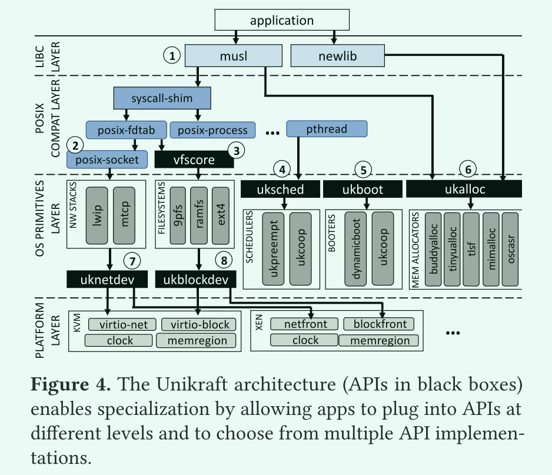
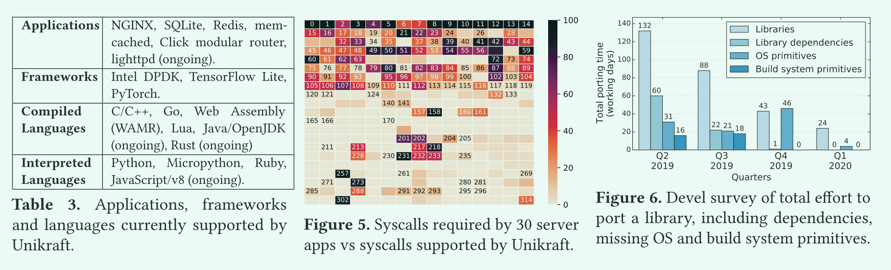
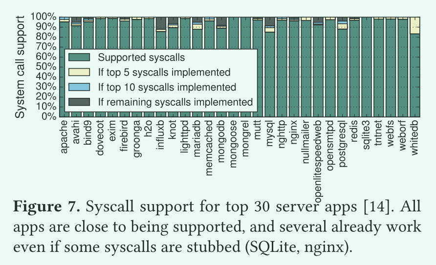
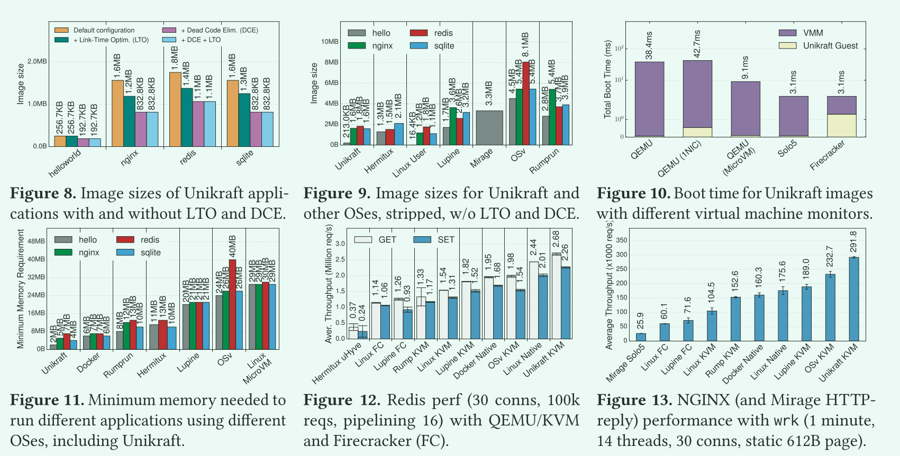
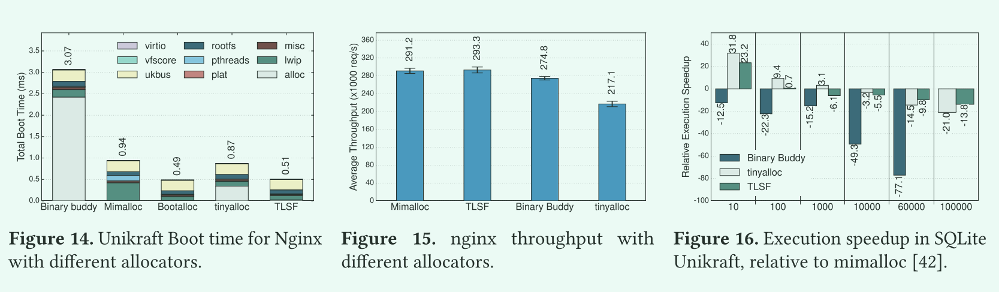

# Unikraft-Fast, Specialized Unikernels the Easy Way

## 摘要

unikernel以在引导时间、吞吐量和内存消耗等方面提供出色的性能而闻名。然而，它们也因难以达到这样的目标并且需要耗费大量时间，大量的工程工作才能将应用程序移植到它们身上而臭名昭著。我们引入了Unikraft，这是一个新颖的微库(micro-library)操作系统

1. 完全模块化了操作系统原语，这样就可以很容易地定制单内核(unikernel)，并且只包含相关的组件
2. 公开了一组可组合的、面向性能的api，以便开发者更容易地获得高性能。

我们使用nginx、SQLite和Redis等现成的应用程序进行评估，结果显示，与Linux相比，在Unikraft上运行这些应用程序的性能提高了1.7x-2.7倍。此外，这些应用程序的Unikraft镜像大小大约是1MB，运行时只需不到10MB的RAM，在VMM上启动大约1ms(总启动时间为3ms-40ms)。Unikraft是Linux基金会的一个开源项目，可以在www.unikraft.org上找到它。

## 1 简介

面向特定领域定制(专门化)可以说是获得卓越性能的最有效方法，不管是为了在网络应用程序中实现高吞吐量[38,50,52]，提高语言运行时环境的效率[20,23,47,65]，还是为了提供高效的容器环境[62,76]。即使在硬件领域，尤其是随着摩尔定律的消亡，制造商们也越来越倾向于硬件专业化，以实现更好的性能;机器学习领域是这一理论的主要代表[30,32,34]。

在虚拟化领域，unikernel是专门化的黄金标准，在吞吐量、内存消耗和引导时间等方面显示出令人印象深刻的结果[36、40、45、47、48]。其中一些好处是因为其拥有单一的内存地址空间，从而可以消除昂贵的系统调用开销，但更多的好处是因为其能够在正确的抽象级别上服务应用程序以获得最佳性能.例如，一个旨在每秒服务数百万个请求的web服务器可以访问一个低级的、基于批处理的网络API，而不是标准的、缓慢的套接字API。这样的方法已经在一些unikernel项目中被采用，但往往是以一种临时的、随时构建随时删除的[38, 48, 52]。总的来说，尽管unikernel有显著的好处，但其也有两个主要的缺点：

1. 它们需要大量的工作来构建和获取高性能 。在大多数情况下，每个应用程序都需要这样的工作。
2. 它们通常不是posix兼容的，因此需要对应用程序和语言环境进行移植。

我们认为这些缺点不是不能克服的，并提出了一个专门构建的unikernel体系结构来解决这些问题。现有的unikernel项目，包括那些基于库体系结构的项目，都倾向于由一个小型但完整的内核组成，这些内核的组件具有复杂的、相互交织的、不透明的api。这意味着开发人员如果要将应用程序移植到这样的系统上，优化它们的性能，必须要深入研究代码和内核的细节，才能获得更深入的理解。

此外，这些系统通常为那些大小敏感的应用进行优化：通过删除所有不必要的组件来实现最小的镜像文件。虽然这种策略已经提供了显著的好处，但我们认为，基于库架构的 unikernel 应该更方便进行专门化，允许用户为特定的应用程序、环境约束和关键性能指标选择最佳的系统组件。

在本文中，我们提出了一种新颖的微库操作系统Unikraft，旨在简单直接地生成专用的、高性能的unikernels.。为了做到这一点，Unikraft依赖两个关键原则:

- 内核应该是完全模块化的，以便让unikernel能够独立且容易地定制。在Unikraft中，像内存分配器、调度器、网络栈和早期启动代码这样的操作系统原语都是独立的微库。
- 内核应该提供注重性能的、定义良好的api，这些api可以很容易地选择和组合，以满足应用程序的性能需求。在Unikraft中，这类api本身就是微库，这意味着它们可以很容易地添加到构建中或从构建中删除，而且它们的功能可以通过提供与之功能类似的微库来进行扩展。

简而言之，unikraft的关键概念创新是为核心操作系统组件定义了一组api，这样用户就可以在不需要时轻松替换某个组件，并在对性能要求较高时从多个组件中进行选取。这些api的构建考虑了性能(例如，通过设计支持批处理)和最小化(不存在不需要的特性)。

为了支持更多的应用，我们移植了musl libc库，并提供了一个系统调用shim层微库。因此，在Unikraft上运行一个应用程序就像用它的原生构建系统构建它一样简单，只要将生成的对象文件链接到Unikraft就可以完成。此外，Unikraft支持许多已经移植的应用程序(如SQLite、nginx、Redis)、编程语言和运行时环境，如C/ c++、Go、Python、Ruby、Web Assembly和Lua，以及许多不同的hypervisor / vmm (QEMU/KVM、Xen、acker[4]和Solo5[78])。

我们在Unikraft上使用这些应用程序的评估结果显示，与Linux系统相比，性能提高了1.7- 2.7倍。此外，这些应用程序的Unikraft映像大约是1MB，只需要不到10MB的ram来运行，并且在VMM基础上启动时间大约1ms(总启动时间为2ms-40ms)。Unikraft是Linux基金会的一个开源项目，源代码可以在www.unikraft.org上找到。


## 2 设计准则和解决方案

在得出Unikraft的关键设计原则之前，有必要分析一下传统操作系统中不需要或不适合单个应用的特性和(臃肿的)机制:

- 在虚拟化环境中，应用程序和内核之间的保护域切换可能是冗余的，因为hypervisor确保了隔离，同时切换也会带来明显的性能下降。
- 多个地址空间在单个应用程序域中可能是无用的，但是在标准操作系统中删除这种支持需要大量的工作。
- 对于rpc风格的服务应用程序，是不需要线程的，一个单一的、运行到完成的事件循环就足以实现高性能。这可以消除VM中对调度器的需求及其相关的开销，以及客户机和hypervisor调度器[19]之间的不匹配。
- 对于以性能为目标的基于udp的应用程序，很多操作系统网络栈都是无用的:应用程序可以直接使用驱动程序级别的API，dpdk风格的应用程序已经这样做了。目前还没有办法简单地从标准操作系统中删除网络堆栈，更不要说整个网络子系统。
- 从应用程序直接访问NVMe存储消除了对文件描述符、VFS层和文件系统的依赖，但从现有的操作系统中移除这种支持(围绕存储API层构建)非常困难。
- 内存分配器对应用程序性能有很大的影响，而对于许多应用程序来说，通用的分配器并不是最优的[66]。因此，如果每个应用程序都能选择自己的分配程序，那将是理想的;然而，这在今天的操作系统中是非常困难的，因为内核使用的分配器是内置的。

不可否认，上述针对应用程序特定优化的不太详尽的列表意味着，对于标准操作系统提供的每个核心功能，至少有一个或几个应用程序不需要它。删除这些功能将减少代码大小和资源使用，但通常需要繁重的重新设计工作。

我们想要解决的问题是，让开发人员能够为每个应用程序创建一个专用的操作系统，以确保获得最佳性能，同时减少与操作系统有关的开发工作，使现有应用程序的移植变得容易。从上述的分析可以得到一些关键的设计决策:

- 单一地址空间：以单一应用场景为目标，可能有不同的应用通过网络进行通信
- 完全模块化的系统：所有组件，包括操作系统原语，驱动程序，特定平台代码和库都应该很容易根据需求添加和删除，甚至api也应该是模块化的。
- 单一保护级别：不应该有用户/内核空间分离，从而避免昂贵的特权级切换。这并不排除分区功能，因为分区功能可以以可接受的开销实现。
- 静态链接：启用编译器功能，例如，死代码消除(DCE)和链接时间优化(LTO)，以自动删除不需要的代码。
- POSIX支持:为了支持旧的应用程序和编程语言，并且可以在其使用的API上进行优化。
- 平台抽象:为一系列不同的hypervisors/VMMs轻松生成映像。

决策已经有了，问题是如何实现这样一个系统？是通过最小化现有的通用操作系统，还是从现有的unikernel项目开始，或者从头开始？

第一个方向采用现有的操作系统并添加或删除不需要的功能。主要是增加了对单一地址空间的支持，并删除了保护域相关内容。OSv[37]和Rump[36]采用了部分BSD内核，并将其重新设计在unikernel 中工作;Lupine Linux[40]依赖于Linux内核的最小化、专用的配置和内核模式Linux (KML)补丁。这些方法使应用程序移植变得容易，因为它们提供了二进制兼容性或POSIX兼容性，但最终的内核仍然是传统的单一内核。

现有的宏内核操作系统确实对每个组件都有api，但是大多数api都是非常复杂的，因为历史原因，许多api经过发展已经衍生出很多变种，一些组件上下层之间常常被模糊化以达到高性能(例如，sendfile是网络和存储堆栈的短路).Linux内核具有高度相互依赖的子系统[8]。

为了更好地量化API的复杂性，我们分析了Linux内核主要组件之间的依赖关系。作为粗略的估计，我们使用内核源代码树中的子目录来标识(广泛的)组件。我们使用cscope从所有内核组件的源码中提取所有函数调用，然后对每个调用进行检查，看看函数是在同一个组件中定义的，还是在不同的组件中定义的;在后一种情况中，我们记录了一个依赖项。我们在图1中绘制了依赖关系图:边缘上的注释显示了节点之间依赖关系的数量。这张密集的图表明，删除或替换Linux内核中的任何单个组件都需要理解和修复其他组件的所有依赖关系，这是一个令人害怕的任务。

虽然完全模块化很困难，但Rump项目已经成功地将宏内核的某些部分进行了模块化。在Rump中，NetBSD内核被分为基础层(所有内核都必须使用)、主机提供的函数(调度、内存分配等)和可以自己运行的部分(例如，网络或文件系统支持)。Rump在一定程度上实现了我们的目标，但仍有许多依赖，比如其要求所有内核都有基础层和调用层。

第二个方向是完全绕过操作系统(OS)，这主要是为了提高I/O性能，通过绕过原来的I/O堆栈，应用程序可以减少不必要的调用。这个方向也需要进行移植工作，因为应用程序必须针对新的网络(DPDK、netmap[64]或Linux的io_uring[11]子系统)或存储(SPDK) API进行修改。

第三个方向是从头开始为每个目标应用程序添加所需的操作系统功能，这些功能可以通过重用现有操作系统的代码。这是ClickOS[51]支持Click模块化路由器，MirageOS[46]支持OCaml应用程序，以及MiniCache[39]实现网络缓存所采取的方法。这种方法可以生成非常小的映像、启动时间快，性能高。但其最大的问题在于移植的工作量很大，大多数时候对每个应用程序都要做重复的工作。

总而言之，从一个现有的项目开始是不是最好办法，因为上述三个方向的项目都不是为了支持我们概述的关键原则而设计的。我们选择了一种全新的API设计方法，尽管我们确实在相关的地方重用了来自现有作品的组件。


## 3 Unikraft架构和api

经典的操作系统工作可以大致分为宏内核(具有良好的性能)和微内核(提供操作系统组件之间的良好隔离(以牺牲性能为代价))，与之相比，我们的工作既包含宏内核设计(组件之间没有保护)，也包含微内核倡导的模块化。

我们使用模块化来实现专用化，将操作系统功能分割成细粒度的组件，这些组件只能通过定义良好的API边界进行通信。我们的观察发现是，可以通过详细的API设计和静态链接来获得性能，而不是为了性能而压缩API边界。为了实现模块化的总体原则，Unikraft由两个主要组件组成:

- 微库：微库是实现Unikraft核心api之一的软件组件，我们将它们与库区分开来，因为它们具有最小的依赖关系，可以是任意小的。所有实现相同API的微库都是可互换的。一个这样的API是内存分配器，几个分配器都实现了ukalloc接口。此外，Unikraft使用来自外部库项目（OpenSSL、musl、Protobuf[31]等）、应用程序（SQLite、Redis等），特定平台（如Solo5、Firecracker、Raspberry Pi 3）的功能。
- 构建系统:这为用户提供了一个基于kconfig的菜单，让他们可以选择在应用程序构建中使用哪些微库，选择针对哪些平台和CPU架构，如果需要，甚至可以配置单个的微库。构建系统会编译所有的微库，将它们链接起来，并为每个选定的平台生成一个二进制文件。



图4显示了Unikraft的架构。所有组件都是微库，它们有自己的Makefile和Kconfig配置文件，因此可以相互独立地添加到unikernel构建中。API也是微库，可以通过Kconfig菜单轻松启用或禁用. 因此，unikernel可以编排组合API来最大限度满足应用程序的需求(例如，一个rcp风格的应用程序可能会关闭uksched API来实现一个高性能的、运行到完成的事件循环)。

Unikraft的体系结构中还包含了支持POSIX的组件，这使得支持现有应用程序变得相对容易(更多内容见§4)。Unikraft可以通过两种方式提高应用程序的性能:

- 通过消除系统调用开销、减少映像大小和内存消耗以及选择有效的内存分配器
- 专用化，通过调整应用程序，在性能关键的地方利用较低级别api(例如，寻求高磁盘I/O吞吐量的数据库应用程序)。

作为unikraft模块化的一个证明，一个最小的HelloWorld配置可以在KVM上生成200KB大小的图像，在Xen上生成40KB大小的图像，只需要平台引导代码和nolibc(这是一个unikraft特有的libc替换)，它只提供基本的最小功能集，比如memcpy和字符串处理。图3显示了该映像中使用的所有库;相反，在Linux中，Hello World应用程序需要图1中的整个Linux内核。

大多数应用程序确实需要更多的功能(参见图2中的nginx映像)。注意:(1)这个映像没有包含一个block子系统，因为它只使用RamFS，(2)所有组件都比它们的Linux对应组件更小，依赖更少。这些例子展示了Unikraft添加和删除组件(包括核心操作系统组件)的能力，允许开发者为他们的应用创建高效、专用的映像。

轻松更换组件以及在不同级别插入应用程序的能力为应用程序开发人员提供了广泛的优化可能性。首先，未修改的应用程序(例如Hello World和nginx)可以可以使用musl（见图4）或nolibc的posix兼容层，由于没有系统调用，unikraft可以从函数调用中轻松获得低启动时间、低内存消耗和提高吞吐量的优势。

同样，应用程序开发人员可以很容易地选择一个适当的内存分配器(6)来获得最大的性能，或者在同一个unikernel中使用多个不同的内存分配器(例如，一个简单的、快速的内存分配器用于引导代码，一个标准的内存分配器用于应用程序本身)。

对快速启动时间感兴趣的开发者可以通过提供他们自己的启动代码(5）来进一步优化unikernel，这些启动代码需要提供ukboot API。在§6中，我们展示了两个启动代码微库的实验，一个是静态内存页面，一个是动态内存页面，展示了启动时间和内存分配灵活性之间的权衡。

对于网络相关的应用程序，开发人员可以使用标准套接字接口(2)或较低级别，更高性能的uknetdev API(7)，以此来提高吞吐量。我们将在下面更详细地讨论这个API，并在§6中对其进行评估。类似地，数据库等磁盘相关的应用程序可以通过vfscore微库(3)遵循标准路径，或者通过ukblock API(8)来优化吞吐量。调度器也是可插拔的(4)，每个CPU核心可以运行不同的调度器(即使多核支持仍在进行中)。

我们将在后面的文章中讨论和评估其中的几个场景，接下来我们通过其中一些例子来更深入地了解Unikraft的api。

### 3.1 uknetdev API

Unikraft的网络子系统将设备驱动端(例如virtio-net、netfront)从网络栈或低级网络应用(简称应用)中解耦出来。在普通操作系统中，为设备驱动更换网络堆栈并不是一件容易的事情，这些驱动程序通常都是为特定的网络堆栈实现。这个API的目的是解耦这两个组件，以便允许驱动程序跨平台重用。

对于后者，网络应用程序或网络堆栈应该能够在使用不同驱动程序的不同平台上不加修改地运行。因为我们要适配的用例范围很广，所以API不应该限制任何一个用例，也不应该成为高性能工作负载的潜在性能瓶颈。我们的部分设计来自于Intel DPDK的rte_netdev API。然而，由于它关注的是高性能而不是高效的资源使用，我们设计了一个API，允许应用程序以轮询、中断驱动或混合模式操作Unikraft驱动程序。

此外，uknetdev将内存管理留给应用程序，其同时支持多队列、零拷贝I/O和package批处理等高性能特性。我们让应用程序完全控制并初始化驱动程序。驱动程序本身不运行任何初始化程序。相反，我们为应用程序提供API接口来提供必要的信息(例如，支持的队列数量和卸载特性)，这样应用程序代码就可以通过选择最佳的驱动程序属性和特性集来专用化。驱动程序将它们的回调(例如，发送和接收)注册到一个uk_netdev结构，然后应用程序使用这个结构来调用驱动程序例程。

为了开发与应用程序无关的网络驱动程序，同时在驱动程序中使用应用程序或网络堆栈的内存管理功能，我们引入了一个网络包缓冲包装器结构，称为uk_netbuf。这个结构包含驱动程序在包缓冲区中发送或接收数据所需的元信息。其思想是，应用程序使用这个结构进行包缓冲区分配，但内存布局由应用程序控制。因为驱动程序和API都不管理分配，所以关键性能的工作负载可以使用预分配的网络缓冲区池，而高效内存应用程序可以通过从标准堆分配缓冲区来减少内存占用。API的发送和接收调用如下所示:


```c
int uk_netdev_tx_burst(struct uk_netdev *dev,
						uint16_t queue_id,
						struct uk_netbuf **pkt,
						__u16 *cnt);
int uk_netdev_rx_burst(struct uk_netdev *dev,
                        uint16_t queue_id,
                        struct uk_netbuf **pkt,
                        __u16 *cnt);
```


用户提交uk_netbufs数组并指定其长度。在发送时，驱动程序将数组中的包尽可能送入队列中。函数返回值表示队列中是否还有空间发送更多的包，或者队列已满。cnt参数也用作输出参数，用于指示发送队列中实际放置了多少包。receive函数以类似的方式工作。

默认情况下，驱动程序以轮询模式控制队列，但API还有一个接口来为特定队列启用中断模式。在这种模式下，每当函数返回值表明没有更多的工作要做(没有更多的包被接收或发送队列已满)，队列的中断模式就会被启用。在驱动程序配置过程中，应用程序可以为每个队列注册一个中断处理程序，一旦接收到包或发送队列上的空间可用，就调用这个中断处理程序。之后，中断程序将会休眠，直到发送或接收函数根据队列状态再次激活它，例如当所有数据包都被应用程序接收时。如何以及在何处接收或传输数据包完全取决于应用程序的实现。例如，中断回调函数可以用来解除接收或发送线程的阻塞，但也可以包含在事件循环实现中。一旦中断到达，应用程序就知道必须调用receive或send函数。这种实现避免了中断风暴，并允许在负载过重的情况下自动过渡到轮询模式。

### 3.2 ukalloc API

Unikraft的内存分配子系统由三层组成:

1. 一个兼容POSIX的外部API
2. 一个名为ukalloc的内部分配API
3. 一个或多个后端分配器实现

外部接口的目的是向后兼容，以便将现有应用程序移植到Unikraft。在C语言的情况下，外部API由一个修改过的标准库公开，该标准库可以是nolibc(一个最小的、unikraft特有的libc实现)、newlib或musl。外部分配接口是unikraft特定的内部分配接口的一个包装，它将分配请求重定向到适当的分配器后端(每个分配器都有自己的、独立的内存区域)。因此，内部分配接口作为一个多路复用工具，允许在同一个unikernel中存在多个内存分配后端。

Unikraft的分配器接口使用POSIX接口的uk_前缀版本:uk_malloc()， uk_calloc()，等等。与POSIX不同，这些函数要求调用者指定应该使用哪个分配后端来满足请求。Uk_malloc()被定义为:

```c
static inline void *
uk_malloc (struct uk_alloc *a, size_t size);
```

`struct uk_alloc *`参数表示分配后端。这个结构体包含了一个指针，其指向实现POSIX分配接口（`malloc()、calloc()、posix_memalign()`）的分配器。需要注意的是，与大多数内部分配接口一样，uk_malloc()被设计为内联方法，以避免在分配路径上产生额外的开销。

分配器必须指定一个初始化函数，由ukboot在启动过程的早期阶段调用。初始化函数参数需要一个指向堆的第一个可用字节的`void *`指针，以及一个``size_t len`参数，该参数指定堆的大小。该函数必须完整初始化分配器，并将分配器注册到ukalloc接口。一旦初始化函数返回，分配器就被认为已准备好进行内存分配。启动阶段会设置内存分配器和内存源之间的关联。

Unikraft支持5个分配后端:`buddy system`、`Two-Level Segregated Fits [53] (TLSF) real-time
memory allocator`、`tinyalloc[67]`、`Mimalloc [42]` (version 1.6.1)和`Oscar`[12]安全内存分配器。一种特殊情况是垃圾收集(GC)内存分配器，它需要一个线程来执行GC。我们可以用两个分配器来实现这些，一个用于初始化GC线程的早期启动时间，然后是主GC分配器，它在线程启动时接管。我们对`Mimalloc`使用这个解决方案因为它有一个pthread依赖。

### 3.3 uksched and uklock APIs

与许多操作系统不同，Unikraft中的调度不仅可用而且是可选的。这样就可以构建轻量级的单线程unikernel或运行完整的unikernel，从而避免客户端内部的调度器引起的抖动。示例用例是提供虚拟机(如在驱动程序域中)或虚拟网络功能(VNFs)的支持功能。

与ukalloc类似，uksched抽象了调度器接口。平台库只提供了一些基本的机制，比如上下文切换和计时器，这样调度逻辑和算法就可以用单独的调度程序库来实现(Unikraft在撰写本文时支持协作和抢占式调度程序)。

此外，Unikraft支持实例化多个调度器，比如一个调度器针对一个可用的虚拟cpu或一个cpu集合。对于VNFs，由于性能和延迟的原因，可以在运行数据处理的虚拟核上选择不进行调度或协作调度，同时在运行逻辑控制的核上选择一个通用的抢占式调度程序。

uklock库提供了同步原语，比如互斥和信号量。为了保持其他库代码的可移植性，uklock根据unikernel的配置选择目标平台进行实现。线程和多核支持是需要同步原语的两个部分，在最简单的情况下(无线程和单核)，因为不需要互斥机制，一些原语可以简单地实现，如果启用了多核(我们还不支持这个)，一些原语会使用自旋锁和RCUs，在这种情况下，可能就需要针对目标平台进行支持。

## 4 应用支持和移植

可以说，一个操作系统的好坏取决于它支持运行的应用程序数量。自unikernel诞生以来，这一直是它的一个难题，因为它经常需要手动移植应用程序。最近的研究关注二进制兼容性，即在运行时获取未修改的二进制文件，并将系统调用转换为unikernel的底层功能[37,54]。这种方法的优点是不需要进行移植工作，但这种转换会带来严重的性能损失。


为了量化这些，表1显示了在Intel i7 9700K 3.6 GHz CPU和Linux 5.11上运行的微基准测试的结果，比较了在unkraft和Linux上进行系统调用和函数调用花费的成本。在Unikraft中使用运行时转换的系统调用比Linux中快2-3倍(取决于是否启用了KPTI和其他缓解措施)。然而，与函数调用相比，使用运行时转换的系统调用的成本是函数调用的十倍，这说明OSv、Rump和HermiTux中的二进制兼容性[36,37,54]所需要的代价非常大。

对于运行单个应用程序的虚拟机，系统调用理论上是不需要的，因为管理程序已经提供了隔离性。在这种情况下，通过去掉用户/内核隔离及其相关成本，unikernel可以获得更大的性能优势。二进制兼容性所使用的间接转换方式大大减少了unikernl的好处。

为了避免这些问题，同时又尽量减少移植工作，我们采用了一种不同的方法:我们依赖于目标应用程序的本地构建系统，在编译完成后，将编译的对象文件与Unikraft编译的对象进行最后的链接。为了实现这一点，我们移植了musl C标准库，因为它与glibc兼容，但资源效率更高。还有newlib，因为它通常用于构建unikernel。

为了支持依赖于Linux系统调用的musl，我们创建了一个名为sycall shim的微库:每个实现系统调用处理程序的库都通过宏向这个微库注册处理程序。shim层生成libc级的系统调用接口。通过这种方式，当使用Unikraft编译应用程序源文件时，我们可以直接链接到系统调用实现，从而将系统调用转换成直接函数调用

表2显示了在不同的应用程序和库上尝试使用musl和newlib构建的结果: 这种方法对newlib无效(“std”列)，但对musl是有效的，大多数库都是可以完整构建的，对于那些不能构建的库，是因为使用了glibc特定的符号（注意，newlib不是这种情况，许多glibc函数在newlib中根本就没有实现）。为了解决这个问题，我们构建了一个glibc兼容层，它基于一系列musl补丁[56]和我们手工实现的20个其他函数(主要是64位版本的文件操作，如pread或pwrite)。


在此基础上，如表(“compat层”列)所示，该层允许几乎所有库和应用程序进行编译和链接。对于musl来说，这是个好消息:只要实现了应用程序工作所需的系统调用，那么映像就会成功运行。

### 4.1 应用程序兼容性

Unikraft有多少系统调用支持?在撰写本文时，我们实现了146个系统调用。根据相关工作[54,74]，在100-150个系统调用范围内就足够运行一套丰富的主流应用程序、框架和语言。我们在表3中确认了这一点，其中列出了Unikraft目前支持的软件。

除此之外，我们还将简要分析支持其他应用程序可能需要做多少工作。我们使用Debian流行度竞赛数据[14]来选择一组30个最流行的服务器应用程序(例如，apache、mongodb、postgres、avahi、bind9)。为了得到这些应用程序实际运行时需要的准确的系统调用，同时将之前工作[61]中的静态分析扩展为动态分析，我们创建了一个由各种配置(例如，web服务器的不同端口号，后台模式等)和单元测试(例如，数据库服务器的SQL查询，DNS服务器的DNS查询，等等)组成的小框架。这些配置和单元测试作为输入提供给分析器，分析器通过strace实用程序来监视应用程序的行为。一旦动态分析完成，就会将结果进行比较并添加到静态分析的结果中。

在图5的热图中，我们根据系统当前支持的系统调用来绘制结果(整个分析和热图生成是由我们开发的一组工具完全自动化的)。每个方块代表一个单独的系统调用，编号从0 (read)到313 (finit_module)。浅色方块说明只有极少数应用程序使用。黑色方块(例如，方块1，write)是所有程序都使用的。正方形上的数字表示Unikraft支持系统调用，而空的正方形表示还不支持此调用。

从图中可以看出，支持流行的应用程序只需要不到一半的系统调用，而且大多数需要的系统调用我们已经支持了。没有支持的大约60个。

- 有几个可以在unikernel上下文中快速实现(比如在单核上使用getcpu);
- 因为Unikraft已经支持了必要的功能，所以很多调用如`semget/semopt/semctl`实现起来很简单
- `epoll, eventfd`正在实现中





为了进一步量化这一点，图7为30个应用程序列出了到目前为止Unikraft支持的系统调用（绿色），我们可以为所有30个应用程序逐步实现其缺失的5个最常见的系统调用（黄色），然后是10个（浅蓝色）常见的系统调用，直到完全支持。所有的应用程序都接近于完全支持（图中大部分是绿色的），而且，即使是正在运行的应用程序也不需要全部是绿色的（例如SQLite、nginx）：这是因为许多应用程序即使在某些系统调用被忽略或返回ENOSYS（如果缺少系统调用的实现，shim层会自动返回这个值）的情况下也能工作。我们目前正在进行一项调查，看看有多少这样的应用程序可以在非全绿色的情况下运行。

我们相信为这些缺失的系统调用做一些额外的工作会使得对应用的支持更加广泛。对于源代码不可用的情况，Unikraft还支持二进制兼容和二进制重写，就像在HermiTux[54]中那样。

### 4.2 Manual Porting

当自动化的方法不起作用以及对性能要求较高导致二进制兼容不可用时，我们需要进行手工移植。由于Unikraft的微库可以为构建一些专用代码提供一个通用的代码基础，这样的手工移植比过去的unikernel项目(包括我们自己的工作)花费的时间要少得多，过去的项目需要几个月的时间才能完成。从移植大量库和应用程序时需要添加的几行代码中就可以清楚地看出这一点(表2，最后一列)。

事实上，在Unikraft的整个生命周期中，随着公共代码库的成熟，移植额外的功能会变得越来越容易。量化移植一个库所花费的实际时间是一项困难的工作(例如，提交时间戳可能隐藏了这样一个事实:在移植一个库的过程中，大量的时间都花在移植它的一个依赖项上)。尽管如此，我们对项目开放源码社区中所有移植了库或应用程序的开发人员(大约70人)进行了调查，并在这里展示了结果。我们要求开发者粗略计算移植一个实际的库或应用所花费的时间，移植库依赖关系所花费的时间(例如，memcached需要libevent)，实现缺少的操作系统原语(例如，poll()函数)或向Unikraft的构建系统添加功能所花费的时间。我们使用git commit history来跟踪工作何时启动。

为了显示随着项目成熟移植工作的变化，我们在图6中绘制了结果，为了便于展示，我们进一步将结果按季度分组。该图说明了随着时间的推移，开发人员花费在移植依赖项或实现缺失的OS原语上的时间显著减少了。

最后，Unikraft支持多种语言及其环境(标准库、垃圾收集器等)，这意味着许多基于这些语言的项目(如Intel的DNNL/ c++、Django/Python、Ruby on Rails/Ruby等)应该可以开箱即用。

## 5 基础评估

Unikraft的主要目标是帮助开发者快速、轻松地创建资源高效利用、高性能的unikernel。在本节中，我们将评估Unikraft在多大程度上透明地实现了这个目标(不用修改应用程序(本质上是图4架构图中的场景1-3))。然后在第6节中，我们将评估如何做轻微的修改，使得符合Unikraft的api可以带来更高的性能。

在整个评估过程中，我们使用KVM作为虚拟化平台。Unikraft也支持Xen和裸机目标(如Raspberry Pi和Xilinx Ultra96-V2)，但我们将它们的性能评估作为未来要做的工作。我们在一台便宜(大约800欧元)的SH370R6型计算机上运行了所有的实验，该计算机配备了Intel i7 9700K 3.6 GHz (4.9 GHz，带有Turbo Boost, 8核)和32GB RAM。对于DPDK实验，我们使用两个通过电缆直接连接的DPDK和一对带有82599EB芯片组的Intel X520-T2卡。

此外，我们禁用了Hyper-Threading，并使用内核引导参数(isolcpus=4-7 noht)隔离主机的4个CPU内核。在剩余的4个CPU内核中，我们将一个固定到VM，另一个固定到VMM(例如，qemu-system)，另一个固定到客户端工具(例如，wrk或redis-benchmark)，并将机器模式设置为性能。最后，对于Xen引导实验，我们使用Xen 4.0版本。

所有的实验都是通过将一个CPU核心固定到VM，另一个CPU核心固定到VMM(例如，qemu-system)，另一个CPU核心固定到客户端工具(例如，wrk或redis-benchmark)来进行的。禁用超线程。设置机器为性能模式。

### 5.1 Resource Efficiency: Smaller is Better 

与传统操作系统相比，unikernel的主要优势是资源消耗低。这反映在磁盘上的二进制映像大小，以及运行时的引导时间和内存占用比。我们对Unikraft中一些具有代表性的应用程序进行了评估，并与优秀的unikernel和Linux进行了比较。我们的结果显示在图8到11中。

为了在Unikraft中量化图像大小，我们为hello world程序，三个应用程序(nginx,redis,sqlite)生成了DCO,LTE以及两者结合的各种映像大小。图8中的结果显示，对于这些应用程序，Unikraft图像都小于2mb。我们在图9中进一步将这些结果与其他unikernel和Linux进行比较。如上图所示，Unikraft图像比其他所有的unikernel项目都要小，并且可以与Linux用户空间的二进制文件相媲美(注意Linux的大小仅用于应用程序。它们不包括glibc和内核的大小)。这是Unikraft模块化方法的结果，大大减少了需要编译和链接的代码量(例如，对于helloworld，不需要调度器和内存分配器)。

较小的映像大小不仅有助于减少磁盘存储，还有助于缩短引导时间。LightVM[48]已经表明，使用高度优化的Xen工具栈，可以在大约2ms的时间内引导一个无操作的unikernel。在我们的评估中，我们使用了标准的虚拟化工具栈，并希望了解Unikraft虚拟机的启动速度。在运行实验时，我们测量VMM所花费的时间(例如:Firecracker,、QEMU、Solo5)和实际的unikernel/VM的引导时间，从运行第一个guest指令到调用main()。

如图10所示，结果显示了使用不同的vmm引导helloworld unikernel需要多长时间。Unikraft的启动时间在QEMU和Solo5(仅为客户端，没有VMM开销)从数十微秒(没有网卡)到数百微秒(一个网卡)不等。在Firecracker上，开机时间稍长，但不超过1ms。这些结果与之前的工作相比有很大改善: MirageOS(在Solo5上1-2ms)， OSv(在只有只读文件系统的Firecracker上4-5ms)， Rump(在Solo5上14-15ms)， Hermitux(在uHyve上30-32ms)， Lupine(在Firecracker上70ms，没有KML时18ms)，Alpine Linux(在Firecracker上约330ms)。这刻画了Unikraft只保留和初始化需要的内容的能力。

总的来说，VM的总引导时间由VMM决定，Solo5和Firecracker是最快的(3ms)， QEMU microVM大约10ms, QEMU最慢，大约40ms(我们用图14和21详细说明了guest引导时间)。这些结果表明，在需要即时实例化vm的场景中，可以很容易地使用Unikraft。

最后，之前的工作[48]强调了快速实例化和VM数量的重要性。为了了解当RAM成为瓶颈时，我们可以在一台服务器上装入多少unikernel VM，我们进行了一些实验，测量作为unikernel引导各种应用程序所需的最小内存量，发现2- 6mb的内存足以满足Unikraft客户的需求(图11)。



### 5.2 Filesystem Performance 

Unikraft有一个VFS层，应用程序可以链接到VFS层进行文件I/O。通常，当Unikraft用户不需要访问持久存储时，他们会包含一个RAM文件系统。为了支持持久存储，应用程序可以使用9pfs[77]协议来访问主机或网络上的这种存储。我们的9pfs实现了VFS,其依赖于驱动virtio-9p与kvm进行传输。开启9pfs设备会使Unikraft虚拟机在KVM上的启动时间增加0.3ms，在Xen上增加2.7ms。

我们测量了读和写的文件访问延迟：9pfs文件系统驻留在主机中，大小为1GB，包含随机数据。我们的Unikraft测试应用程序读取大小为4K、8K、16K和32K的块，测量每次读取的延迟。为了与Linux VM进行基准测试比较，我们使用dd将相同的数据传输到/dev/null，通过将总时间除以数据块的数量来估计dd输出的延迟。图20的结果显示，在不同块大小的情况下，Unikraft的读时延和写时延都较低，明显优于Linux VM。

### 5.3 Application Throughput

在这一部分的评估中，我们使用手工移植的nginx和Redis(两个典型的服务器应用)，并将它们的性能与现有的解决方案进行比较，包括一个非虚拟化(原生)Linux二进制文件，一个Docker容器，一个Linux microVM，和一个经典的unikernel集合。我们使用相同的应用配置和可行的相同的应用版本(这是受应用支持的限制，例如，Lupine, HermiTux和Rump只支持特定版本的Redis)在单个核上进行所有测量。我们没有优化应用程序或内核配置的性能，但会消除每个系统中明显的性能瓶颈，例如，将Unikraft的网络堆栈(基于lwIP[17])切换到基于内存池分配，，移植Lupine到QEMU/KVM，以避免Firecracker性能瓶颈[4,24]。Unikraft测量使用Mimalloc作为内存分配器。

结果如图12和13所示。对于这两个应用，Unikraft比在容器中运行的相同应用快30%-80%，比在Linux虚拟机中运行的相同应用快70%-170%。令人惊讶的是，在这两个例子中，Unikraft都比Native Linux快10%-60%。我们将这些结果归因于系统调用的成本(KPTI的存在增加了系统调用的成本——在没有KPTI的情况下，本地Linux和Unikraft之间的差距缩小到0-50%)，也可能是因为在Unikraft中使用了Mimalloc作为系统范围的分配器。不幸的是，如果不进行大量的代码修改，就无法在Linux中使用Mimalloc作为内核分配器。请注意，我们确实尝试将LD_PRELOAD 机制用于redis连接mialloc，但性能改进并不显著。我们希望，如果在编译时一同编译Mimalloc，而不是依赖于预加载机制(使编译器意识到分配器的存在，从而允许它执行编译/链接时的优化)，这种改进会更显著，但我们不能执行这个实验，因为当前的Redis代码库并不支持Mimalloc。

与QEMU/KVM上的Lupine相比，Unikraft在Redis和NGINX上都快了50%左右。这些结果可能是由于在Lupine的官方配置中过度删减，也有可能是调度的差异(我们选择Unikraft的协作调度，因为它很适合Redis的单线程方法)，或者是因为Lupine中一些冗余内容，无法通过配置选项来消除。与OSv相比，unkraft在Redis上比OSv快35%，在nginx上快25%。Rump表现出较差的性能:它已经有一段时间没有维护了，这限制了我们可以使用的配置数量。例如，我们不能设置文件限制，因进行这个设置的程序(rumpctrl)无法编译了。HermiTux[55]不支持nginx，对于Redis来说，它的性能相当不稳定。这可能是由于缺乏virtio支持，导致VMM级别的性能瓶颈(HermiTux依赖于uHyve，一种定制的VMM，这个VMM像Firecracker一样，性能与qemu /KVM有差异)。与Lupine不同，将其移植到QEMU/KVM需要对[25]进行大量的代码更改。



### 5.4 Performance of Automatically Ported Apps

目前测试的应用都是手动移植的。在本节中，我们将提供对自动移植的初步评估。我们使用SQLite并测量执行60K SQL插入查询所需的时间，结果如图17所示。

运行在musl和newlib上的手动移植版本的SQLite在图中的“native”条中表示，而“external”条显示了自动移植的SQLite的性能。这意味着我们使用它自己的构建系统来构建，并将生成的静态库与Unikraft链接起来，正如§4中所讨论的那样。结果表明，自动移植的应用程序只比手动移植的版本慢1.5%，甚至比Linux baremetal版本略快(可能是由于系统调用开销和我们使用TLSF作为内存分配器的)。

总的来说，这些结果表明，在Unikraft中不需要移植就可以让主流应用程序工作(除了设置一些编译标志，以便SQLite的构建系统生成一个静态库)，而且可以获得在unikernel中运行的性能优势。

### 5.5 Memory Allocators

没有一种内存分配器是适用于所有场景的[66]，这使它们成为专业化的专攻目标。为了支持这一点，ukalloc API允许在一个映像中出现多个分配器，并允许不同的微库使用不同的分配器(图4中的体系结构中的6)。

Unikraft有五个内存分配器符合设计的API:(1)伙伴内存分配器来自Mini-OS [41][28];(2) TLSF[53]，专为满足实时性要求而设计的通用动态内存分配器;(3) mimalloc，微软最新的通用分配器;(4) tinyalloc[67]，一个简单的小型分配器;(5) bootalloc，一个简单的区域分配器，用于更快的引导。

我们用上面所有的分配器构建了nginx，并测量了Unikraft的guest启动时间(图14)，以及服务器的持续性能(图15)。不同分配器的启动时间差别很大:从0.49ms (bootalloc)到3.07ms (buddy)，这意味着nginx的即时实例化用例应该避免使用buddy分配器。然而，在运行时，buddy分配器的性能与tlsf和mimalloc类似，tinyalloc的性能降低了30%。

SQLite的引导性能类似，其中buddy分配器最差，tinyalloc和tlsf最好(为了简短，没有显示结果)。然而，在运行时，排名取决于运行了多少查询(见图16):tinyalloc在少于1000个查询时的速度是3-30%，当请求更多时就会变得次优，因为它的内存压缩算法更慢。相反，使用mimalloc可以在高负载下提供20%的性能提升。

对于Redis的结果(图18)，进一步确认了没有一个分配器对于所有的工作负载是最优的事实，并且为工作负载和用例选择正确的分配器可以提高2.5倍的性能。总之，这些结果以及Unikraft同时支持多个分配器的能力，为将来根据当前负载动态更改分配器从而获得更好的性能的工作留下了空间。

## 6 Specializing Applications 

上一节已经展示了Unikraft的核心库速度是非常快的，通过将现有的应用移植到Unikraft，我们甚至可以超越Linux。

尽管如此，Unikraft的强大之处在于能够以现有解决方案难以实现的方式进一步定制映像，无论是宏内核操作系统还是其他unikernel项目。unkraft库的高度模块化特性使得可以轻松替换核心组件，比如内存分配器、页表支持、调度器、标准库等等。

在本节中，我们将开始初步探讨Unikraft提供的专用化机会，其主要目标是实现更好的性能。其它包括更好的健壮性、正确性或安全性的专用化应用是未来的主题。在这一节中，我们将引用体系结构图(图4)来指出我们将涉及哪些专用化场景。


### 6.1 专用引导代码(场景5)

作为第一个实验，我们尝试了客户机分页支持的不同实现。默认情况下，Unikraft二进制文件包含一个已经初始化的页表结构，由VMM加载到内存中。在启动过程中，Unikraft仅仅启用分页并更新页表基寄存器以指向正确的地址。对于大多数应用程序来说这已经足够了，而且这种方式提供了快速的启动性能(1GB RAM启动只需要30us，见图21)。Unikraft也有动态页面管理支持，当应用需要显式改变他们的虚拟地址空间(例如通过mmap)时可以启用。当使用它时，整个页表都将在引导时填充。图21显示，具有32MB动态页表的客户机的引导时间比具有预先初始化的1GB页表的客户机稍长一些，而且引导时间随着内存的大小成比例地增加。

最后，Unikraft使客户端可以在受保护(32位)模式下运行，完全禁用客户端分页功能。这可以帮助运行遗留的32位应用程序，或者在高cpu争用场景中降低TLB丢失的成本。

### 6.2 网络性能(场景7)

uknetdev API是Unikraft的核心库之一，在设计和实现上花的时间最长。我们的目标是在不考虑虚拟化技术的情况下实现高性能网络，并使所有运行在uknetdev之上的其他代码(如lwip)免受特定于平台的更改的影响。

在KVM上，可以将uknetdev API配置为使用标准virtio-net协议并使用主机中的设备(vhost-net，我们目前使用的默认配置)，但它也可以将数据路径分发给vhost-user(在主机用户空间中运行的基于ddpd的virtio传输)，以获得更高的性能——但代价是需要在主机中轮询。

为了了解uknetdev API的效率，我们编写了一个简单的应用程序，它发送尽可能多的数据包，并测量了在不同机器上运行DPDK testpmd应用程序的吞吐量。我们改变数据包大小并测量吞吐量，将uknetdev API与运行在Linux虚拟机中的DPDK进行比较(DPDK是目前高性能网络的黄金标准)。结果如图19所示，使用vhost-user分发的uknetdev与运行在Linux VM中的DPDK实现了类似的吞吐量。

### 6.3 VFS和文件系统专门化(场景3)

在这个专用化的实验中，我们的目标是通过删除Unikraft的vfs层(vfscore)，并让应用程序直接使用一个专门构建的基于散列表的文件系统SHFS上（该文件系统从[39]移植而来）从而获得web缓存应用程序的高性能。

为了对性能进行基准测试，我们测量查找一个文件并打开一个文件描述符所花费的时间。为此，我们准备了一个小型的根文件系统，其中的文件位于文件系统根。我们测量了在1000个打开请求的下执行一个打开请求所花费的平均时间，并考虑了两种情况: 文件存在时的open()请求和文件不存在时的open()请求。我们将这种专门的设置与在Linux VM中运行相同的应用程序(initrd和文件位于RAM中)，以及与在vfscore之上运行在Unikraft上的应用程序进行比较。

图22中的结果显示，与在Linux VM中运行相比，在unkraft中运行没有专用化的应用程序已经获得了一些好处。当运行专专用化的优化版本时，会带来更大的优势。在本例中，与非专用化版本相比，专用化版本获得5-7倍的提升，与Linux相比甚至更高。

### 6.4 专用化键值存储(场景7)

我们使用recvmsg/sendmsg系统调用实现了一个基于udp的内存键值存储，然后在此基础上创建了一个基于lwip的Unikraft映像，以及Linux二进制文件。

我们测量了每个版本可以保持的请求速率，结果如表4所示。Unikraft的性能(LWIP)略低于Linux客户(Single)，是裸机Linux (Single)的一半。


为了提高Linux的性能，我们必须分摊系统调用的成本(在基本版本中，每个系统调用发送一个包)。为此，我们使用了msg系统调用的批处理版本，这可以使得在裸机和guest情况下都有大约50%的改进。为了进一步提高性能，我们将应用程序移植到DPDK上运行，这需要对应用程序进行重大修改，以适应DPDK框架——这将客户性能提高到640万请求/秒，但代价是在VM中使用两个内核，其中一个专门用于DPDK。

对于Unikraft，我们删除了lwip堆栈和调度程序(通过Unikraft的Kconfig菜单)，以及针对uknetdev API的代码，这是我们在轮询模式中使用的。我们专用的unikernel需要类似于DPDK的移植工作。它的性能与DPDK的性能相当，但这样做使用的资源要少得多:它只需要一个核而不是两个核，它的映像大小为1.4MB，而不是大约1GB，而且它的启动时间为80ms，而不是几秒钟。

## 7 讨论

unikernel是否在安全性上有所取舍?传统实现中，unikernel有严重的安全问题，但我们认为这些问题只是实现的方式错误，而不是根本性问题。事实上，unikernel在商业上被用于具有安全意识的领域，如汽车，因为它们的高度专用化意味着它们提供一个小型的可信计算基础。话虽如此，过去的unikernel项目未能提供标准操作系统中常见的标准安全特性(例如，堆栈和页面保护，ASLR等)。Unikraft已经支持了其中的一些功能，包括CFI[3]和Address sanititisation[70-72]，以及英特尔MPK[1]对硬件分区的初步支持。因此，Unikraft应该可以在保持高性能的同时实现良好的安全性。

专用操作系统的一个常见缺点是调试它们困难。大多数unikernel因为没有Linux那样丰富的调试工具而臭名昭著。

除了映像可以在gdb中运行之外，Unikraft有很多工具可以帮助debug。首先，Unikraft提供了一个ukdebug微库，可以打印不同(可配置)临界级别的关键信息。这个库还可以启用/禁用断言，并在其消息中打印堆栈的底部地址。其次，Unikraft提供了一个跟踪点系统，可以通过ukdebug的菜单选项启用。第三，ukdebug微库提供了一个插入反汇编器的抽象。到目前为止，Zydis反汇编器[7]的一个移植提供了对x86的支持。

最后，Unikraft提供了一个linuxu (Linux用户空间)平台目标。这允许用户在开发过程中，利用Linux丰富的调试工具集，为这个目标构建他们的专用操作系统。一旦映像按预期运行，用户就可以选择一个不同的平台(例如，Xen)进行实际部署。

Unikraft的进程。Unikraft目前不支持进程及其相关函数(如fork()和exec())，尽管它们可以通过克隆虚拟机[881,82]或通过地址内空间隔离来实现，如Iso-Unik [43] with Intel MPK。Unikraft提供了支持页表的微库，可以作为实现fork和进程的基础。然而，许多现代应用程序不再依赖进程来实现[5]的功能，而那些依赖进程的应用程序通常会提供一个可配置的、基于线程的替代方案(例如，nginx)。

## 8 相关工作

许多研究和系统工作针对各种软件进行专用化。

Unikernels和Library os。近年来，出现了大量的library os或Unikernel项目。大多数是应用程序或编程语言特定的项目: runtime.js [65] (JavaScript)，包括os [9] (c++)， HaLVM [20] (Haskell)， Xen上的LING或Erlang [23] (Erlang)， MiniPython [49] (MicroPython)， ClickOS[51][52](Click Mod-
ular Router/Network Function Virtualization(NFV))，和MiniCache[39][38](内容缓存)。LightVM[48]构建了微型的unikernel，并定制了Xen工具栈来实现较低的引导时间。与所有这些相比，Unikraft有效地支持一系列主流应用程序和运行时。

MirageOS[46]是一个专注于类型安全的ocaml特定的单内核，因此不支持主流应用程序，而且它的性能，正如我们的评估所显示的，与其他unikernel项目和Unikraft相比，是低于标准的。虽然它提供了一个相当小的内核(Mini-OS[41])，但它仍然是一个宏内核，因此不容易定制。

UniK[29]为其他多个unikernel项目提供了一个包装器。container和Kata Containers[62](于2017年合并)[76]提供基于linux的虚拟机(vm)定制，以在其中运行容器。Drawbridge[59]是一个库操作系统，可以运行最新版本的微软应用程序。Graphene[73]是一种库操作系统，目标是高效执行单进程和多进程应用程序。

Rump[35]引入了Anykernel概念，将NetBSD内核的部分转换为在单个地址空间中运行，并支持fork和execve等问题。它为标准应用程序提供了良好的兼容性，但它对宏内核的依赖意味着专用化的空间不大。SEUSS[10]使用Rump构建一个功能即服务(Function as a Service, FaaS)系统。HermiTux[55]是一个通过系统调用重写提供二进制兼容性的单内核。与Unikraft不同，HermiTux是不可定制的，它对二进制兼容性的依赖带来了性能成本，。最后，OSv[37]是一个专注于云计算的操作系统，像HermiTux一样，提供了二进制兼容性支持，以及对许多编程语言和平台的支持。它的内核也是单一的，这使得它很难定制

堆栈和API专门化。许多文章都着眼于针对不同用例的软件和网络堆栈。Sandstorm[50]引入了一个非常(手动)定制的网络堆栈，用于支持高性能web和域名系统(DNS)服务器。像Unikraft一样，null内核[44]提供了不同级别的硬件抽象接口，并允许应用程序/进程组合这些不同的接口。然而，它们既没有提供实现，也没有提供应用程序兼容性的细节。

应用程序特定的软件栈[13]实现了编译器扩展，可以为解释型语言和共享库自动消除死代码，这是对Unikraft的补充。另一项补充工作是HALO[66]，这是一个自动的链接后优化工具，可以分析内存分配如何进行，从而使内存管理例程专用化，从而增加空间局部性。

内核旁路。为了专用化I/O应用程序和工作负载，已经提出了许多部分或完全绕过内核以增加吞吐量的工作。demickernel[80]是一个新的操作系统库，专门针对内核旁路设备。IX[6]是一种新颖的操作系统，目标是高吞吐量和低延迟。Arakis[58]也是一种新的操作系统，其中应用程序可以直接访问虚拟I/O设备，而内核提供网络和磁盘保护，但并不参与每一个操作。Parakernel[18]使bypass成为一级公民，允许进程直接访问非共享设备，并透明地多路复用访问由多个进程共享的设备。最后，MDev-NVMe[57]实现了NVMe ssd的直通。与这些方法不同的是，Unikraft的可定制api意味着它可以在不绕过内核的情况下实现高性能。

连接用户空间/内核分区。许多项目的目标是在单一内存地址空间中运行应用程序和Linux内核，以减少域切换成本，就像unikernel一样。例如，用户模式Linux (UML)[15]允许将内核作为用户空间进程运行。LibOS[26]将内核网络堆栈作为用户空间中的共享库运行。Linux内核库(LKL)[60]将内核转换为一个可以作为虚拟机运行的库。Unikernel Linux (UKL)[63]将一个用户空间应用程序静态地编译到Linux内核中，使用shim层将glibc系统调用重定向到内核函数(但为每个图像添加45MB的glibc代码)。这些方法避免了用户内核空间切换，但并没有专用化实际的软件堆栈。最近的工作叫做Lupine[40]，它使用Linux内核以内核模式加载应用程序二进制文件，从而消除了系统调用开销。它还利用内核配置选项来丢弃不必要的特性，从而减少映像大小。然而，我们已经证明，与Unikraft相比，它的表现不佳。

## 9 总结

我们推出了一种新颖的微库操作系统Unikraft，它通过对unikernel镜像的全面而简单的专用化来实现高性能。除了对未修改的应用程序产生好处(例如，更快的启动时间，更低的内存消耗等)外，对应用程序进行轻微的修改以符合Unikraft的api，可以带来更高的性能。

作为未来的工作，我们将继续努力提供更好的系统调用兼容性，以透明地支持更主流的应用程序。我们还打算利用Unikraft的模块化来实现安全目的，用内存安全的甚至静态可验证的语言来编码微库，并在链接镜像文件时使用分区技术来维护安全属性。

## Acknowledgments

我们要感谢匿名的评论者和我们的领头人Manuel Costa，感谢他们的评论和见解。非常特别地感谢Unikraft OSS社区过去和现在所做的大量贡献。这项工作的部分资金来自欧盟H2020拨款协议825377 (UNICORE)和871793 (ACCORDION)。Costin Raiciu的部分资金来自VMWare的捐赠。

## 附录

我们已经花了相当大的努力，以确保本文中的所有实验都是可重复的。本附录提供了关于如何运行它们的详细信息。评估(AE)仓库可以在[22]找到。此外，我们总结了所有实验的表格，并粗略估计每个实验运行所需的时间。

### 9.1 硬件要求

在运行这些实验之前，您需要准备3个物理主机环境:推荐使用物理主机而不是虚拟机，因为它们提供更好的性能。在本文中，我们使用了三种不同的设置:

1. 启用KVM的Linux主机(Debian Buster)， Linux内核为4.19。这个主机用于大多数实验。我们使用4.19内核是因为HermiTux不能在新版本中运行，如[27]中所述。
2. 一台Linux主机(Debian Buster)，使用Linux内核4.19，使用10gbit/s以太网线连接到第一台主机。我们将它用于DPDK网络实验(图19和表4)，以及需要特别设置CPU频率的实验。详情请参见9.2节。
3. Xen主机(Debian Buster)用于Xen 9pfs实验

几乎所有的实验都可以使用一台服务器，尽管它需要不同的Linux内核参数或Xen管理程序，并需要重新启动才能从一个设置切换到另一个设置。DPDK实验是个例外，它需要两台服务器通过10Gb的链路相互连接。

提醒一下，我们所有的结果都运行在便宜(大约800欧元)的Shuttle SH370R6[68]计算机上，配备英特尔i7 9700K 3.6 GHz (4.9 GHz，带有Turbo Boost, 8核)和32GB ram。对于DPDK实验，我们使用了两个通过直接电缆连接的DPDK和一对带有82599EB芯片组的Intel X520-T2[33]卡。

### 9.2 软件要求

所有的实验都在安装了Debian Buster和Linux 4.19的物理主机上运行。AE存储库中的所有安装和准备脚本都针对此发行版和内核版本。

对于所有的设置，我们禁用Hyper-Threading (noht)，隔离4个CPU内核(例如:isocpus=2-6)，关闭IOMMU (intel_iommu=off)，禁用IPv6 (IPv6 .disable=1)。这可以通过在引导加载程序中设置内核引导参数来实现，例如使用Grub (/etc/default/ Grub):

```
GRUB_CMDLINE_LINUX_DEFAULT="isolcpus=2-4 \
                                noht \
                                intel_iommu=off \
                                ipv6.disable=1"
```

或者使用syslinux/pxelinux:

```
LABEL item_kernel0
    MENU LABEL Linux
    MENU DEFAULT
    KERNEL vmlinuz-4.19.0
    APPEND isolcpus=2-6 noht intel_iommu=off ipv6.disable=1
```

在Xen上，我们使用以下参数(请根据您的可用RAM调整Dom0固定内存的数量，我们给Dom0 32GB内存的一半.Grub (/etc/default/ Grub):

```
GRUB_CMDLINE_LINUX_XEN_REPLACE_DEFAULT=""
GRUB_CMDLINE_LINUX_XEN_REPLACE="earlyprintk=xen \
								console=hvc0 \
								ipv6.disable=1"
GRUB_CMDLINE_XEN=""
GRUB_CMDLINE_XEN_DEFAULT="smt=0 dom0_max_vcpus=4 \
						dom0_vcpus_pin cpufreq=xen \
						dom0_mem=15360M,max:16384M \
						gnttab_max_frames=256"
```

请注意，以下实验需要额外的内核参数，例如启用特定的CPU频率：表1和图4、19和22。

### 9.3 Getting Started

1. 在进行任何这些实验之前，请用上面详细的建议为您的主机做好准备。

2. 许多实验使用Docker作为中间工具来创建构建和测试环境(以及测试Docker本身)。请在您的系统上安装Docker[16]。

3. 一旦Docker安装，克隆我们的AE库:

   ```
   git clone \
   https://github.com/unikraft/eurosys21-artifacts.git
   ```

4. 所有的实验都应该安装必要的工具并下载额外的资源，然后才能运行。这可以通过对单个实验调用run.sh fig_XX prepare(下面有更多细节)或对所有实验调用run.sh prepare来实现。(注:所有实验的准备步骤通常超过几个小时。)

5. 准备好之后，只需使用run.sh脚本调用希望重新复现的相关实验。

我们已经用run.sh工具封装了所有单独的实验。这个脚本将为Debian Buster安装所有实验所需的依赖项(不包括Docker)。每个实验在experiments/中的子目录中都有README，里面包含更多关于单独实验的细节。

### 9.4 Notes

- 所有的实验都应该以root用户的身份在主机上运行，因为这将需要修改主机并使用更高权限运行命令，例如创建和销毁虚拟机，设置/proc的限制等。
- 在许多实验中，我们使用中间Docker容器来构建映像和访问预构建的二进制文件。除此之外，这个存储库还克隆Linux内核来进行更改以进行测试。因此，用于进行所有实验的预期磁盘存储空间为50GB。
- 所有实验的准备步骤通常超过几个小时。
- 由于重叠的CPU内核亲和性，实验不能并行运行。
- 每个实验都有自己的子目录和Makefile脚本。我们提供了一个主要的run.sh脚本来打包所有的实验。
- 一些实验(如图22)产生了一些错误信息，但仍然完成并正确地生成了图。如果是这种情况，可以查阅子目录中的详细信息
- 通过run.sh运行时，所有plot都被保存到全局/plot目录中。当使用单个实验的Makefile时，它被保存到实验的文件夹中。

### 9.5 Beyond the Paper

AE库只包含Unikraft的性能评估。除了这个附录和仓库，Unikraft项目还提供了大量关于如何在现实环境中使用Unikraft的文档[75]。此外，欢迎有兴趣的研究人员通过Xen项目邮件列表[79]和GitHub[21]加入社区。


